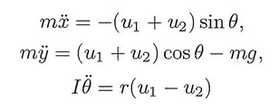
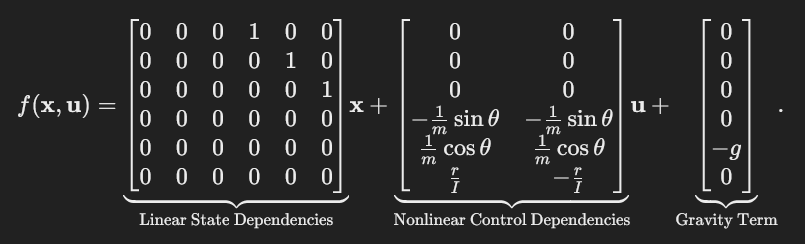
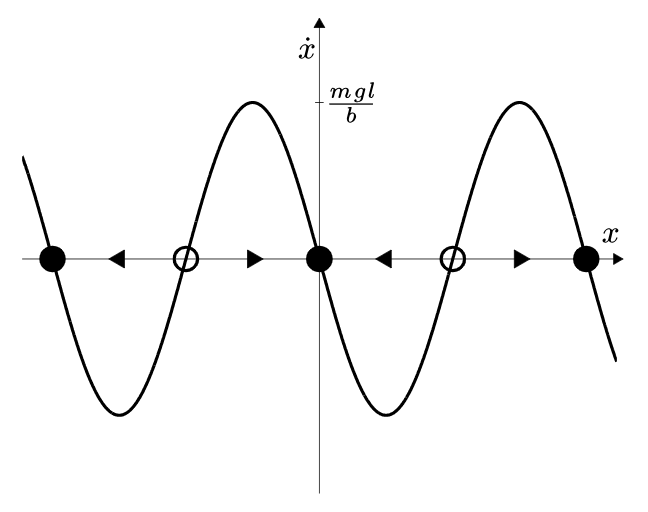
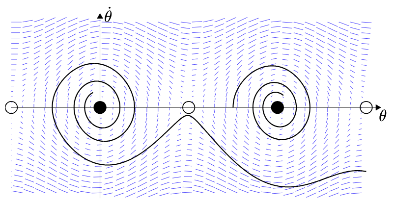
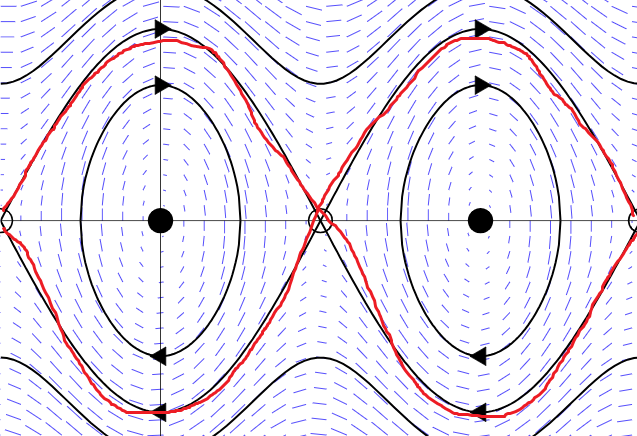

# Underactuated Systems

Dynamics of robot expressed using diff eq, relating state & control input to derivatives of state. In particular, we use 2nd-order diff eq, because we typically care about the resulting acceleration from a state & control input (why acceleration? well, $q$ and $\dot{q}$ are easy to measure with sensors; if you wanted a diff eq with jerk, you'd need a measure of $\ddot{q}$, which are usually noisy, and this is usually not necessary anyway).

General 2nd-order Dynamical System Control Equation:

$$ \ddot{q} = f(q, \dot{q}, u, t) $$

$q$ = state vector, $u$ = control command. For a fully actuated dsystem, $f$ is surjective; for each $\ddot{q}$ there exists a $u$. This is not true for underactuated systems.

Actually, dynamics of many robots is linear in torque with an added constant not dependent on $u$, so we re-express the dynamics:

$$ \ddot{q} = f_1(q, \dot{q}, t) + f_2(q, \dot{q}, t)u $$

For a robot manipulator (with rigid linkages and joints), recall the manipulator equation:

$$ M(q) \ddot{q} + C(q, \dot{q})\dot{q} = \tau_g(q) + Bu $$

where $M$ is the inertia matrix (symmetric, positive definite, invertible), and $B$ maps $u$ into generalized forces. We can re-express this in the form of the linear dynamics equation ($M^{-1}B$ represents $f_2$ and $M^{-1}[\tau_g(q) - C(q,\dot{q})\dot{q}]$ represents $f_1$):

$$ \ddot{q} = M^{-1}(q)[\tau_g(q) + Bu - C(q,\dot{q})\dot{q}] $$

As long as $B$ is full-row-rank (i.e. has rank equal to the number of dimensions of $q$, and therefore has a right inverse), $\exist u$ such that $\ddot{q}$ can achieve any value in full-dimensional space.

Sidenote 1: The manipulator equation ignores friction, but you could add a $\tau_f(q)$ to the manipulator equation to model this  (or, if you have torque-dependent friction, then $\tau_g(q)u$)

Sidenote 2: $B$ must be dimension $dim(q) \times dim(u)$, and the only way for it to be full-row-rank is if $dim(u) \geq dim(q)$. $dim(u)$ could even be much larger than $dim(q)$ if you have multiple actuators per joint; in this case the inverse of $B$ may not be unique.

If, for example, the manipulator has a free-spinning joint, then $B$ would lose a dimension, and then $\ddot{q}$ would be limited within the subspace that $B$ projects to.

### Feedback Equivalence/Cancellation

For full-actuated systems, control is easy. For any desired $\ddot{q}^d$:

$$ u = B^{-1} [ M(q) \ddot{q}^d - \tau_g(q) + C(q,\dot{q})\dot{q}] $$

$u$ is calculated analytically.

This is also called a "double integrator" controller. Disadvantage: requires may actuators + energy.

Also, feedback equivalence may only be possible sometimes. $B^{-1}$ could get large $\rightarrow$ demand unreasonably high torques.

#### Feedback Linearization

Subset of Feedback Equivalence--specifically when Feedback Equivalence linearizes the dynamics of the system (this is not always possible, especially for underactuated systems when multiple DoF are coupled). If you solve for the feedback equivalence controller $u$, then plug $u$ into the dynamics, the dynamics should be linear if feedback linearization is possible.

For underactuated systems, if its only possible to linearize the dynamics in a few (but not all) dimensions, this is called *partial* feedback linearization.

### Input and State Constraints

Limits to $u$ can cause underactuation. $q$ limits (i.e. obstacles or joint limits) don't necessarily cause underactuation; they actually reduce the state space, which could make an underactuated system temporarily fully-actuated.

### Nonholonomic Constraints

Also cause underactuation. i.e. cars can't move sideways $\rightarrow$ doesn't restrict its set of possible configurations, but does restrict possible $\ddot{q}$.

 
 

# Standard Form Dynamics

We denote $\mathbf{x}$ as the state vector. $\mathbf{x}$ contains all the positions of the system along with their derivatives (velocities). For example, the state of a 2D quadrotor contains $x, y, \theta, \dot{x}, \dot{y}, \dot{\theta}$.

The standard form dynamics look like (where $\mathbf{u}$ is the control input vector):

$$\dot{\mathbf{x}} = f(\mathbf{x}, \mathbf{u})$$

This form is very useful because it makes integrating/rolling out the dynamics very easy; in the discrete case, we get that $\mathbf{x}_{k+1} = \dot{\mathbf{x}}_{k}*dt + \mathbf{x}_{k}$. It's a very intuitive form; you get the acceleration of the system based on its current position/velocity and control.

We often intuitively understand the dynamics of a system with a set of equations like this (these are the dynamics of a 2D quadrotor):

 

We must then convert these dynamics equations to the standard form.

In the 2D quadrotor case, we have:

$$\mathbf{x} = \begin{bmatrix}
x \\
y \\
\theta \\
\dot{x} \\
\dot{y} \\
\dot{\theta}
\end{bmatrix}, \quad
\mathbf{u} = \begin{bmatrix}
u_1 \\
u_2
\end{bmatrix}
$$

$$
\dot{\mathbf{x}} = \begin{bmatrix}
\dot{x} \\
\dot{y} \\
\dot{\theta} \\
\ddot{x} \\
\ddot{y} \\
\ddot{\theta}
\end{bmatrix} = 
\begin{bmatrix}
\dot{x} \\
\dot{y} \\
\dot{\theta} \\
-\frac{u_1 + u_2}{m} \text{sin} \theta \\
\frac{u_1 + u_2}{m} \text{cos} \theta - g \\
\frac{r}{I}(u_1- u_2)
\end{bmatrix}
$$

In matrix form ($\dot{\mathbf{x}} = A(x) \mathbf{x} + B(x) \mathbf{u}$):

 

 
 

# Dynamics (using a Pendulum as example)

### Background: Phase Portraits

When we are unable to solve for the analytical solution to an ODE (i.e. most 2nd order ODEs), we resort to analyzing behavior using a phase portrait.

Phase portraits plot $\dot{q}$ vs $q$, along with a vector field of vectors $[\dot{q}, \ddot{q}]^T$ and repesent the dynamics of the system. We may call the "state vector" $x = [q, \dot{q}]^T$. Then, the vectors in the vector field are all $\dot{x} = [\dot{q}, \ddot{q}]^T$.

This is a simple sliding cart-mass system where, with no external force $u$, there is no $\ddot{q}$:

 

Note that, if there were, say, $u=1$, then there would be a non-zero $\ddot{q}$, then all the vectors would have a slight tilt upward. By providing torques or forces, one can shape the vector field. But only the y-components of each $\dot{x}$ vector--the x-component is fixed at $\dot{q}$.

The vector field symbollically represents the states that the system can get to from the current state. Therefore, valid trajectories must follow the vector field.

In the case of this sliding cart-mass system, the dynamics are simple: $m\ddot{q} = u$. Then, to achieve the desired $\ddot{q}$ at any time, we can just input the correct $u$. Say we want to form a particular vector $\dot{x}^d$ in the vector field; thens pick a $u$ such that $\dot{x}^d = [\dot{q}, \frac{u}{m}]^T$

In the phase portrait above, the red trajectory represents a possible trajectory with the correct control inputs $u$, while the blue trajectory is impossible to achieve. Specifically, at all $x$ on the red trajectory, there is $u$ that points $\dot{x}$ in the direction of the red arrow ($u = -0.25m \dot{q}$), but for the blue trajectory, $u$ cannot influence the x-component of $\dot{x}$, so the x-component of $\dot{x}$ can never point left like the blue arrow does.

### Back to the Pendulum.

Equation of motion for a pendulum (solved using Euler Lagrange):

$$ ml^2\ddot{\theta} + b\dot{\theta} + mgl\sin\theta = u $$

The goal would be to solve for $\theta$ as a function of time given $u, \theta, \dot{\theta}$, but, this diff. eq. of this form are not solvable (it's a non-linear 2nd order system). Therefore, we have to do some casework to roughly analyze special cases (i.e. limits as $t \rightarrow \infty$).

### Overdamped Case

Pendulum is overdamped if $b\dot{\theta} >> ml^2\ddot{\theta}$; which is equivalent to $b \sqrt\frac{l}{g} >> ml^2$ ($\sqrt\frac{l}{g}$ is the natural freq. and is there to ensure both sides have the same units, and is assumed to have a reasonable value and therefore not affect the inequality relationship).

Then, the equation of motion becomes roughly this (1st order):

$$ b\dot{\theta} + mgl\sin\theta = u_0 $$

Now, plotting $\dot{\theta}$ vs $\theta$:

 

We see equilibria at $\theta=-\pi, 0, \pi$. The only stable equilibira is at $\theta=0$ (when $\theta$ becomes slightly larger, $\dot{\theta}$ is negative, and vice versa when $\theta$ becomes slightly smaller.)

Sidenote: why do we plot $\dot{\theta}$ vs $\theta$? Because $\dot{\theta}$ and $\theta$ (velocity and position) represent "state", so each point on the plot is a different state.

Types of Lyapunov (local) Stability; if $x^*$ is the stable point:
- **Locally Stable** (i.s.L. - in the sense of Lyapunov): for some small scalar $\epsilon$, if $||x(0) - x^*|| < \delta$ where $\delta \leq \epsilon$, then $\forall t ~||x(t) - x^*|| < \epsilon$. Basically, for any $\epsilon$ ball where $x$ will stay in the $\epsilon$ ball for all time, $\exists$ a $\delta$ ball that $x(0)$ is in.
    - Example: $\dot{x} = 0$
- **Locally Attractive**: if $||x(0) - x^*|| < \epsilon$, then $lim_{t \rightarrow \infty} ~x(t) = x^*$. Basically, $x$ will reach the stable point eventually.
- **Locally Asymptotically Stable**: If both **Locally Stable** & **Locally Attractive**
- **Locally Exponentially Stable**: if $||x(0) - x^*|| < \epsilon$, then if $||x(t) - x^*|| < Ce^{-\alpha t}$, for some $C, \alpha$.

Note: Lyapunov analysis only applies to passively dynamic systems (no external forcing).

Note: Attractivity does not imply stability i.s.L. For example, a pendulum with an energy-shaping controller is attractive to the homoclinic orbit, but is not stable to any fixed point (since the pendulum can rotate infinitely on the homoclinic orbit).

Now, stable point drawn as block dots, unstable points drawn as circles:

 

Notice, that anytime $\dot{x} > 0$, any initial condition will tend to move right, and vice versa for $\dot{x} < 0$. Therefore, we have **regions of attraction** around the black dots and **separatrix** (separating regions of attraction) at each white dot.

In certain cases, your system might have a parameter $w$, and varying $w$ varies the number of equilibirium points in the system. This is called a **bifurcation**. You can plot a **bifurcation diagram** of $x*$ versus $w$; it may have "pitches" if, at a certain $w$, the number of $x*$ changes.

Also, note that, if $u$ was a non-zero constant (imagine a constant torque shifting the equilibrium of the pendulum), you effectively shift the entire phase plot up or down (also shifting the fixed points left or right--the fixed points always are on the x-axis).

### Undamped Case

Now, $b=0$. $ ml^2\ddot{\theta} + mgl\sin\theta = u_0 $; there is no first order term.

We can rewrite the second order equation as a first order equation with a change of variables (which doubles the number of variables). In general:

$$ \ddot{q} = f(q, \dot{q}, u) $$

becomes;
$$\begin{align*}
x_1 &= q \\
x_2 &= \dot{q} \\
\dot{x}_1 &= x_2 \\
\dot{x}_2 &= f(x_1, x_2, u)
\end{align*}$$

In the case of the pendulum, $ ml^2\ddot{\theta} + mgl\sin\theta = u_0 $ becomes:

becomes;
$$\begin{align*}
& \dot{\theta} = x \\
& \dot{x} = \frac{1}{ml^2}(u-0 - mgl \sin \theta - bx)
\end{align*}$$

From these first order equations, we can draw a phase portait, plotting $\dot{\theta}$ vs $\theta$, with a vector field depicting $(\dot{\theta}, \ddot{\theta})$.

 

Assume again that $u_0$ = 0.

The black counters represent energy level sets (conservation of energy). The pendulum will always remain on a level set. We can solve the conservation of energy equation (expressing $\dot{\theta}$ in terms of $\theta$, to be able to plot on the phase portait) to get the following:

$$ \dot{\theta}(t) = \pm \sqrt{\frac{2}{I}[E_0 + mgl \cos \theta(t)]} $$

### The Damped Case

 

The stable fixed points are now asymptotically stable.

### Control of a Torque-Limited Simple Pendulum

Now, let's consider control for this fully-actuated pendulum. **In short, the control problem is to redirect the vector field so that you get from $\theta(t_{now})$ to $\theta_{desired}$.**

**If you did not have torque limits and did not care about efficiency, you could reshape the entire vector field using feedback equivalence. But what we really want is the most minimal change to the vector field that can achieve getting from $\theta(t_{now})$ to $\theta_{desired}$.**

IMPORTANT SIDENOTE: Let's be clear about how the phase portrait works. Control inputs can only shape $\ddot{q}$, which is the y-component of each vector in the vector field. The x-component of each vector is $\dot{q}$, which is fixed (it is equal to the y-value where the vector is in the phase portrait). You cannot simply move wherever you want in the phase portrait, even with no limits on control inputs; you can only control the y-component of the vectors in the phase portrait.

First, consider the case of no damping.

One way to think about this is changing the energy of the system. Total energy is:

$$ E = \frac{1}{2} ml^2 \dot{\theta}^2 - mgl \cos \theta $$

Taking the derivative:

$$\begin{align*}
\dot{E} &= ml^2 \dot{\theta} \ddot{\theta} + \dot{\theta} mgl \sin \theta \\
&= \dot{\theta}[u-mgl \sin \theta] + \dot{\theta} mgl \sin \theta \\
&= u \dot{\theta}
\end{align*}$$

What this shows is applying torque directly changes the rate of change of energy.

As an example, let's say we want to get to $E^{desired} = mgl$; aka, when the pendulum is vertical. Then the current difference in energy is: $\tilde{E} = E - E^d$. Since $E^d$ is fixed, $\dot{\tilde{E}} = \dot{E} = u \dot{\theta}$.

Imagine a feedback controller ($k$ can be any positive constant to scale the "severity" of the controller): 

$$u = -k \dot{\theta} \tilde{E}$$

Then:

$$\dot{\tilde{E}} = -k \dot{\theta}^2 \tilde{E}$$

Imagine the phase plot for this--it would be a straight $y=-x$ -looking line. This means there's a stable fixed point at the origin where $\tilde{E} = 0$. The intuitive understanding of this controller is that, when $\tilde{E}$ is positive, energy is taken out of the system, and vice versa when $\tilde{E}$ is negative. 

This is a non-linear controller and the fixed point (the unfilled circle below) is locally attractive, but not stable (the fixed point on the phase portrait of $\dot{\tilde{E}}$ vs $\tilde{E}$ may be stable, but not on the phase portrait of $\dot{\theta}$ vs $\theta$). The controller will attempt to keep the system on the energy level set drawn in red.

 

It is locally attractive bc, as you can see, the trajectories on the energy level set loop around but always go back to the fixed point.

If we want to account for damping, this can be easily added to the control law: 

$$u = -k \dot{\theta}^2 \tilde{E} + b \dot{\theta}$$

  

# Control of the Pendulum

## As an Optimization

Consider double integrator system (aka 1D sliding cart):

$$ \ddot{q} = u $$

Our goal will be to bring $\dot{q} = 0$ and $q = 0$ starting from some $\dot{q}(0)$ and $q(0)$.

You can, imagine, with $u=0$, the phase portrait $\dot{q}$ vs $q$ of this system would have a vector field of just horizontal vectors. 

Now, consider a "time-optimal" bang-bang controller (so $u$ can only be -1 or 1). We can express this problem like so:

$$\begin{align*}
& \text{minimize} 
& & ~t_f \\
& \text{subject to}: 
& & x(t_0) = x_0 \\
&&& x(t_f) =0 \\
&&& \ddot{q}(t) = u(t) \\
&&& |u(t)| = 1
\end{align*}$$

We will consider this in two separate cases, when $u=1$ and $u=-1$. For $u=-1$:

$$ \ddot{q}(t) = u = -1 $$
$$ \dot{q}(t) = \dot{q}(0) - t $$
$$ q(t) = q(0) + \dot{q}(0)t - \frac{1}{2}t^2 $$

For this specific system, the control law is integratable, so we end up with a 1st order ODE (you can substitute to rid of $t$ in the third equation above). This means we can plot its behavior analytically on the phase portrait; we get a bunch of parabolas (the x-offset depends on initial conditions):

 

When $u=1$, you will find the solution to be the same but mirrored across the y-axis.

As stated above, the goal is to reach $\dot{q} = 0$ and $q = 0$--the origin of this plot, in minimum time. If we consider both $u=1$ and $u=-1$ at the same time, the phase portrait looks like this:

 

Note that this drawing intentionally cuts off parts of each parabola to illustrate how the optimal control policy would work. For example, if your initial conditions were at the red star, you would follow $u=-1$ until intersecting with the $u=1$ parabola, at which point switch $u$ to $1$. Notice how there is overshoot in this example; the inital speed was so high that overshoot was unavoidable.