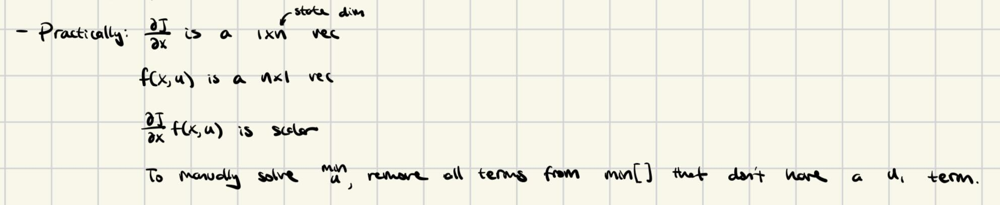
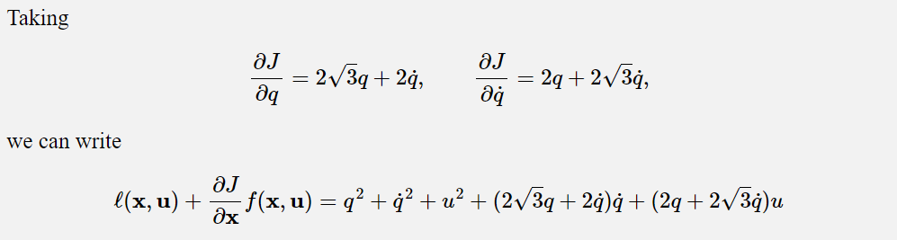
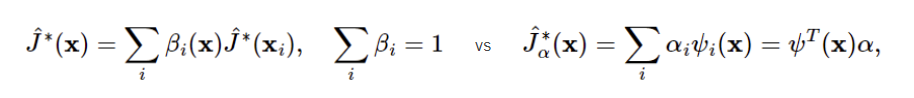
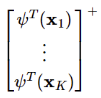
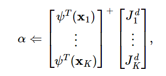
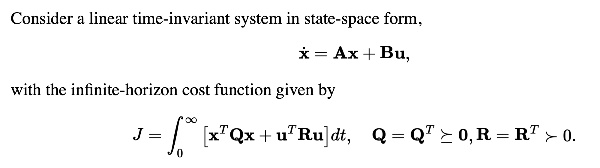

# Dynamic Programming (DP) (aka Value Iteration)

## Discreet Time DP

Additive costs (i.e. that add or are integrated in time), whether for finite or infinite horizons, is easiest to optimize with dynamic programming. For example, a discreet-time minimum time cost is simply (accruing cost so long as we've not acheived our goal) (however, any additive loss function will work):

$$
    \ell(s_i, a)= 
\begin{cases}
    1,& \text{if } s\neq s_{goal}\\
    0,              & \text{otherwise}
\end{cases}
$$

Consider an approximation of optimal control as a graph problem: Discretize state space into a grid of nodes in the phase portrait representing every possible state the system can reach.

Call each node a "state" $s_n$, and each edge to another state "action" $a_n$. Define the transition function: $s[n+1] = f(s[n], a[n])$, if you move from $s_n$ using action $a_n$ to $s_n+1$.

You initialize objective $J^*(s)=0$ (or something random) for all states. Then, you work recursively from $s_0$ to $s_{goal}$, setting $J^*(s_i)$ (a constant) at each value iteration step: 

$$ \forall i ~J^*(s_i) = \min_{a \in A} \left[ \ell(s_i, a) + J^*(f(s_i, a)) \right]$$

where $\ell(s_i, a)$ is the cost for state action pair $s_i, a$.

We call this the "cost-to-go" function--it describes the cost of each action at the current state, and therefore allows you to find the best action. $J^*(s_i)$ is the optimal cost-to-go, which is the minimum possible cost incurred from taking an action at state $s_i$.

Basically, the cost at the current state is equal to the minimum cost at the next state plus the cost to transition from current to next.

### The "Value Iteration" Version.

From here, we'll switch away from DP to "value iteration". The concept is very similar, except, for value iteration, we don't typically solve for a specific $s_0$; we allow the recursion to continue until $J^*(s)$ converges (stops updating) for all $s$; the the real cost of each possible state has been globally computed.

This is different than the DP formulation, where there is a clear order of recursion from $s_0$ to $s_{goal}$; but value iteration simply updates all states (from $s_{goal}$) until "convergence" -- when further value iteration updates no longer change $J^*$.

In practice, you might store $J^*$ not as a function but as a vector, with an element for all possible (finite number of discretized) states. Each value-iteration update will update on element of the vector $J^*$, and this will continue recursively until covergence.

**Limitations of Discreet Time/Discreet State/Discreet Action Value Iteration**:
 - Accuracy loss due to discretization errors in state space (which propogate out further from the goal state)
 - Lack of scalability due to massive state spaces (only practical for $\leq 6$ dimensions)
 - Known state transitions & costs
 - Requires "full state" feedback

## Continuous State, Action, Time DP

Rather than a discreet state transition function like $f()$ above, we have:

$$ \dot{x}(t) = f_c(x(t), u(t)) $$

(The $f_c$ subscript denotes "continuous" for clarity). Recall that $x$ is the state vector, containing both position and velocity; so this function is calculating the resulting velocity and acceleration from applying a torque input at a given position and velocity. This function should be a known of the system (it's the system dynamics).

The long-term cost is, instead of a sum over discreet time steps, is an integral of the cost function over dt:

$$ \int l_c(x, u) dt $$

To solve for the optimal control action $u$ given, we need to do two things; first, we must solve for the optimal cost-to-go function $J^*(x)$ using value iteration, then we use the Hamilton-Jacobi-Bellman (HJB) equation to solve for $u$ using $J^*(x)$:

$$ \forall x ~ 0=\min_u \bigg [\ell(x,u) + \frac{\delta J^*}{\delta x} \bigg|_x f_c(x, u) \bigg ]$$

 

Note: you can still solve for $u$ even if your $J(x)$ is not optimal; it's just that your resulting $u^*$ may just be sub-optimal (and also the right side of HJB will not evaluate to $0$).

First, we will show how to solve for $u$, assuming we know $J^*(x)$. This is simply a matter of solving the optimization problem that is the HJB equation (finding $u$ to mininimize the right-hand-side).

In the discreet time/state/action DP algorithm, we could evaluate over all possible $u$ and pick the best. In continuous action space, this is not possible. Either we need to solve for $u$ analytically or use numerical methods (like gradient descent). We will take a look at a special case where we can solve for $u$ analytically: the system must be "control affine", meaning that the acceleration of the system is linear with torque, plus some constant not dependent on $u$:

$$ f(x, y) =  f_1(x) + f_2(x)u $$

and, the cost function must be of the form (quadratic with respect to the command (i.e. a quadratic energy cost) plus something having to do with state; the cost function with the HJB cart mass system example above is an example of this):

$$ \ell(x, u) = \ell_1(x) + u^T R u $$

We can now write HJB as:

$$ 0 = \min_u \bigg[\ell_1(x) + u^T Ru + \frac{\delta J}{\delta x} \bigg|_x [f_1(x) + f_2(x)u] \bigg] $$

We can use this HJB to solve for the optimal $u^*$; notice how the function on the right side is a quadratic; we can solve for the analytical minimum by taking the gradient and setting to 0:

$$ \frac{\delta}{\delta u} \bigg[\ell_1(x) + u^T Ru + \frac{\delta J}{\delta x} \bigg|_x [f_1(x) + f_x(x)u] \bigg] = 2u^T R + \frac{\delta J}{\delta x}f_2(x) = 0 $$

Solving for $u$, we get:

$$ u^* = -\frac{1}{2} R^{-1} f_2^T(x) \frac{\delta J^T}{\delta x} $$

However, if we have limits on $u$ (i.e. torque limits), which would be linear constraints on $u$, then $u^*$ can be easily solved as a Quadratic Program.

Now, we are able to find the optimal $u^*$ for any given cost function and state. This is a control policy, so once we have $u^*$, we know how to apply the optimal controls for our system from any state.

#### General Case
What happens if the cost function is not quadratic or the dynamics are not control affine? Then you can't solve for $u$ by just setting the gradient of HJB to 0. One workout is, every iteration of the algorithm, you could take a positive-definite quadratic approximation in $u$ of the HJB and then solve for $u^*$. Alternatively, use numerical optimization methods like gradient descent to solve for $u$.

### Example: HJB on Cart Mass System (Double Integrator)

Now, we will see an example of how to use HJB to solve for $u^*$ for controlling a cart mass system.

Once again, the goal of the Cart Mass System problem is to keep the mass at the origin.

Let's say this is our cost (quadratic in state variables and effort):

$$ \ell(x, u) = q^2 + \dot{q}^2 + u^2 $$

And let's say we've already solved for the optimal cost-to-go function:

$$ J(x) = \sqrt{3} q^2 + 2q\dot{q} + \sqrt{3}\dot{q}^2 $$

We will now prove our $u^*$ by plugging this cost-to-go function into HJB and seeing that we get $u^*$ back.

 

This math involves partial derivatives of a scalar function with respect to vectors. Just trust that this is how it works. The derivative of a scalar function wrt vectors creates a row vector. The double integrator has dynamics $f(x, u) = \begin{bmatrix}
\dot{q} \\
u 
\end{bmatrix}$ (recall that $f(x, u) = \dot{x}$ by definition), so $\frac{\delta J}{\delta x} f(x, u)$ is equal to the blob on the right side of the equation.

Now, we need to find $u$ to minimize the equation above (as required by HJB). To do so, we take the gradent of the equation with respect to $u$, set it equal to 0, and we will find $u^* = -q - \sqrt{3} \dot{q} $, the optimal controller.

## Solving for $J^*(x)$ using Value Iteration

Now, it's clear how HJB can solve for $u^*$ given $J^*(x)$; but how do we calculate the function $J^*(x)$ in the first place?

Sidenote: It's also possible to use $\hat{J}^*(x)$ itself to compute the optimal policy $u^*$ instead of solving for $u^*$ from HJB (although simply solving from HJB would be faster). For example: store a table of each $u(x)$ during value iteration (however, this won't work well for continuous state space); if you continue exploring all states even after convergence, then $u$ will be optimal for each $x$.

Sidenote; all of these methods for approximating $J^*(x)$ are only feasible for rough approximations or low dimensions due to computational load.

Sidenote: textbook on the math for solving for $J^*(x)$ analytically (which is only possible for a handful of systems): https://meyn.ece.ufl.edu/wp-content/uploads/sites/77/archive/spm_files/Courses/ECE555-2011/555media/PagesFrom515text.pdf

### Solving for $J^*(x)$ using Value Iteration with a Mesh & Interpolation

This is basically discretizing the cost-to-go function as a set/mesh of points, with interpolation between points on the mesh. If you must calculate $\hat{J}^*(x)$ at some $x$ that isn't at a point on the mesh, then you use an interpolated $\hat{J}^*$ value:

$$ \hat{J}^*(x) = \sum_i \beta_i(x) \hat{J}(x_i), ~~~~~~~\sum_i \beta_i(x) = 1$$

This is called "Barycentric Interpolation", and $\beta$ are the Barycentric weights. Barycentric interpolation can also take many forms; the simplest is linear interpolation, where $\beta(x)$ is solved as the distance from $x$ to each $x_i$ (normalized so that all $\beta(x)$ add to $1$.).

To actually perform value iteration, we do value iteration updates until convergence, as we would normally do, but we update all mesh points of $\hat{J}^*$ at the same time ($x_k$ denotes a mesh point): 

$$ J_k = \min_u \bigg[ \ell(x_k, u) + \hat{J^*}(f(x_k, u)) \bigg] $$

Value Iteration with $\hat{J}^*$ approximated using Mesh Interpolation is guaranteed to converge $\hat{J}^*$ to the globally optimal $J^*$; this is because Barycentric Interpolatation is an example of a linear function approximator, which is further explained below. You can see the analogs between the Barycentric Interpolation paramterization of $\hat{J}^*$ and the linear function approximation paramaterization:

 

$\hat{J}^*(x_i)$ is an analog to $\alpha$ (the vector being updated in each value iteration update), and $\beta(x)$ an analog to $\psi_i(x)$ (some non-linear feature).

### Solving for $J^*(x)$ using Value Iteration with Neural Network Paramaterization (Discreet time, continuous state)

AKA ***Neural-fitted Value Iteration***

We paramaterize the cost-to-go function using $\alpha$: $\hat{J_\alpha}(x) $. Basically, we make $\hat{J_\alpha}(x) $ a black box linear NN and use supervised learning to solve for the weights $\alpha$.

Then the value iteration update is (with 2 steps):

$$ J_k^d = \min_u \bigg[ \ell(x_k, u) + \hat{J_\alpha^*}(f(x_k, u)) \bigg] $$

$$ \alpha = \argmin_\alpha \sum_k \bigg( \hat{J_\alpha^*}(x_k) - J_k^d \bigg) $$

We take a random sample of states $x_k$ and then perform the update using those samples.

The purpose of having two steps instead of combining into one is that the computation of $J_k^d$ will use the prior value of $\alpha$, so the minimization over $\alpha$ step will have $J_k^d$ as a constant. 

The intuition behind this value iteration update is that we first calculate a desired cost-to-go given the current estimate of $\alpha$, taking only into account future time steps; then, we try to tune $\alpha$ to achieve this desired value at the current time step. Note that cost-to-go decreases as time goes on; so comparing $\hat{J_\alpha^*}(x_k)$ to $J_k^d$ is sort of unfair because $J_k^d$ is the cost-to-go at a future time step. This forces $\hat{J_\alpha^*}(x_k)$ to try to minimize.

We can apply this value iteration update repeatedly until convergence.

To actually compute $\argmin_\alpha$, we might use stochastic gradient descent or the Adam optimizer (any of the classics in deep learning).

When actually implementing this algorithm using i.e. PyTorch, you would set up a linear NN with $\alpha$ as the weights (no activation function in this case), and set the loss equal to the error between $\hat{J}_\alpha^*(x_k)$ (the output of the NN) and $J^d_k$. You then perform back-prop to update $\alpha$ each iteration (in addition to setting $J^d_k$).

Note: this strategy of sampling $k$ states does not scale well to high dimension; in those cases, RL has some methods that involve long simulation rollouts; so instead of sampling random states, you sample states in the direction you want to go.

### Example: Solving for $J^*(x)$ using Value Iteration for LQR

(Assuming you have read the below section on LQR): we know the cost-to-go for an LQR controller is of the form $J^*(x) = x^TSx$ where $S$ is some matrix. Here, $J^*(x)$ is a linear function of $S$, so we can treat $J^*(x)$ as a neural network with the values of $S$ as the weights. Then, we set up a linear NN, compute loss as $\hat{J}^*(x)- J^d$, and update $S$ using an optimizer like Adam.

### Linear Function Approximators

The above method of paramaterize the cost-to-go function using $\alpha$: $\hat{J_\alpha}(x) $ only works well for certain paramaterizations $\alpha$. One such paramaterization is the "linear function approximation" paramaterization:

$$ \hat{J}_\alpha^*(x) = \sum_i^K \alpha_i \psi_i(x) ~~~~~~~~~\text{vector form: } \hat{J}_\alpha^*(x)=\psi^T(x)\alpha$$

where each $\psi_i(x)$ is a "nonlinear feature" (i.e. any function, like $\sin(x)$, $x^3$, etc.); $\psi^T$ is a vector of nonlinear features and is shape $1 \times N$, where $N$ is the number of nonlinear features. Then, this matrix:

 

is $K \times N$, and $\alpha$ is an $N \times 1$ vector of scalars. One advantage of paramaterizing $\hat{J}^*$ using linear function approximators is that you can solve for $\alpha$ analytically, given $\hat{J}^*$ ($^+$ = pseudoinverse; note that the pseudomatrix of an $N \times M$ matrix is $M \times N$):

 

It's pretty easy to see that this solution for $\alpha$ does satisfy $ \alpha = \argmin_\alpha \sum_k \bigg( \hat{J_\alpha^*}(x_k) - J_k^d \bigg) $; plugging this solution for $\alpha$ into $\hat{J}_\alpha^*(x)=\psi^T(x)\alpha$ yields $\hat{J}_\alpha^*(x) = J^d_k$. Therefore, approximating $J^*$ using any linear function approximator will guarantee $\hat{J}^*$ coverges to $J^*$.

### HJB Fundamentals

It's a bit degrading to think of HJB as just a mechanism to solve for $u$ given $J^*$; in general, HJB is a *sufficiency theorem* (note the difference between "sufficient" for optimality and "necessary" for optimality). If your policy and cost-to-go satisfy HJB, you can be sure that your policy is optimal.

There are, however, many caveats to be careful of:
 - even if your policy and cost-to-go satisfy HJB, this does not mean your cost-to-go is optimal. For example, adding a constant to an optimal cost-to-go function makes it no longer optimal, but may still satisfy HJB. Satisfying HJB is only sufficient to show optimality of your *policy*.
 - HJB is a necessary condition only *if* you know that the *optimal* cost-to-go function is continuously differentiable. If not, HJB doesn't really apply (since the HJB equation involves a derivative of the cost-to-go). An example is a bang-bang controller; the cost-to-go of a bang-bang controller is not differentiable [(proof)](https://underactuated.mit.edu/dp.html#minimum_time_double_integrator), so HJB is not applicable. 
 - In general, finding the optimal cost-to-go function $J^*$ is probably impossible. We know the optimal cost-to-go functions for some canonical systems (i.e. a linear system with quadratic cost, which has optimal cost-to-go of the form $J^* = x^TSx$), but for most systems, we have to get an approximation of $J^*$ (i.e. using Neural-fitted cost-to-go functions, linear function approximators). In these cases, you will never satisfy HJB perfectly, but you can use HJB as a measure of "distance from optimality" (magnitude of the right side of the HJB equation).

To get a better understanding of why HJB is a condition for optimality, we first do an informal derivation of the equation:

$$ x[n+1] \approx x[n] + dt*f_c(x[n], u[n]) $$

(this is simply a discreet-time approximation of continuous space using a small $dt$).

$$ J^*(x) = \min_u \bigg [dt*\ell(x, u) + J^*(x + dt*f_c(x, u)) \bigg ] $$

Using a first-order Taylor Expansion, we can approximate $ J^*(x + dt*f_c(x, u))$ as $J^*(x) + \frac{\delta J^*}{\delta  x} \bigg|_x dt*f_c(x, u)$. Plugging this in above:

$$ J^*(x) = \min_u \bigg [dt*\ell(x, u) + J^*(x) + \frac{\delta J^*}{\delta  x} \bigg|_x dt*f_c(x, u) \bigg ] $$

With this step done, we've now separated $J^*$ into $J^*(x)$, which is not dependent on $u$, from the part of $J^*$ that is dependent on $u$. On the right side of the eqution, we can pull $J^*(x)$ out of the $\min_u$ operator, and cancel it from the left side of the equation. We can also pull the $dt$ multiplier out, since this is also independent of $u$, and this divide this term out. We are left with the HJB equation above:

$$ 0 = \min_u \bigg [\ell(x, u) + \frac{\delta J^*}{\delta  x} \bigg|_x f_c(x, u) \bigg ] $$

The intuitive reason for why HJB is a condition for optimality follows: HJB sort of has two parts: $\ell(x, u)$ and $\frac{\delta J^*}{\delta  x} \bigg|_x f_c(x, u)$. The meaning of the first part is clear--cost incurred now. The meaning of the second part is less obvious, but it basically means the decrease in cost to go, aka a decrease in future expected cost incurred. HJB wants to minimize both of these, which makes sense--we want to minimize cost incurred now while positioning ourselves to incur low cost in the future. As for why, intuitively, HJB wants these two items to add to 0, I'm not sure; the best explanation I can come up with is simply to read the informal derivation above.

Math Note: $\frac{\delta J^*}{\delta  x} \bigg|_x f_c(x, u)$ can be seen as the rate of change of the cost-to-go with respect to time. Since $J^*$ is the cost-to-go, $\frac{\delta J^*}{\delta  x} \bigg|_x$ is how the cost-to-go changes with a small change in state, and $f_c(x, u)$ is how the state changes with time, their product gives the rate of change of the cost-to-go with respect to time.

  

# Linear Quadratic Regulator (LQR)

LQR is one tool for linear systems that we can derive from HJB.

LQR solves optimal control for a system with Linear dynamics + infinite horizon quadratic cost, where the goal is to stabilize to $x^* = 0$ with minimum cost (at the bottom of the quadratic cost function). 

More specifically, LQR works on system dynamics of the form:

$$ \dot{x} = Ax + Bu $$

with quadratic cost ($Q$ and $R$ are symmetric positive definite matrices):

$$ \ell(x, u) = x^TQx + u^TRu $$

In short, this is the formulation of LQR:

 

And LQR, given $A, B, Q, R$, spits out the $S$ and $K$ that stabilizes $x$ to 0, where the optimal controller is $u(x) = -Kx$ and the optimal cost-to-go is $J^*(x) = x^TSx$.

Note: $S$ and $K$ can be pre-computed, so when using LQR, the only online computation is $-Kx$ and $x^TSx$.

## LQR Derivation

It's known that the quadratic cost-to-go is of the form (where $S \succ 0$):

$$ J^*(x) = x^T Sx $$
 
We now plug the above into HJB to find the optimal $u^*$ and optimal $S$:

$$ \forall x, ~ 0 = \min_u \bigg [ x^TQx + u^TRu + \frac{\delta J^*}{\delta x} (Ax + Bu) \bigg ]$$

$$ \frac{\delta J^*}{\delta x} = 2x^T S $$

Take the gradient of the HJB function wrt $u$, as we did above (which will find the analytical minimum of the quadratic function), and you will get:

$$ u^*(x) = -R^{-1} B^T Sx = -Kx$$

which is linear in $x$ (we defined a new variable here $K$ for convenience).

However, we still need to find the optimal $S$. We can plug $u^*$ back into HJB:

$$ 0 = x^T[Q-SBR^{-1}B^TS + 2SA]x $$

This must hold for all $x$, so we can sort of "divide" $x$ out. Then $Q-SBR^{-1}B^TS + 2SA = 0$, and we must solve for $S$. This is complicated; in practice, your numerical toolbox (i.e. drake, matlab) will have a function that will return $S$ and $K$ given $Q,R,A,B$.

LQR works for a variety of systems; even systems without linear dynamics or quadratic cost, you can take linear/quadratic approximations and still get good control.

If, for example,you want to stabilize to a fixed point other than $x=0$, you can also perform a change of variables such that you are stabilizing the new varible to $0$.

## Tuning LQR

$Q$ and $R$ are hyperparameters. Scaling both $Q$ or $R$ together just scales the cost; doesn't affect the optimal controller. The relative scale of $Q$ nd $R$ is what matters, so typically you just set $R$ = 1 and tune $Q$. You are essentially weighing how much you care about "error" vs "effort". It's a good idea to think bout the units of $Q$ and $R$, and then scale them so they are similarly sized when in the same units.
