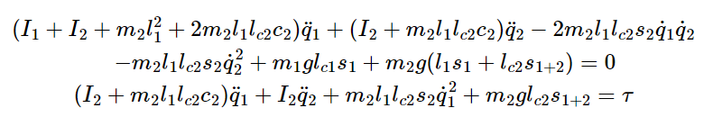
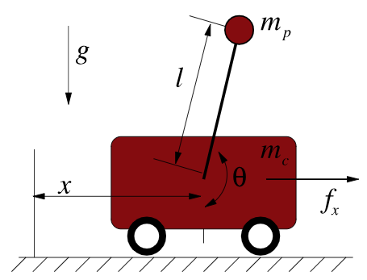
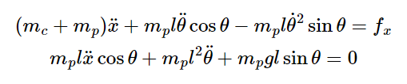
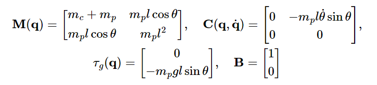
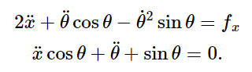
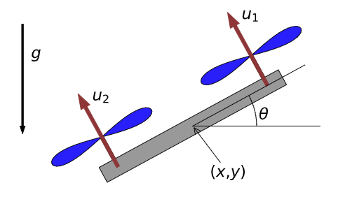

## Acrobots, Cart-Poles and Quadrotors (Applying Linearization and LQR)

Canonical underactuated systems, and how to control them.

### Acrobot
2-link planar robot with only an actuator at the elbow:

 

The goal of the Acrobot is to achieve the state $x =\begin{bmatrix}
           \pi \\
           0 \\
           0 \\
           0
         \end{bmatrix}$

Consider $I_1$ and $I_2$ the Moments of Inertia about the pivots for each link.

Let's first use Euler Lagrange to solve for the 2 equations of motion ($s1$ is shorthand for $\sin(\theta_1)$, and $c_{1+2}$ is shorthand for $\cos(\theta_1 + \theta_2)$, etc.):

 

where $\tau$ is a Generalized Force applied on the system (the torque from the elbow actuator).

Let's express this in the form of the manipulator equations by combining $q = \begin{bmatrix}
           q_1 \\
            q_2
         \end{bmatrix}$; essentially, each equation in the Euler Lagrange EoMs becomes a row of the manipulator equations (note that $u$ = $\tau$):

$$ M(q) \ddot{q} + C(q, \dot{q})\dot{q} = \tau_g(q) + Bu $$

 

Linearization and LQR will be easier having the EoMs in this single matrix equation.

Our approach for controlling the acrobot will be to first develop a linear controller (i.e. LQR) for the system linearized around the target fixed point/state (which is $x =\begin{bmatrix}
           \pi \\
           0 \\
           0 \\
           0
         \end{bmatrix}$). First, then, let's linearize the manipulator equation.

Because our system also has a non-constant $u$, we need to linearize around a fixed point in both $x$ and $u$, so let's denote the fixed point $x^*$ and $u^*$. As we typically do with linearization, let's also define "errors": $\bar{x} = x-x^*$ and $\bar{u} = u-u^*$ (so the linearization is around $\bar{x}$ and $\bar{u}=0$). Using a 1st order Taylor Approximation around the fixed point, we get: 

 

where $f(x,u)$ is the dynamics equation for the given system (i.e. the manipulator equation). If the fixed point we choose is an equilibrium point, then $f(x^*, u^*) = 0$ (velocity and acceleration at equilibrium = 0). Then, our equation is linear in terms of $\bar{x}, \bar{u}$:

$$\dot{\bar{x}} = A_{lin} \bar{x} + B_{lin} \bar{u}$$

where $A_{lin}$ and $B_{lin}$ are constant matrices resulting from evaluating $[\frac{\delta f}{\delta x}]_{x=x^*, u=u^*}$ and $[\frac{\delta f}{\delta u}]_{x=x^*, u=u^*}$ respectively.

If we evaluate $A_{lin}$ and $B_{lin}$ using the manipulator equation for $f(x,u)$, we get the block matrices:

 

Note that the linearization gives us quite a good approximation; if the linearized system is stable, then the nonlinear system is locally exponeitially stable. If the linearized system is unstable, the nonlinear system is locally unstable.

Now, to optimally control the system, we use LQR. We just define a quadratic cost with which to optimize (where $Q$ and $R$ are positive definite symmetric matrices):

$$ J(x^*) = \int^\infty_0 [x^TQx + u^TRu] dt $$

Then:

$$u(t) = -Kx(t)$$

We call `K = LinearQuadraticRegulator(A, B, Q, R)` passing in $A, B, Q, R$, and get the resulting control $K$ out.

  

### Cartpole

 

We define $q = \begin{bmatrix}
           x \\
           \theta \\
         \end{bmatrix}$ and try to stabilize around $x = \begin{bmatrix}
           0 \\
           \pi \\
           0 \\
           0
         \end{bmatrix}$.

Once again using Euler Lagrange to solve for the 2 equations of motion:

 

where $f_x$ is the generalized force applied on the system (the horizontal force the cart generates).

Re-expressing this in the form of the manipulator equations:

 

To solve for the optimal controller, we once again linearize the system's dynamics and apply LQR. To linearize, we perform the same first-order Taylor series expansion as above on the manipulator equation given that we have already solved for all the elements of the manipulator equation. Next, we simply define a quadratic cost and plug in matrices $A, B, Q, R$ into the LQR to get the optimal controller back. This procedure is all the same as for the acrobot.

<!-- For the cartpole, it's simple to isolate the accelerations:

 

For simplicity, let's just say all constants are 1:

  -->

  

### Quadrotors

(Technically a bi-rotor in the planar case):

 

The equations of motion are extremely simple:

 

Same as for the acrobot and cartpole, we can re-express these EoMs as the manipulator equation, linearize it, then apply LQR to control it to a desired state $x^*$ and $u^*$.

  

## Controllability

Controllability: If a system with dynamics $\dot{x} = f(x,u)$ has an input signal $u(t)$ that can move the system from any initial state to any final state in finite time.

For a linear system (or a linear approximation of a nonlinear system), this can be analytically calculated. Assuming the dynamics are of the form:

$$\dot{x} = Ax + Bu$$

The system is controllable if the matrix is full rank:

 

**Derivation:**

The analytical solution ($x(t)$) to the linear ODE is as follows: 

 

As can be seen, we make an assumption here for a stabilizing controller, that $x(t_f) = 0$. You can simplify this solution even further to an equation of this form:

$$x(0) = M*\begin{bmatrix}
           f_0(u) \\
           f_1(u) \\
           \dots \\
           f_n-1(u)
         \end{bmatrix}$$ 
         
where $M$ is the controllability matrix. Therefore, for every initial condition $x(0)$, there must be a correspoding set of $u$ (and therefore, $f_i(u)$). This is true when $M$ has linearly independent rows (each row of $M$ maps to an element in $x(0)$, and each element of $x(0)$ needs to be independently "actuatable").

The full derivation is here ("A general solution"): https://underactuated.mit.edu/acrobot.html#controllability_matrix

## Stabilizability

Stabilizability: If the system has an unconstrained input $u(t)$ that reaches $\lim_{t \rightarrow \infty} x(t) = 0$.

Controllability requires that we arrive at the origin in a finite time, stabilizability allows for asympotitic convergence.

LQR will solve optimal control for any linear system that is stabilizable. Note that both the acrobot and cart-pole are controllable (and therefore also stabilizable).

Also note that an underactuated system can be controllable (i.e. acrobot and cart-pole).