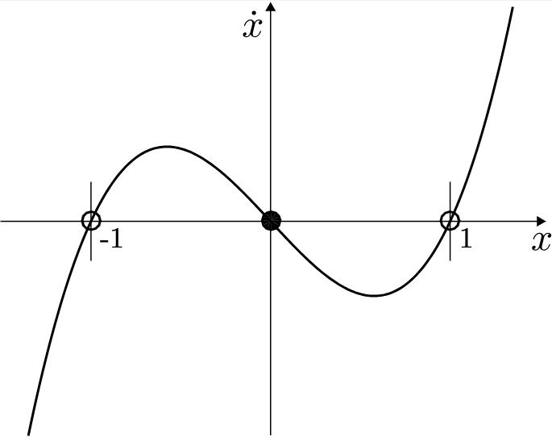
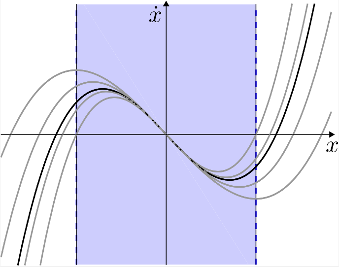

# Lyapunov Analysis

What/why? Lyapunov is not an optimal control scheme; it is more of a "viable" control scheme--will you get to $x^*$ eventually or not. Comparing to Value Iteration:

$$ \dot{J}^*(x) = -\ell(x, u^*) $$
$$ \text{vs} $$
$$ \dot{V}(x) \prec 0 $$

We can see that HJB's result is a (specifically, the optimal) Lyapunov function (if $\ell(x, u)$ is positive definite). While HJB requires the function to take on a specific gradient value, the Lyapunov just requires that the function is decreasing.

## Lyapunov Functions ($V$)

Any positive definite function (denoted as $V \succ 0$) of system state that decreases (possibly weakly) with time as the system evolves.

### Lyapunov's Direct Method

Computes whether a system is locally stable, asymptotically stable, or exponentially stable (or none) using $V$.

#### Stable in the sense of Lyapunov

Given system dynamics $\dot{x} = f(x)$, and some small region/subset of $\R^N$ around the origin $D$, if you can produce $V(x)$ such that:

$$ V(x) > 0, ~~~\forall x \in D \backslash \{0\}~~~ V(0)=0 $$

and

$$ \dot{V}(x) = \frac{\delta V}{\delta x} f(x) \leq 0, ~~~\forall x \in D \backslash \{0\} ~~~\dot{V}(0)=0$$

Then $x=0$ is stable in the sense of Lyapunov.

What these two requirements mean, intuitively: the first states that $V(x)$ must be positive at all $x$ in $D$, and $0$ at $x=0$. The seconds states that $V(x)$ must be decreasing or zero for all $x$ in $D$, and $0$ at $x=0$. 

#### Asymptotically Stable

$$ \dot{V}(x) = \frac{\delta V}{\delta x} f(x) < 0, ~~~\forall x \in D \backslash \{0\} ~~~\dot{V}(0)=0$$

#### Exponentially Stable

$$ \dot{V}(x) = \frac{\delta V}{\delta x} f(x) \leq -\alpha V(x), ~~~\forall x \in D \backslash \{0\} ~~~\dot{V}(0)=0$$

for some $\alpha>0$. Also, the same, but with a requirement on the rate that $V(x)$ decreases over time.

### Lyapunov Analysis for Global Stability

Stability in the sense of Lyapunov is an inherently local notion (with the epsilon/delta balls), but asymptotic and exponential stability can apply globally.

Notation note: 
 - $g(x) \succ 0$ = positive definite function ($g(x) > 0$, $g(0) = 0$)
 - $g(x) \prec 0$ = negative definite function ($g(x) < 0$, $g(0) = 0$)
 - $g(x) \succeq 0$ = positive semi-definite function ($g(x) \geq 0$, $g(0) = 0$)

#### Global Asymptotic Stability

If:

$$ V(x) \succ 0$$
$$ \dot{V}(x) = \frac{\delta V}{\delta x} f(x) \prec 0$$
$$ V(x) \rightarrow \infty ~~\text{whenever}~~ ||x|| \rightarrow \infty$$

This last condition is called "radial instability".

#### Global Exponential Stability   

If we have global asymptotic stability and that:

$$ \dot{V}(x) \preceq -\alpha V(x) $$

In other words (where $x^*$ is the point around which the system is stable): 

$$\exists ~C, \alpha ~~s.t.~~ ||x(t)-x^*|| < Ce^{-\alpha t} ||x(0)-x^*||$$

### LaSalle's Invariance Principle

Makes it possible to state asymptotic stability even when $\dot{V}(x) \preceq 0$ instead of $\dot{V}(x) \prec 0$.

If:

$$ V(x) \succ 0 ~~~\text{and}~~~ \dot{V}(x) \preceq 0$$
$$ V(x) \rightarrow \infty ~~\text{whenever}~~ ||x|| \rightarrow \infty$$

Then $x$ will converge to the largest "invariant set" where $\dot{V}(x) = 0$. An "invariant set" is the set of $x$ where, once the system enters the set, it never leaves. Basically, if $\dot{V}(x)$ is only negative semidefinite instead of negative definite, LaSalle's states that the system will converge to anywhere in the largest invariant set, instead of just where $V(x)=0$.

ALTERNATE FORMULATION: If:

$$ V(x) \succ 0 ~~~\text{and}~~~ \dot{V}(x) \preceq 0$$

and if $x(t)$ is a bounded trajectory, $x(t)$ will converge to the largest "invariant set" where $\dot{V}(x) = 0$. (This formulation does not require radial unboundedness).

Consider the example of the simple (non-actuated) damped pendulum; we can use the energy of the pendulum as the Lyapunov function. Then, $V(x) \succ 0$ and $\dot{V}(x) \preceq 0$, and $x(t)$ is a bounded trajectory for a pendulum.

Then, LaSalle's states that the pendulum will converge to the largest invariant set where $\dot{V}=0$; for the damped pendulum, this the set of all the fixed points; once you enter a fixed point ($\theta = k \pi, \dot{\theta}=0$), $\dot{V}=0$, and, obviously, the pendulum will not leave it. So, the pendulum will converge to either the bottom or top position.

### Pendulum Example

Recall the dynamics of an actuated, undamped pendulum: $ ml^2 \ddot{\theta} + mgl \sin\theta = u$.

The energy of the system is: $E(x) = \frac{1}{2} ml^2 \dot{\theta}^2 - mgl\cos(\theta)$.

Then, $\dot{E} = ml^2 \ddot{\theta} \dot{\theta} + mgl \sin{\theta} \dot{\theta} = u \dot{\theta}$.

If our goal is to stand the pendulum up, then $E^d = E(x^*) = mgl$.

Let's pick the Lyapunov function $V(x) = \frac{1}{2}\tilde{E}^2$, where $\tilde{E} = E(x) - E^d$. Clearly, $V(x) \succ 0$.

Then the derivative of the Lyapunov function is: $\dot{V}(x) = \tilde{E}*\dot{\tilde{E}} = \tilde{E} * \dot{E} = \tilde{E} * u \dot{\theta}$.

In order to get a system that converges to $E^d = mgl$, we need to pick some $u$ such that $\dot{V}(x) \prec 0$, and $\dot{V}(x^*)=0 $.

We pick $u=-k\dot{\theta}\tilde{E}$ (for some positive constant $k$). Then, $\dot{V}(x)=\tilde{E}*u \dot{\theta} = \tilde{E}*(-k\dot{\theta}\tilde{E})\dot{\theta} = -k\dot{\theta}^2\tilde{E}^2$. Clearly, $\dot{V}(x)$ is decreasing except when $E(x) = E^d$, when it is zero.

Therefore, we validate that this control policy will be successful in getting the system to the "homoclinic orbit": when $E = E^d = mgl$. Once the pendulum is in homoclinic orbit, we can switch to a simpler policy like LQR to stabilize around the upright position specifically (but note that the control policy we picked cannot do this final step).

In this example, we had no systematic way to choose $u$; we simply picked something that would obviously make $\dot{V}(x)$ negative definite. Next, we look at more analytical ways to do this.

### Regions of Attraction

Regions of attraction are another useful idea to prove that a system will converge to a specific fixed point/invariant set. They are particularly useful because they allow you to find the exact state-space region from which the system will converge.

Definition: Region of attraction to $x^*$ = largest set $D \subseteq X $ for which $x(0) \in D \implies lim_{t \rightarrow \infty} x(t) = x^*$. Regions of attraction are connected invariant sets. 

Firstly, any sublevel set of a Lyapunov function is an invariant set; this is clear bc $\dot{V}(x) \leq 0$, so once you reach a certain $V(x)$, you cannot reach any state with higher $V(x)$.

**Lyapunov Invariant Set and Region of Attraction Theorem:**

If we can find $V(x) \succ 0$ and a sublevel set of $V(x)$ $G: \{x|V(x) \leq \rho\}$, where, for all $x$ in $G$: $\dot{V}(x) \preceq 0$, then $G$ is an invariant set. By LaSalle, $x$ will converge to the largest invariant subset of $G$ where $\dot{V} = 0$.

Example: consider this 1D system, $\dot{x} = -x + x^3$:

 

Consider the Lyapunov function $V(x) = \frac{1}{2}x^2$. Firstly, observe that we have sublevel sets $G$ at any $|x| < k$. Also, $\dot{V}(x) = -x^2 + x^4$, which is negative for $|x| < 1$. This satisfies the conditions for $|x| < 1$ being a region of attraction. This means, for any $-1 < x(0) < 1$, $x$ will converge to the origin, where $V(0) = 0$.

### Lyapunov Functions with Uncertainty

Imagine you want to prove stability of a system with an uncertain parameter $\alpha_{min} \leq \alpha \leq \alpha_{max}$: $\dot{x} = f_\alpha(x)$. Then we must find a Lyapunov function $V(x)$ where $\dot{V}(x) \leq 0$ for all possible $\alpha$.

Example: consider the same system above with uncertainty: $\dot{x} = -x + \alpha x^3, ~~~ \frac{3}{4} < \alpha < \frac{3}{2}$

 

As can be seen, the various $\alpha$ change the dynamics slightly, with the blue region representing the smallest region of attraction.

To solve this region of attraction analytically: $\dot{V} = -x^2 +\alpha x^4$ which is negative for $x^2 > \alpha x^4$, or $|x| < \frac{1}{\sqrt{\alpha_{max}}}$.

With other types of uncertainty, the fixed point of the system could shift; the goal in these cases would still be to find the region of attraction, to guarantee that the system will at least reach the region (and it's hard to say anything about the exact point of convergence).

### Barrier Functions

For continuously-differential dynamical system, if you can find a function $B(x)$ where $\forall x, \dot{B}(x) \leq 0$, then the system will never reach states with $B(x(t)) >B(x(0))$. This is useful if we can ensure "failure" regions have higher $B$ values than $x(0)$. 

 
 

## Lyapunov as an Algorithm

The general idea is this:

Inputs: 
 - system dynamics.
 - parameterized family of polynomial/trigonometric functions for the Lyapunov function (technically, you pass in a vector of "nonlinear basis functions" and a vector of decision variables).

Output: Coefficients for the polynomial + certificate of stability $\forall x$.

Example poly/trig function family for the pendulum: $V = (a - bc_0 + cs_0\dot{\theta}_0 + ds_0^2 + ec_0^2 + f\dot{\theta}^2_0)$

You formulate an optimization problem to solve for the the coefficients of the nonlinear basis functions.

### Computing Lyapunov Functions using Linear Programming and Sampling

With system dynamics: $\dot{x} = f(x)$

We parameterize the Lyapunov function like so:

$$V(x) = \sum_{j=0}^J \alpha_j \phi_j(x) = \alpha^T \phi(x)$$

where each $\phi_j(x)$ is some nonlinear basis function (of which there are a total of $J$). We would typically manually select the basis functions based on prior knowledge about the dynamics of the system (i.e. a single pendulum might have $1$, $\theta$, $\cos \theta$, $\sin \theta$, $\cos^2 \theta$, $\theta^2$ as its basis functions).

We sample a bunch of states $x_i$. Make Lyapunov function; pick $\alpha$ to satisfy all of these constraints:

$$ \forall x_i ~~~~V(0) = 0, ~~~~V(x_i) > \epsilon x_i^Tx_i, ~~~~\dot{V}(0) = 0, ~~~~\dot{V}(x_i) = \frac{\delta V}{\delta x} \bigg|_{x=x_i} f(x_i)< -\epsilon x_i^Tx_i$$

Basically, we're adding constraints to the program that $V(0)$ and $\dot{V}(0)$ are $0$, $V(x)$ is positive definite and radially unbounded, and the derivative of $V(x)$ is negtive definite/strictly decreasing (to guarantee asymptotic stability).

Plugging in our parameterization of $V(x)$, we get linear constraints in terms of $\alpha$ (the nonlinear terms will be evaluated at each $x_i$ and will become constants):

$$ V(0) = 0, ~~~~\alpha^T \phi(x_i) > \epsilon x_i^Tx_i, ~~~~\dot{V}(0) = 0, ~~~~\alpha^T \frac{\delta \phi}{\delta x} f(x_i) < -\epsilon x_i^Tx_i$$

With just these linear constriant and no objective, an LP solder could return any feasible $\alpha$, so to ensure a more reasonable answer, we add the linear objective: $ min_\alpha | \dot{V}(x_i)+1|$ (try to make gradient of $V(x)$ 1).

This probably works (assuming enough samples $x_i$), but since we only validate the Lyapunov function constraints on finite # of samples $x_i$, no certificate of stability.

### Computing Lyapunov Functions for Linear Systems

If our system satisfies $\dot{x} = Ax$ (it's a linear system), we can solve a Lyapunov equation analytically and quite easily.

For linear systems, valid Lyapnuov functions only exist of the (quadratic) form:

$$V(x) = x^TPx,~~~ P = P^T \succ 0$$

$$\dot{V}(x)  = \frac{\delta V}{\delta x} f(x) = 2x^TPAx= x^TPAx + x^TA^TPx \prec 0$$

If we find a valid lyapunov function, we guarantee global exponential stability (exponential because $\dot{V}(x) = -\alpha V(x)$).

(Note that $V(x)$ does satisfy radial unboundedness bc $P \succ 0$. Also, note that $x^TPAx = x^TA^TPx$ because they are both scalars, and $(x^TPAx)^T = x^TA^TPx$.)

To satisfy the $\dot{V}(x)\prec 0$, we just need (since the $x^Tx \geq 0$):

$$PA+A^TP \prec 0$$

This can be formulated as an SDP with decision variable $P$ and constraints (note that you can easily express a negative semidefinite constraint as a PSD constraint by multiplying by $-1$ and flipping the inequality): 

$$ P \succeq 0, ~~~PA + A^TP \preceq 0 $$ 

**Sidenote**: for linear systems, it's obvious that SDP is a bit overkill; instead, if $A$ is stable (all its eigenvalues have negative real parts $\rightarrow$ system's response decays to zero at $t=\infty$), then we can just solve for $P \succeq 0$ for any $Q = Q^T \succ 0$: $ PA + A^T P = -Q$

This method of solving the Lyapunov function of a linear system can also be used to propose Lyapunov functions for nonlinear systems by performing a linearization, and often works for proving local stability (and can be supplemented with region of attraction analysis).

#### Example: Lyapunov analysis for linear system with uncertainty

Suppose you have a linear system $\dot{x} = Ax$ with $A$ unknown, but bounded. Then we define some $A_i$ that represent the vertices of the convex set bounding the set of possible $A$.

Then, the solve the SDP for $P$ (yielding the Lyapunov function for this uncertain system):

$$ P \succeq 0, ~~~\forall i, P A_i + A_i^T P \preceq 0$$

Note that in this case with multiple $A_i$, it's possible that $P$ is unsolvable even if all the $A_i$ are stable. This is simply because the quadratic form of $V(x)$ is not expressive enough.

### Computing Lyapunov Functions for Global Stability for Polynomial Systems using SOS

Now, we show how to solve Lyapunov functions for systems with polynomial dynamics.

We parameterize our Lyapunov function like so (where $\alpha \geq 0$): 

$$V_\alpha(x) = \alpha_0 + \alpha_1 x_1 + \alpha_2 x_2 + \alpha_3 x_1x_2 + \alpha_4 x_1^2 ...$$

Our first goal will be to re-express this as a Sum of Squares (SOS). This means, given $\phi(x)$, a vector of hand-selected nonlinear basis functions (i.e. $\begin{bmatrix}
1 \\
x \\
y \\
xy \\
x^2 \\
...
\end{bmatrix}$), finding some $P$ satisfying:

$$ V_\alpha(x) = \alpha_0 + \alpha_1 x_1 + \alpha_2 x_2 + \alpha_3 x_1x_2 + \alpha_4 x_1^2 ... = \phi^T(x) P \phi(x), ~~~P \succeq 0$$

$$ -\dot{V}_\alpha(x) = - \frac{\delta V_\alpha}{\delta x} f(x) = \phi^T(x) Q \phi(x)  ~~~Q \succeq 0$$

Note that $\phi(x)$ only needs to contain monomials up to $\frac{1}{2}$ the degree of the $V_\alpha(x)$.

If we can solve this optimization for both $\alpha$, $P$, and $Q$, then we have a valid Lyapunov equation. The key reason this works for polynomial dynamics is that, firstly, $V_\alpha(x)$ is still positive semidefinite; and, secondly, if $f(x)$ is polynomial, $\frac{\delta V_\alpha}{\delta x} f(x)$ is also a polynomial, so it's still possible to express this as a SOS, ensuring $\dot{V}_\alpha(x)$ is negative semidefinite.

The optimization itself should be solved using an SDP; $P \succeq 0$ and $Q \succeq 0$ are clearly PSD constraints, and the "SOS" equalities $\alpha_0 + \alpha_1 x_1 + \alpha_2 x_2 + ... = \phi^T(x) P \phi(x)$ are actually just linear equality constraints.

In practice, you can use an "SOS" optimization solver, which will take "SOS" constraints and automatically determine the appropriate basis functions $\phi(x)$, and solve $P$ and $Q$ behind the scenes (they are not actually needed for the final Lyapunov function $V(x)$). In this case, you would express the optimization like so:

$$ \text{find } \alpha: ~~~~~~~~~V_\alpha(x) \text{ is SOS},~~~V_\alpha(0) = 0, ~~~P \succeq 0$$
$$ ~~~~~~~~~~~-\dot{V}_\alpha(x) = - \frac{\delta V_\alpha}{\delta x} f(x) \text { is SOS} $$

A similar formulation works for not just polynomials, but $\sin$ and $\cos$ too. You just need to account for trigonometric identities with the linear constraints that match the polynomial terms to basis function terms.

Note however, that it's not always possible to solve for $V_\alpha(x)$ given polynomial dynamics, though these cases are rare and generally engineered.

<!-- The set of PSD matrices between (i.e. interpolated between) two PSD matrices is a convex set (all matrices remain PSD) $\rightarrow$ searching this space is a convex optimization. -->

#### Example: Searching for a Lyapunov function via SOS

Consider a system with nonlinear dynamics:

$$ \dot{x}_0 = -x_0 - 2x_1^2 ~~~~~~~~~~~~~$$
$$ \dot{x}_1 = -x_1 - x_0x_1 - 2x_1^3 $$

Let's parameterize the Lyapunov function:

$$V(x) = c_0 + c_1x_0 + c_2x_1 + c_3x_0^2 + c_4x_0x_1 + c_5x_1^2$$

Then we set the constraints of our optimization (where $c$ are the decision variables): 

$$ V(x) \text{ is SOS}, ~~~ -\dot{V}(x) \text{ is SOS} $$

We also add the constraint $V(0) = 0$, and $V([1,0])= 1$ to ensure all the $c$ remain a reasonable scale.

Then, solving this optimization, we come out with correct values of $c$ for a valid Lyapunov function: $V(x) = x_0^2+ 2x_1^2$.

### Aside: Optimization

 - Linear Program (LP): linear cost ($c^Tx$), linear constraints ($Ax \leq b$).
 - Quadratic Program (QP): quadratic cost ($\frac{1}{2} x^TQx + c^Tx$), linear constraints ($Ax \leq b$).
 - 2nd Order Cone Program (SOCP): quadratic cost ($\frac{1}{2} x^TQx + c^Tx$), conical constraints ($Ax \leq b$) ?????
 - Semi-deifinite Program (SDP): linear cost ($c^Tx$), linear constraints ($Ax \leq b$) + P.S.D matrix constraints (i.e. contraining a matrix to be PSD).
 - Sum of Squares (SOS): mroe of a "frontend" for SDP; allows you to pass in SOS constrants ("$p_\alpha(x)$ is SOS" where $p_\alpha(x)$ is a polynomial w/coefficients $\alpha$).
   - will automatically figure out the right basis functions for $\phi^T(x) P \phi(x)$ and solve for $\alpha$ and $P$ using SDP.