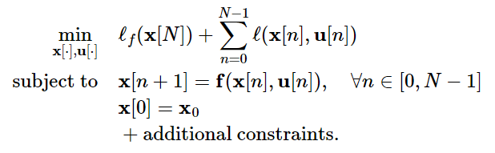
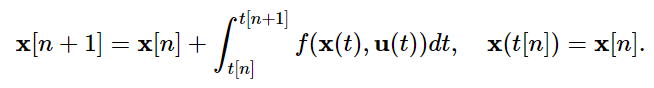
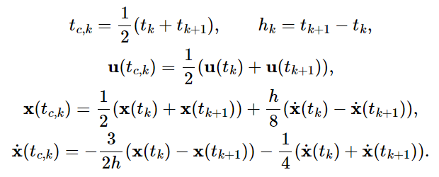
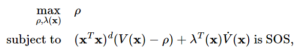

# Trajectory Optimization

The big idea: Stop searching for "policies" ($\forall x$ initial conditions); only search for control given $x_{now}$.

Breaks the curse of dimensionality.

Think about it: control policies make sense for simple systems like a pendulum; but for a humanoid, the robot will never visit all of its possible states anyway (the number of possible states scales exponetially with DoF). Control policies don't make sense.

## Problem Definition

 - $\dot{x} = f(x,u)$
 - $x_0$
 - $u(t)$ over $t \in [t_0, t_f]$
 - finite horizon cost: $J_u(x_0) = \ell_f(x(t_f)) + \int_{t_0}^{t_f} \ell(x(t),u(t))~dt$
   - $\ell_f(x(t_f))$ = termination cost

Trajectory optimization problem:

$$ \begin{align*}
    \min_u \quad & J_u(x_0) = \ell_f(x(t_f)) + \int_{t_0}^{t_f} \ell(x(t),u(t))~dt \\
    \text{subject to} \quad & \dot{x}(t) = f(x(t), u(t)) \\
    & x(t_0) = x_0
\end{align*} $$

May have other constraints (non-collision, input limits, etc.).

To make this problem solvable, $u(t)$ will have to be parameterized by a finite number of decision variables. One can already see that the problem of parameterization is much easier for traj. opt. than solving for a global control policy; the dimension of the parameterization of $u(t)$ may grow linearly with time and state space dimension, while, i.e. for Value Iteration on a mesh, the dimension of the mesh grows exponentially with dimension of the state space.

## Linear Systems, Discrete Time (Convex Optimization)

Dynamics of the form: $x[n+1] = Ax[n] + Bu[n]$.

### Direct Transcription

Goal:

$$ \begin{align*}
    \min_{x[\cdot], u[\cdot]} \quad & l_f(x[N]) + \sum_{n=0}^{N-1} l(x[n], u[n]) \\
    \text{subject to} \quad & x[n+1] = Ax[n] + Bu[n], & \forall n \in [0, N-1] \\
    & x[0] = x_0 \\
    & \text{other linear constraints...}
\end{align*} $$

Commonly, another constraint is for $x[N] = x_f$.

The idea of "Direct Transcription" is to model $x[\cdot]$ as decision variables and dynamics as a constraint.

With a linear system and a linear or quadratic cost, we could solve this using LP or QP.

In the case of a quadratic cost, you might notice this problem formulation is similar to LQR (except, of course, LQR solves a global policy). LQR is easier to solve than a QP too. The main benefit of this formulation is that you can specify other linear constraints for your trajectory; this is not possible with LQR.

We can also pick $l_f(x[N]) = x^T S x$, where $S$ is the solution to the LQR formulation of this problem. What this intuitively means is that, beyond $t=N$, we approximate the cost of the rest of time with the optimal solution to the unconstrained problem.

Also note--$N$ must be selected manually; if $N$ were a decision variable of the optimization, then the number of $x[\cdot]$ and $u[\cdot]$ decision variables would be variable. However, if, for example, you want to solve a minimum time problem to a particular $x_f$, you can solve the optimiztion multiple times until you find the minimum $N$ where a feasible answer is still produced.

Note that Direct Transcription can be used with non-linear systems--instead of constraining $x[n+1] = Ax[n] + Bu[n]$, you have $x[n+1] = f(x[n], u[n])$.

#### Discretization Errors

With discrete-time dynamics, there is some discretization error. For example, if you have continuous dynamics:

$$ \dot{x} = Ax + Bu $$

This lends to discrete-time dynamics (using Euler Integration):

$$ x[n+1] = x[n] + \Delta t * (Ax[n] + Bu[n]) $$

Clearly, we are making a constant $\dot{x}$ assumption each $\Delta t$ time step, which loses accuracy.

With linear systems only, there is a possibility of removing this error by taking an actual integration of $\dot{x}$: 

$$ x[n+1] = x[n] + \int_{t_n}^{t_n + \Delta t} (Ax[n] + Bu[n])dt = \Delta t*(e^{A*dt} x[n] + Bu[n]) $$

However, with discreet time systems, there is one discretization error that is not possible to resolve: $u$ is only parameterized at each time step (rather than being a continuous function), losing accuracy and optimality.

### Direct Shooting

In Direct Transcription, having $x[n]$ as a decision variable, and including the dynamics as a constraint, leads to both extra decision variables and constraints. Instead, we can just formulate our optimization as a single constraint, applying the dynamics in "forward simulation" for $n$ steps:

$$ \begin{align*}
x[1] &= Ax[0] + Bu[0] \\
x[2] &= A(Ax[0] + Bu[0]) + Bu[1] \\
x[n] &= A^nx[0] + \sum_{k=0}^{n-1} A^{n-1-k}Bu[k]  \end{align*}$$

Notice how this is still linear in the decision variables $u$ (can still be solved with convex optimization given a convex cost). The optimization then does not even need a constraint related to the dynamics (we plug the equation for $x[n]$ directly into the cost function):

$$ \begin{align*}
    \min_{u[\cdot]} \quad & l_f(x[N]) + \sum_{n=0}^{N-1} l(A^nx[0] + \sum_{k=0}^{n-1} A^{n-1-k}Bu[k], u[n]) \\
\end{align*} $$

Except, if you want a $x[N] = x_f$ constraint, you would need to specify $x[N]$ as $A^Nx[0] + \sum_{k=0}^{N-1} A^{N-1-k}Bu[k]$.

#### Drawbacks of Direct Shooting

Usually, numerically infeasible (requires explicitely computing $A^n$, which usually is not possible on a 64-bit machine).

Also, puts a huge weight on $u[0]$ compared to $u[N]$ ($u[0]$ is multiplied by $A$ to a much higher power), which makes the optimization numerically difficult. While this is true in real life (your first action matters more), this is better distributed in the constraints in Direct Transcription, where the solver can enforce constraints in both directions (i.e. modify an earlier action to fit withn a constraint relative to a later action).

In addition, if you do have many constraints on $x$ (i.e. $x[n] \leq 2 ~\forall ~n$), each constraint requires an instance of $A^nx[0] + \sum_{k=0}^{n-1} A^{n-1-k}Bu[k]$, so the efficiency is quickly lost. It's more natural to simply have $x[\cdot]$ as decision variables in practice.

Also, the "sparsity" of the constraints (each constraint touches a small number of decision variables) in Direct Transcription makes it not too bad to solve. 

Direct Transcription is more common in practice.

## Non-Linear Systems, Discrete Time (Non-Convex Optimization)

Direct Transcription and Direct Shooting still work, just becomes a nonconvex optimization.

General formulation of Direct Transcription:

 

General formulation of Direct Shooting is also ~identical to the linear formulation, except you compose the nonlinear dynamics.

To better approximate continuous-time dynamics, you similarly perform an integration over $\dot{x}$ instead of an Euler integration:

 

There are also many numerical integrators that can perform this operation with varying speed/accuracy (https://drake.mit.edu/doxygen_cxx/group__integrators.html0). 

### Direct Collocation

In general, the formulation is very similar to direct transcription, except the input trajectory and state trajectory are parameterized as piecewise polynomial functions (specifically as first-order polynomials,and cubic polynomials, respectively).

The decision variables for the optimization are simply sample points in $u(t)$ and $x(t)$; for $u(t)$ (a first-order, linear polynomial), two samples fully define the trajectory. For $x(t)$ (a cubic spline), two samples, along with two derivatives at those samples (which can be computed using system dynamics from $x(t)$ and $u(t)$), can fully define the $x(t)$ trajectory. 

Clarification: there is a separate 1st order hold for $u(t)$ and cubic polynomial for $x(t)$ between each sample point.

The optimization does require constraints on the dynamics of the system: $x(t_{k+1}) = x(t_k) + \int_{t_k}^{t_{k+1}} f(x(t), u(t)) dt$. These constraints are applied at each collocation point of the system. The collocation points are chosen at the midpoints (in the time-axis) between each breakpoint. 

 

where each $t(k)$ is a breakpoint time, and $h$ is the time step. Euler integration is used to apply the dynamics from $x(t_k)$ (sample point) to $x(t_{c,k})$ (collocation point). 

Overall, the optimization is expressed like so:

$$ \begin{align*}
    \min_{x[\cdot], u[\cdot]} \quad & l_f(x[N]) + \sum_{n=0}^{N-1} \Delta t * l(x[n], u[n]) \\
    \text{subject to} \quad & \dot{x}(t_{c,n}) = f(x(t_{c,n}), u(t_{c,n})), & \forall n \in [0, N-1] \\
    & x[0] = x_0 \\
    & \text{other linear constraints...}
\end{align*} $$

(Sidenote: we're also multiplying $\Delta t$ in the summation in the cost function because this is a continuous time formulation, where $\ell()$ returns the rate of change of cost.)

Most solvers will also allow you to apply an initial guess for $x[\cdot], u[\cdot]$.

## Trajectory Stabilization

The basic problem with direct transcription/shooting/collocation is that they solve for the trajectory given the initial state... and that is all. They don't use any feedback to ensure the robot actually follows that trajectory in real life.

Therefore, direct transcription/shooting/collocation are not enough in real life. Real life has small disturbances (plus, if you are using Euler Integration or an approximated method of integration to roll forward your dynamics, this introdues more inaccuracy) that will cause the system to miss the trajectory.

This is where Trajectory Stabilization comes into play.

### Local LQR (Linearizing around Trajectory)

Call $x_0(t)$ and $u_0(t)$ the trajectory points at time $t$. We will linearize around these points.

Then, $\tilde{x}(t) = x(t) - x_0(t)$ and $\tilde{u}(t) = u(t) - u_0(t)$.

Performing the linearization using a 1st-order Taylor Series:

$$\begin{align*}
    \dot{x}(t) &= f(x_0(t), u_0(t)) + \frac{\delta f}{\delta x} \bigg |_{x_0(t),u_0(t)}(x-x_0) + \frac{\delta f}{\delta u}\bigg |_{x_0(t),u_0(t)} (u-u_0) \\ 
    &= \dot{x}_0(t) + \frac{\delta f}{\delta x}\bigg |_{x_0(t),u_0(t)} (x-x_0(t)) + \frac{\delta f}{\delta u}(u-u_0(t)) \\
    \dot{\tilde{x}}(t) &= A(t)\tilde{x} + B(t)\tilde{u}

\end{align*}$$

Notice how $A$ and $B$ are no longer constant--we call this now a time-varying system.

LQR still works even if $A$ and $B$ are time-varying, and given a finite horizon ($t_f$ = time trajectory ends). The problem formulation looks almost identical to classic LQR:

$$ \min_{u(t)} \int_{0}^{t_f} \tilde x^T(t)Q \tilde x(t) + \tilde u^T(t)R \tilde u(t) ~dt $$

$$\dot{\tilde x}(t) = A(t) \tilde x(t) + B(t) \tilde u(t)$$

The solution looks like this (the optimal cost-to-go is now a function of time because the horizon is finite (intuitively, being at a far-away state at $t=0$ is much less bad thn being at a far-away state at $t$ close to $t_f$))  (where $S(t) \succ 0$):

$$J^*(x,t) = \tilde x^TS(t) \tilde x $$

$$\tilde u^* = -K(t) \tilde x$$

This simple control strategy--re-linearizing and re-applying LQR with a finite-horizon at a fixed loop speed--can achieve very robust control with real world disturbances.

Note: LQR assumes the target state can be reached by $t_f$. In the classic (infinite-horizon) LQR case, the target state can obviously be reached in infinite time. In the finite-horizon LQR case, we are giving the controller authority over the duration of the trajectory.

Note: using LQR to solve means we cannot add other constraints like input limits or state constraints.

Note: you ***can*** have even $Q$ and $R$ be functions of time.

Note: Having a cost-to-go function that is a function of time --> HJB equation is slightly different (has additional partial derivative w.r.t time term): 
$$ 0 = \min_u \bigg [\ell(x, u) + \frac{\delta J^*}{\delta  x} \bigg|_{x,t} f_c(x, u) + \frac{\delta J^*}{\delta  t} \bigg|_{x,t} \bigg ] $$

This means the solution for $S(t)$ is also different: $Q-S(t)B(t)R^{-1}B^T(t)S(t) + 2S(t)A(t) = -\dot{S}(t)$

#### Limitation of Time-Varying Linearization

Trajectories are solved as functions of time. Therefore, if there are unexpected forces/dynamics applied on the system, the nominal point around which linearization is done, $x_0, u_0$, will continue moving forward in time even though the system is no longer following the trajectory; in this case, $\tilde{x}$ and $\tilde{u}$ can increase significantly, making the linearization less and less accurate. The control policy can fail in this case.

Simply remapping time by always performing the linearization around the nearest $x, u$ on the trajectory to the current $x, u$, can introduce other instabilities, so is not a good option either. TODO: give example

### Time-Varying Lyapunov

If we locally linearize as with the "Local LQR" method, we can analyze the stability of the resulting time-varying system. We can write time-varying Lyapunov conditions:

$$\forall t \quad V(x, t) \succ 0, ~V(0, t) = 0$$
$$ \dot{V}(t, x) = \frac{\delta V}{\delta x} f(x) + \frac{\delta V}{\delta t} \preceq 0$$

Or, if we're interested in how much perturbation around the planned trajectory the system can take to still arrive at the target state (i.e. certifying regions of attraction):

$$ V(x, t) \leq \rho(t) \implies \dot{V}(x, t) \leq \dot{\rho}(t) \quad \forall t \in [t_0, t_f] $$

where we can parameterize $\rho(t)$ as a polynomial. 

Using LQR as our controller, we get an optimal cost-to-go function $ J^*(x) = x^T Sx $ (where $S \succ 0$) that we can use as our Lyapunov function (recall that cost-to-go functions are weakly decreasing). Then, $\rho(t)$ can be solved with an SOS optimization:

Common in practice is to actually sample discrete times along the trajectory and solve for $\rho$ at each sample to get an approximation of $\rho(t)$. To solve for each $\rho$, we use the method discussed in *4) Lyapunov Analysis*:

 

where $d$ is a fixed positive integer, and we use the appropriate $A(t), B(t), K(t), S(t)$ for the sampled time.

Knowing $\rho(t)$ gives us an idea of the size of the region of stability for the system and controller (this is simply an analysis tool).

### Model Predictive Control (MPC)

**Repeat every time step:**
1. Estimate current state $\hat{x}$
2. Solve traj opt w/ $x[0] = \hat{x}$ for $N$ steps into the future ("receding horizon"), i.e. using direct collocation
3. Execute $u[0]$ and let dynamics evolve

Note: you must solve the traj opt multiple steps into the future even if you discard $u[1] ... u[N]$, since you cannot have an "optimal control" unless you consider the future.

Recursive feasibility is an important notion: if a feasible solution is found in one time step, it should not be lost in future time steps. The basic formultion of MPC does not have this; by having a receding horizon, essentially every time step, MPC adds a new constraint at a future time that has not been considered before; this constraint could cause sudden infeasibility. There are a few ideas to combat this:
 - Add a constraint that $x[k+N+1] = x^*$ (where $k$ is the current time step), where $x^*$ is the target state at the end of the trajectory. If the controller can get to $x^*$ by $t = k + N$, then it is sure to be feasible to get there in time steps beyond that. (This only works for short trajectories or very long horizons)
    - Extension: if you can define a "safe set" where you know the system can converge to $x^*$ from this set, constraint $x[k+N+1]$ to be in this set.
 - "heuristic penalty / heuristic constraint on the last couple of states" - TODO: update this

### Linear Model Predictive Control (MPC)

Same principle as MPC, but perform a linearization of the system around the current state at each time step, then perform linear optimal control (general MPC might just do a nonlinear optimization), i.e. with direct transcription or direct shooting. The reason for this is that convex optimization can give you guarantees of optimality and feasibility that non-convex optimization cannot.

This is also very similar to Local LQR, except we don't restrict ourselves to an LQR cost and optimization, so Linear MPC can still solve optimizations with other linear constraints. 

The downside to Linear MPC compared to Local LQR is 

You can, in fact combine Local LQR and Linear MPC, using LQR if you know you are far from the linear constraints, and switching to MPC otherwise. Local LQR is more computationally efficient, and Local LQR is more tractable for analysis (i.e. SOS optimization for verifying regions of attraction).

## Case Study: Perching Plane
1. Direct Collocation to solve trajectory
2. Linearization + LQR to stabilize along trajectory
3. Cost-to-go from LQR as Lyapunov function (cost-to-go strictly decreases each time step)
4. Find largest $\rho(t)$

## iLQR (Iterative LQR)

iLQR full code example: https://deepnote.com/workspace/michael-zengs-workspace-61364779-69ef-470a-9f8e-02bf2b4f369c/project/10-Trajectory-Optimization-Duplicate-604fbbf9-5cbe-438f-ab43-250212f50cd7/notebook/ilqr_driving-6003b030a7da40b2ab690aa54e6242d9

iLQR is a method of *trajectory optimization* (comparable to Direct Collocation or Direct Transcription). It is frequently paired with trajectory stabilization techniques like MPC.

The algorithm begins with an initial guess for the trajectory (i.e. linear interpolation between initial and target state) $\bar{\mathbf{x}}[\cdot], \bar{\mathbf{u}}[\cdot]$, and iteratively switches between solving Local LQR-like problems along the trajectory using approximated costs/dynamics to calculate the optimal control, and rolling these controls forward (with true costs/dynamics) to evaluate true performance of the controller and derive a new "guess" for the trajectory.

<!-- (note that $\bar{\mathbf{u}}[\cdot]$ does not matter in the initial guess--it will be overridden in the first ).  -->

**In detail, these are the steps of the algorithm:**

1. Backward Pass: The broad goal of the backward pass is to find the optimal control policy $\delta \mathbf{u}[n]^*$ that minimizes the quadratic Taylor approximation (around $\bar{\mathbf{x}}[n], \bar{\mathbf{u}}[n]$) of the Q-function $Q(\mathbf{x}[n], \mathbf{u}[n])$.

The Q-function is a recursive measure of total cost. It is defined according to the Bellman equation (recall that $Q$ is dependent on both state and action; $V$ is only dependent on state assuming you take the optimal action at that state ($Q(x[n], u^*[n]) = V(x[n])$)):

$$ Q(\mathbf{x}[n], \mathbf{u}[n]) = \ell(\mathbf{x}[n], \mathbf{u}[n])  + V(\mathbf{x}[n+1]) $$
$$ V(\mathbf{x}[n]) = \ell_f(\mathbf{x}[N]) $$

In other words, each backward pass, our primary goal is (with a quadratic approximation of the Q-function), for all $n$:

$$ \begin{aligned} \delta \mathbf{u}[n]^* &= {\arg\!\min}_{\delta \mathbf{u}[n]} \quad Q(\mathbf{x}[n], \mathbf{u}[n])  \\ 
&= {\arg\!\min}_{\delta \mathbf{u}[n]} \quad Q_n  + \begin{bmatrix} Q_{\mathbf{x},n} \\  Q_{\mathbf{u},n} \end{bmatrix} ^T  \begin{bmatrix} \delta \mathbf{x}[n] \\ \delta \mathbf{u}[n] \end{bmatrix} + \frac{1}{2}\begin{bmatrix} \delta \mathbf{x}[n] \\ \delta \mathbf{u}[n] \end{bmatrix} ^T \begin{bmatrix} Q_{\mathbf{xx},n} &  Q_{\mathbf{ux},n}^T\\  Q_{\mathbf{ux},n} & Q_{\mathbf{uu},n}\end{bmatrix}\begin{bmatrix} \delta \mathbf{x}[n] \\ \delta \mathbf{u}[n] \end{bmatrix} \end{aligned} $$

Note about notation: all $Q$ with $n$ in the subscript are evaluated at $\bar{\mathbf{x}}[n], \bar{\mathbf{u}}[n]$. The subscripts with $\mathbf{x}$ or $\mathbf{u}$ denote partial derivatives with respect to those variables.

We solve the backward pass starting from $n=N$ to $n=0$, because of the recursive nature of the Bellman equation (the value function is known only at $n=N$ and must be solved backwards to $n=0$).

To solve this $\arg\!\min_{\delta \mathbf{u}[n]}$ problem, we need to express $Q_{\mathbf{x},n}, Q_{\mathbf{u},n}, Q_{\mathbf{xx},n}, Q_{\mathbf{ux},n},$ and $Q_{\mathbf{uu},n}$ in terms of $\mathbf{x}$ and $\mathbf{u}$, which is not trivial. We can look back to the Bellman equation to try to express all the partials of $Q$ as partials of $\ell[n]$ and $V[n+1]$, since $\ell[n]$ and $V[n+1]$ are known equations in terms of $\mathbf{x}$ and $\mathbf{u}$ (we can assume by inductive hypothesis that the $V[n+1]$ and its partials were solved in the previous iteration with a base case at iteration 0: $V(\mathbf{x}[n]) = \ell_f(\mathbf{x}[N])$). We simply expand both sides of the Bellman equation using 2nd order Taylor Approximations:

$$ \begin{aligned} Q(\mathbf{x}[n], \mathbf{u}[n]) & \approx \ell_n + \begin{bmatrix}\ell_{\mathbf{x},n} \\  \ell_{\mathbf{u},n} \end{bmatrix} ^T  \begin{bmatrix} \delta \mathbf{x}[n] \\ \delta \mathbf{u}[n] \end{bmatrix} + \frac{1}{2}\begin{bmatrix} \delta \mathbf{x}[n] \\ \delta \mathbf{u}[n] \end{bmatrix} ^T \begin{bmatrix}\ell_{\mathbf{xx},n} &  \ell_{\mathbf{ux},n}^T\\  \ell_{\mathbf{ux},n} & \ell_{\mathbf{uu},n}\end{bmatrix} \begin{bmatrix} \delta \mathbf{x}[n] \\ \delta \mathbf{u}[n] \end{bmatrix}, \\ & \quad + V_{n+1} + V_{\mathbf{x},n+1}^T  \delta \mathbf{x}[n+1] + \frac{1}{2}\delta \mathbf{x}[n+1]^T V_{\mathbf{xx},n+1} \delta \mathbf{x}[n+1], \\& = Q_n + \begin{bmatrix} Q_{\mathbf{x},n} \\  Q_{\mathbf{u},n} \end{bmatrix} ^T  \begin{bmatrix} \delta \mathbf{x}[n] \\ \delta \mathbf{u}[n] \end{bmatrix} + \frac{1}{2}\begin{bmatrix} \delta \mathbf{x}[n] \\ \delta \mathbf{u}[n] \end{bmatrix} ^T \begin{bmatrix} Q_{\mathbf{xx},n} & Q_{\mathbf{ux},n}^T\\  Q_{\mathbf{ux},n} & Q_{\mathbf{uu},n}\end{bmatrix} \begin{bmatrix} \delta \mathbf{x}[n] \\ \delta \mathbf{u}[n] \end{bmatrix}.\end{aligned} $$

We'll need to expand out $\delta \mathbf{x}[n+1]$ in terms of $\mathbf{x}$ and $\mathbf{u}$:

$$
\begin{aligned}
\delta \mathbf{x}[n+1] & = \mathbf{x}[n+1] - \bar{\mathbf{x}}[n+1] \\
& = \mathbf{f}_n + \begin{bmatrix} \mathbf{f}_{\mathbf{x},n} & \mathbf{f}_{\mathbf{u},n} \end{bmatrix} 
\begin{bmatrix} \delta \mathbf{x}[n] \\ \delta \mathbf{u}[n] \end{bmatrix} - \bar{\mathbf{x}}[n+1] \\
& = \mathbf{f}_n + \begin{bmatrix} \mathbf{f}_{\mathbf{x},n} & \mathbf{f}_{\mathbf{u},n} \end{bmatrix} 
\begin{bmatrix} \delta \mathbf{x}[n] \\ \delta \mathbf{u}[n] \end{bmatrix} - \mathbf{f}(\bar{\mathbf{x}}[n], \bar{\mathbf{u}}[n]) \\
& = \begin{bmatrix} \mathbf{f}_{\mathbf{x},n} & \mathbf{f}_{\mathbf{u},n} \end{bmatrix} 
\begin{bmatrix} \delta \mathbf{x}[n] \\ \delta \mathbf{u}[n] \end{bmatrix}.
\end{aligned}
$$

Plugging in the value for $\delta \mathbf{x}[n+1]$ into the expanded Bellman equation:

$$ \begin{aligned} Q(\mathbf{x}[n], \mathbf{u}[n]) & \approx \ell_n + \begin{bmatrix}\ell_{\mathbf{x},n} \\  \ell_{\mathbf{u},n} \end{bmatrix} ^T  \begin{bmatrix} \delta \mathbf{x}[n] \\ \delta \mathbf{u}[n] \end{bmatrix} + \frac{1}{2}\begin{bmatrix} \delta \mathbf{x}[n] \\ \delta \mathbf{u}[n] \end{bmatrix} ^T \begin{bmatrix}\ell_{\mathbf{xx},n} &  \ell_{\mathbf{ux},n}^T\\  \ell_{\mathbf{ux},n} & \ell_{\mathbf{uu},n}\end{bmatrix} \begin{bmatrix} \delta \mathbf{x}[n] \\ \delta \mathbf{u}[n] \end{bmatrix}, 

\\ & \quad + V_{n+1} + V_{\mathbf{x},n+1}^T  \begin{bmatrix}\mathbf{f}_{\mathbf{x},n} &  \mathbf{f}_{\mathbf{u},n} \end{bmatrix}   \begin{bmatrix} \delta \mathbf{x}[n] \\ \delta \mathbf{u}[n] \end{bmatrix} + \frac{1}{2} \begin{bmatrix} \delta \mathbf{x}[n] \\ \delta \mathbf{u}[n] \end{bmatrix}^T \begin{bmatrix}\mathbf{f}_{\mathbf{x},n}^T \\  \mathbf{f}_{\mathbf{u},n}^T \end{bmatrix}  V_{\mathbf{xx},n+1} \begin{bmatrix}\mathbf{f}_{\mathbf{x},n} &  \mathbf{f}_{\mathbf{u},n} \end{bmatrix}   \begin{bmatrix} \delta \mathbf{x}[n] \\ \delta \mathbf{u}[n] \end{bmatrix}, 

\\& = Q_n + \begin{bmatrix} Q_{\mathbf{x},n} \\  Q_{\mathbf{u},n} \end{bmatrix} ^T  \begin{bmatrix} \delta \mathbf{x}[n] \\ \delta \mathbf{u}[n] \end{bmatrix} + \frac{1}{2}\begin{bmatrix} \delta \mathbf{x}[n] \\ \delta \mathbf{u}[n] \end{bmatrix} ^T \begin{bmatrix} Q_{\mathbf{xx},n} & Q_{\mathbf{ux},n}^T\\  Q_{\mathbf{ux},n} & Q_{\mathbf{uu},n}\end{bmatrix} \begin{bmatrix} \delta \mathbf{x}[n] \\ \delta \mathbf{u}[n] \end{bmatrix}.\end{aligned} $$

Finally, to get values of $Q_{\mathbf{x},n}, Q_{\mathbf{u},n}, Q_{\mathbf{xx},n}, Q_{\mathbf{ux},n},$ and $Q_{\mathbf{uu},n}$, we compare coefficients of each term on the left and rght side of the equation. In the end, we get:

$$ Q_{\mathbf{x},n} = \ell_\mathbf{x}^T + V_\mathbf{x}^T \mathbf{f}_\mathbf{x} \\
Q_{\mathbf{u},n} = \ell_\mathbf{u}^T + V_\mathbf{x}^T \mathbf{f}_\mathbf{u} \\
Q_{\mathbf{xx},n} = \ell_\mathbf{xx}^T + \mathbf{f}_\mathbf{x}^T V_\mathbf{xx} \mathbf{f}_\mathbf{x} \\
Q_{\mathbf{ux},n} = \ell_\mathbf{ux}^T + \mathbf{f}_\mathbf{u}^T V_\mathbf{xx} \mathbf{f}_\mathbf{x} \\
Q_{\mathbf{uu},n} = \ell_\mathbf{uu}^T + \mathbf{f}_\mathbf{u}^T V_\mathbf{xx} \mathbf{f}_\mathbf{u} $$

Now, we can solve for $\arg\!\min_{\delta \mathbf{u}[n]}$ by taking the derivative of the Q-function (notice that the Q-funtion is quadratic) and setting it to 0:

$$
0 = \frac{\partial}{\partial \delta \mathbf{u}[n]} \bigg ( Q_n  + \begin{bmatrix} Q_{\mathbf{x},n} \\  Q_{\mathbf{u},n} \end{bmatrix} ^T  \begin{bmatrix} \delta \mathbf{x}[n] \\ \delta \mathbf{u}[n] \end{bmatrix} + \frac{1}{2}\begin{bmatrix} \delta \mathbf{x}[n] \\ \delta \mathbf{u}[n] \end{bmatrix} ^T \begin{bmatrix} Q_{\mathbf{xx},n} &  Q_{\mathbf{ux},n}^T\\  Q_{\mathbf{ux},n} & Q_{\mathbf{uu},n}\end{bmatrix}\begin{bmatrix} \delta \mathbf{x}[n] \\ \delta \mathbf{u}[n] \end{bmatrix} \bigg )
$$

Expanding the right side of this equation (and ommitting terms without $\delta \mathbf{u}[n]$):

$$
0 =\frac{\partial}{\partial \delta \mathbf{u}[n]} \bigg ( Q_{\mathbf{u},n}^T \delta \mathbf{u}[n] + 2 \delta \mathbf{x}[n]^T Q_{\mathbf{ux},n}^T \delta \mathbf{u}[n] + \delta \mathbf{u}[n]^T Q_{\mathbf{uu},n} \delta \mathbf{u}[n] \bigg )~~~~~~~~~
$$

We get a solution of the form: $\delta \mathbf{u}[n]^* = k + K \delta \mathbf{x}[n]$, with:

$$
k = -Q_{\mathbf{uu}}^{-1} Q_\mathbf{u} \\
K = -Q_{\mathbf{uu}}^{-1} Q_\mathbf{ux}
$$

Finally, we solve for $V_{x,n}$ and $V_{xx,}$, since these will be used in the next iteration of the backward pass. The idea here is simple: realize that $V(x[n]) = Q(x[n],u[n]^*)$ by definition. Then, we can simply plug in $\delta \mathbf{u}[n]^*$ into the equation for the Q-function, then equate this to the V-function, and express $V_{x,n}$ and $V_{xx,}$ in terms of the partials of $Q$. In detail:

 

2. Forward Pass: Now that the backward pass has solved $\delta \mathbf{u}[n]^*$, the forward pass applies $\delta \mathbf{u}[n]^*$ to the original (nonlinear) system dynamics for each time step in the trajectory, while keeping track of running total cost. (This is as simple as it sounds). This will result in a new, likely different $\mathbf{x}[n], \mathbf{u}[n]$ than the nominal trajectory. 

Repeat these two steps process until convergence (the total cost stops decreasing between interations). As iterations progress, the trajectory should tend toward optimal with second order convergence (very fast), as the linearizations of the dynamics get better and better as the trajectory changes less between iterations.

#### Convergence Guarantees

With differentiable dynamics, iLQR will always converge to a *locally* optimal solution. At each time step, we pick an optimal policy that minimizes the cost; so the total cost will always reduce.

(If the dynamics are not differentiable, you can clearly see how the math above will not work; you cannot compute any partials of $\mathbf{f}$).

iLQR will not solve globally optimal trajectory optimization because the optimization at each time step is based on a local linearization; this makes iLQR's notion of optimality local by nature.

#### Main Advantage of iLQR

The primary advantage is for nonlinear systems; for any of the other methods described above (direct transcription, direct shooting, direct collocation), non-convex optimization is required to solve. Meanwhile, iLQR can rely on only convex optimization (at the expense of sacrificing global optimality), which makes it generally more computationally efficient.

### DDP (Differential Dynamics Programming)

Very similar to iLQR, except, instead of taking a linear approximation of the system dynamics, you take a quadratic approximation. Of course, this will have a slight impact on the math in the backward pass.