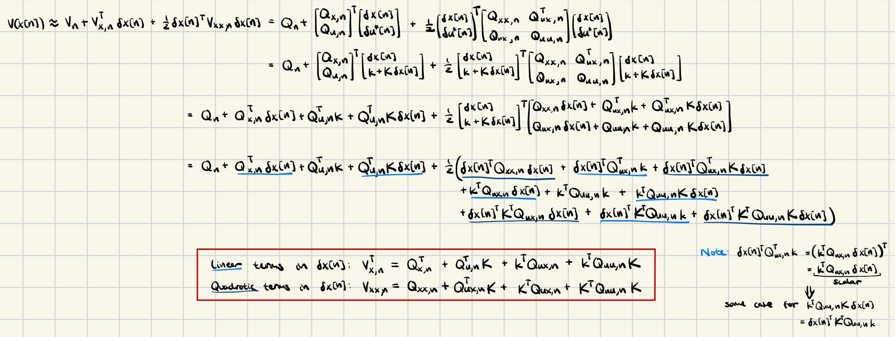
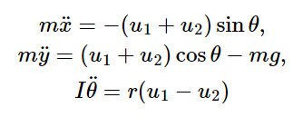

# Trajectory Optimization

The big idea: Stop searching for "policies" ($\forall x$ initial conditions); only search for control given $x_{now}$.

Breaks the curse of dimensionality.

Think about it: control policies make sense for simple systems like a pendulum; but for a humanoid, the robot will never visit all of its possible states anyway (the number of possible states scales exponetially with DoF). Control policies don't make sense.

## Problem Definition

 - $\dot{x} = f(x,u)$
 - $x_0$
 - $u(t)$ over $t \in [t_0, t_f]$
 - finite horizon cost: $J_u(x_0) = \ell_f(x(t_f)) + \int_{t_0}^{t_f} \ell(x(t),u(t))~dt$
   - $\ell_f(x(t_f))$ = termination cost

Trajectory optimization problem:

$$ \begin{align*}
    \min_u \quad & J_u(x_0) = \ell_f(x(t_f)) + \int_{t_0}^{t_f} \ell(x(t),u(t))~dt \\
    \text{subject to} \quad & \dot{x}(t) = f(x(t), u(t)) \\
    & x(t_0) = x_0
\end{align*} $$

May have other constraints (non-collision, input limits, etc.).

To make this problem solvable, $u(t)$ will have to be parameterized by a finite number of decision variables. One can already see that the problem of parameterization is much easier for traj. opt. than solving for a global control policy; the dimension of the parameterization of $u(t)$ may grow linearly with time and state space dimension, while, i.e. for Value Iteration on a mesh, the dimension of the mesh grows exponentially with dimension of the state space.

### Note on Solvability

In the case of non-convex costs and constraints/dynamics, the bottom line is that no traj. opt. method described here can guarantee global optimality. Direct Transcription, Direct Shooting, Direct Collocation will yield nonconvex optimization problems. Methods like iLQR can guarantee convergence to local minima. 

To achieve/guarantee global optimality, usually convex relaxations (SOS programming, SDP relaxation), branch-and-bound methods (TODO: learn more), or, special cases with the system dynamics (i.e. differential flatness), are needed. Usually, SOS relaxations and branch-and-bound methods become too computationally expensive to be practical for real-time control.

## Direct Transcription

Goal:

$$ \begin{align*}
    \min_{x[\cdot], u[\cdot]} \quad & l_f(x[N]) + \sum_{n=0}^{N-1} l(x[n], u[n]) \\
    \text{subject to} \quad & x[n+1] = Ax[n] + Bu[n], & \forall n \in [0, N-1] \\
    & x[0] = x_0 \\
    & \text{other linear constraints...}
\end{align*} $$

Commonly, another constraint is for $x[N] = x_f$.

The idea of "Direct Transcription" is to model $x[\cdot]$ as decision variables and dynamics as a constraint.

With a linear system and a linear or quadratic cost, we could solve this using LP or QP.

In the case of a quadratic cost, you might notice this problem formulation is similar to LQR (except, of course, LQR solves a global policy). LQR is easier to solve than a QP too. The main benefit of this formulation is that you can specify other linear constraints for your trajectory; this is not possible with LQR.

We can also pick $l_f(x[N]) = x^T S x$, where $S$ is the solution to the LQR formulation of this problem. What this intuitively means is that, beyond $t=N$, we approximate the cost of the rest of time with the optimal solution to the unconstrained problem.

Also note--$N$ must be selected manually; if $N$ were a decision variable of the optimization, then the number of $x[\cdot]$ and $u[\cdot]$ decision variables would be variable. However, if, for example, you want to solve a minimum time problem to a particular $x_f$, you can solve the optimiztion multiple times until you find the minimum $N$ where a feasible answer is still produced.

Note that Direct Transcription can be used with non-linear systems--instead of constraining $x[n+1] = Ax[n] + Bu[n]$, you have $x[n+1] = f(x[n], u[n])$.

### Discretization Errors

With discrete-time dynamics, there is some discretization error. For example, if you have continuous dynamics:

$$ \dot{x} = Ax + Bu $$

This lends to discrete-time dynamics (using Euler Integration):

$$ x[n+1] = x[n] + \Delta t * (Ax[n] + Bu[n]) $$

Clearly, we are making a constant $\dot{x}$ assumption each $\Delta t$ time step, which loses accuracy.

With linear systems only, there is a possibility of removing this error by taking an actual integration of $\dot{x}$: 

$$ x[n+1] = x[n] + \int_{t_n}^{t_n + \Delta t} (Ax[n] + Bu[n])dt = \Delta t*(e^{A*dt} x[n] + Bu[n]) $$

There are also many numerical integrators that can perform this operation with varying speed/accuracy (https://drake.mit.edu/doxygen_cxx/group__integrators.html0). 

However, with discreet time systems, there is one discretization error that is not possible to resolve: $u$ is only parameterized at each time step (rather than being a continuous function), losing accuracy and optimality.

In general, Direct Transcription is the simplest and easiest for formulate, but the least accurate.

## Direct Shooting

In Direct Transcription, having $x[n]$ as a decision variable, and including the dynamics as a constraint, leads to both extra decision variables and constraints. Instead, we can just formulate our optimization as a single constraint, applying the dynamics in "forward simulation" for $n$ steps:

$$ \begin{align*}
x[1] &= Ax[0] + Bu[0] \\
x[2] &= A(Ax[0] + Bu[0]) + Bu[1] \\
x[n] &= A^nx[0] + \sum_{k=0}^{n-1} A^{n-1-k}Bu[k]  \end{align*}$$

Notice how this is still linear in the decision variables $u$ (can still be solved with convex optimization given a convex cost). The optimization then does not even need a constraint related to the dynamics (we plug the equation for $x[n]$ directly into the cost function):

$$ \begin{align*}
    \min_{u[\cdot]} \quad & l_f(x[N]) + \sum_{n=0}^{N-1} l(A^nx[0] + \sum_{k=0}^{n-1} A^{n-1-k}Bu[k], u[n]) \\
\end{align*} $$

Except, if you want a $x[N] = x_f$ constraint, you would need to specify $x[N]$ as $A^Nx[0] + \sum_{k=0}^{N-1} A^{N-1-k}Bu[k]$.

If your system dynamics are nonlinear, the principle of Direct Shooting still applies, you just compose the nonlinear dynamics.

### Drawbacks of Direct Shooting

Usually, numerically infeasible (requires explicitely computing $A^n$, which usually is not possible on a 64-bit machine).

Also, puts a huge weight on $u[0]$ compared to $u[N]$ ($u[0]$ is multiplied by $A$ to a much higher power), which makes the optimization numerically difficult. While this is true in real life (your first action matters more), this is better distributed in the constraints in Direct Transcription, where the solver can enforce constraints in both directions (i.e. modify an earlier action to fit within a constraint relative to a later action).

<!-- In addition, if you do have many constraints on $x$, each constraint requires an instance of $A_i^nx[0] + \sum_{k=0}^{n-1} A_i^{n-1-k}B_iu[k]$, so the efficiency is quickly lost. It's more natural to simply have $x[\cdot]$ as decision variables in practice. -->

Also, the "sparsity" of the constraints (each constraint touches a small number of decision variables) in Direct Transcription makes it not too bad to solve. 

Direct Transcription is more common in practice. Direct Shooting is generally only viable for simple trajectories with few/no constraints.

## Direct Collocation

Core idea: Instead of solving the continuous optimal control problem, discretize time into $N$ segments parameterized by polynomials (specifically as first-order polynomials, and cubic polynomials, respectively) and enforce system dynamics are carefully chosen collocation points. The decision variables are the state, control inputs, and state derivative at each breakpoint between segments.

This is still considered a "transcription" method, since we are still transcribing the continuous dynamics into discrete constraints enforced at certain time steps.

Direct collocation is generally used for nonlinear systems (assuming you don't liearize them) in the context of longer-horizon trajectory optimization, and solved with NLP solvers like SNOPT or IPOPT. For nonlinear systems, the smoothness and having no discretization error are important for accuracy and numerical stability. Also, for nonlinear systems, the polynomial trajectory parameterization can allow longer time steps and decrease overall variable and constraint count. However, for linear systems, direct transcription is almost always chosen over direct collocation. Firstly, trajectory optimization for linear systems, in practice, is usually done with short horizons in the context of a linearized nonlinear system, in which case small timesteps are fine and parameterizing the state trajectory as a cubic spline is just overkill/computationally more expensive. 

For each interval $[t_k, t_{k+1}]$, the control input trajectory is parameterized by a linear function:

$$u(t) = u_k + \frac{t - t_k}{h_k} (u_{k+1} - u_k)$$

where $u_k$ and $u_{k+1}$ are the control values at the breakpoints, and $h_k = t_{k+1} - t_k$ is the duration of this segment.

For each interval $[t_k, t_{k+1}]$, the state trajectory is parameterized by a cubic spline:

$$x(t) = a_k + b_k (t - t_k) + c_k (t - t_k)^2 + d_k (t - t_k)^3,$$

$a_k, b_k, c_k, d_k$ are the coefficients of the cubic polynomial which are fully determined by the state and state derivative at the start and end of the cubic spline:

1. $x(t_k) = x_k$: State at the start of the interval.
2. $x(t_{k+1}) = x_{k+1}$: State at the end of the interval.
3. $\dot{x}(t_k) = \dot{x}_k$: Velocity at the start of the interval.
4. $\dot{x}(t_{k+1}) = \dot{x}_{k+1}$: Velocity at the end of the interval.

i.e. if $x(t_k), x(t_{k+1}), \dot{x}(t_k), \dot{x}(t_{k+1})$ are known, then $a_k, b_k, c_k, d_k$ are fully determined. 

The system dynamics are enforced at the collocation points, which are chosen as the midpoint of each interval: 

$$ t_{c,k} = \frac{t_k + t_{k+1}}{2}$$

For each interval $[t_k, t_{k+1}]$, we define these intermediate variables (called the collocation points) where the dynamics will be enforced:

$$
\begin{align*}
\mathbf{u}(t_{c,k}) &= \frac{1}{2} \left( \mathbf{u}(t_k) + \mathbf{u}(t_{k+1}) \right), \\[8pt]
\mathbf{x}(t_{c,k}) &= \frac{1}{2} \left( \mathbf{x}(t_k) + \mathbf{x}(t_{k+1}) \right) + \frac{h_k}{8} \left( \dot{\mathbf{x}}(t_k) - \dot{\mathbf{x}}(t_{k+1}) \right), \\[8pt]
\dot{\mathbf{x}}(t_{c,k}) &= -\frac{3}{2h_k} \left( \mathbf{x}(t_k) - \mathbf{x}(t_{k+1}) \right) - \frac{1}{4} \left( \dot{\mathbf{x}}(t_k) + \dot{\mathbf{x}}(t_{k+1}) \right).
\end{align*}
$$

The first two equations for $u(t_{c,k})$ and $x(t_{c,k})$ compute linear and cubic interpolations between the value of $u$ and $x$ at the breakpoints. The third equation for $\dot{x}(t_{c,k})$ evaluates the derivative of the cubic spline at the collocation point.

Finally, then, the dynamics are applied at these collocation points: 

$$ \dot{x}(t_{c,k}) = f(x(t_{c,k}), u(t_{c,k})) \quad \forall k \in [0, N-1]$$

Note that continuity of the state and control trajectories between segments is automatically enforced by simply using the same variable for adjacent segments.

The full optimization is expressed like so:

$$ \begin{align*}
    \min_{\forall k. ~x[t_k], u[t_k]} \quad & l_f(x[N]) + \sum_{n=0}^{N-1} h_k * l(x[n], u[n]) \\
    \text{subject to} \quad & \dot{x}(t_{c,n}) = f(x(t_{c,n}), u(t_{c,n})), & \forall n \in [0, N-1] \\
    & x[0] = x_0 \\
    & x[N] = x_f \\
    & \text{other constraints, i.e. control inputs, etc...}
\end{align*} $$

(Sidenote: we're also multiplying the time step $h_k$ in the summation in the cost function because this is a continuous time formulation, where $\ell()$ returns the rate of change of cost. However, you could use a more advanced integration method to calculate the cost than a simple Euler integration).

$N$ (the number of piecewise polynomial functions used to parameterize the trajectory), along with $h_k$, the time interval for each piecewise polynomial function, must be user-defined. Obviously, larger $N$ and smaller $h_k$ results in more variables/constraints but higher trajectory fidelity. Ballpark choices might be $h_k = 0.05$, $N=50$ (for 2.5 second long trajectory).

## Kinematic Trajectory Optimization

This is a somewhat different view on traj opt compared to transcription, shooting, collocation methods. This is less concerned about encoding dynamic constraints, and more concerned about kinematic feasibility (i.e. smoothness and respecting velocity/acceleration/higher-order derivative limits). It's strategy is to solve a smooth path in robot configuration space, and it assumes that such a path will be dynamically feasible (THIS ASSUMPTION IS NOT ALWAYS VALID. See last paragraph of this section). It is also formulated as an optimization problem.

We parameterize a trajectory in configuration space using something like a B-spline with some pre-set number of control points (B-splines have nice properties -- the entire traj remains within the convex hull of the control points, and derivatives (w.r.t. time) of B-splines are still B-splines, so enforcing derivative constraints at the control points also enforces the derivative constraints along the entire trajectory). These control points are the decision variables of the optimization. A simple cost can be something like the length of the B-spline. Constraints are then all applied to the B-spline. For example, velocity, acceleration, jerk limits are applied as linear constraints on the control points of the 1st, 2nd, and 3rd derivative of the B-spline (derivatives of B-splins are still just linear combinations of the control points). Obstacle avoidance can be achieved by adding minimum-distance constraints at discrete samples along the B-spline (though this would obviously be non-convex in general).

To parameterize time within the trajectory, we add scalar $T$, the duration of the trajectory, as a additional decision variable (you can also imagine having a simple linear time-cost with $T$). B-splines are actually functions of not only the control points, but also the knot vector (which is usually just fixed beforehand for simplicity/numerical feasibility) and a time parameter $u$. The knot vector is a vector of weakly increasing values describing the time intervals at which each control point is "active"/influencing the spline. $u$, which ranges from 0 to 1, "traces" along the spline. The equation for a B-spline is:

$$ x(u) = \sum_{i=0}^n N_{i,p}(u) \mathbf{P}_i $$

 - $x(u)$ is the point on the curve at parameter $u$.
 - $\mathbf{P}_i$ are the control points.
 - $N_{i,p}(u)$ are the B-spline basis functions of degree $p$, which depend on the knot vector and $u$.

$T$ is then used as a time-rescalar, where, previously, $u \in [0,1]$, now, $u \in [0,T]$. Note that the velocity, acceleration, and higher-order derivative constraints all do need to be scaled by $T$ as well, leading to non-linearity for acceleration and higher-order derivatives, though velocity constraints are still linear ([source](https://chatgpt.com/share/6771a0a2-bde0-8009-8056-a5d603fa77bb)).

Note that, even though the optimization only optimizes the control points and full trajectory duration $T$, it still has some control over the timing of the whole trajectory. For example, if acceleration constraints are not being satisfied, the optimization may increase $T$ to slow the entire trajectory down or move control points around to give more space to accelerate up to speed.

There's one major flaw to Kinematic traj opt, and there's a reason it's not covered in *"Underactuated"* Robotics. It assumes a smooth path in robot configuration space is dynamically feasible, but this isn't always true; for example, underactuated systems might not have the control authority to follow an arbitrary trajectory through configuration space. Additionally, constraints that are highly correlated to the robot's dynamics (i.e. torque limits, which care about inertias, gravity, coriolis force) aren't able to be expressed easily.

In general, kinematic trajectory optimization is good for fully-actuated, powerful robots where pure power can basically override the robot's dynamics, i.e. robot arms.

## Trajectory Stabilization / Tracking / Control

Direct transcription/shooting/collocation are methods of traj. opt. -- that is, they solve for the blind, feed-forward trajectory given the initial state... and that is all. They don't use any feedback to ensure the robot actually follows that trajectory.

Therefore, direct transcription/shooting/collocation are not enough in real life. Real life has small disturbances (plus, if you are using Euler Integration or an approximated method of integration to roll forward your dynamics, this introduces more inaccuracy) that will cause the system to miss the trajectory.

This is where Trajectory Stabilization comes into play.

### Time-Varying LQR (Linearizing around Trajectory)

Call $x_0(t)$ and $u_0(t)$ the trajectory points at time $t$. We will linearize the system dynamics around these points.

Also, define error coordinates: $\tilde{x}(t) = x(t) - x_0(t)$ and $\tilde{u}(t) = u(t) - u_0(t)$.

Performing the linearization of the dynamics using a 1st-order Taylor Series:

$$\begin{align*}
    \dot{x}(t) &= f(x_0(t), u_0(t)) + \frac{\delta f}{\delta x} \bigg |_{x_0(t),u_0(t)}(x-x_0) + \frac{\delta f}{\delta u}\bigg |_{x_0(t),u_0(t)} (u-u_0) \\ 
    &= \dot{x}_0(t) + \frac{\delta f}{\delta x}\bigg |_{x_0(t),u_0(t)} (x-x_0(t)) + \frac{\delta f}{\delta u}(u-u_0(t)) \\
    \dot{\tilde{x}}(t) &= A(t)\tilde{x} + B(t)\tilde{u}

\end{align*}$$

Notice how $A$ and $B$ are no longer constant--we call this now a time-varying system.

LQR still works even if $A$ and $B$ are time-varying, and given a finite horizon ($t_f$ = time trajectory ends). The problem formulation looks almost identical to classic LQR (the last $\tilde{x}^\top Q_f \tilde{x}$ term is a terminal cost):

$$ J^*(\tilde{x}(t_{\text{now}}), t_{\text{now}}) = \min_{u(t)} \int_{t_{\text{now}}}^{t_f} \tilde x^\top(t)Q \tilde x(t) + \tilde u^\top(t)R \tilde u(t) ~dt + \tilde{x}^\top Q_f \tilde{x}$$

$$\dot{\tilde x}(t) = A(t) \tilde x(t) + B(t) \tilde u(t) \quad \forall t \in [t_{\text{now}}, t_f]$$

The solution looks like this (the optimal cost-to-go is now a function of time because the horizon is finite (intuitively, being at a far-away state at $t=0$ is much less bad than being at a far-away state at $t$ close to $t_f$))  (where $S(t) \succ 0$):

$$J^*(\tilde{x},t) = \tilde x^TS(t) \tilde x $$

$$\tilde u^* = -K(t) \tilde x$$

This simple control strategy--re-linearizing and re-applying LQR with a finite-horizon at a fixed loop speed--can achieve very robust control with real world disturbances.

Note: using LQR to solve means we cannot add other constraints like input limits or state constraints.

Note: you ***can*** have even $Q$ and $R$ be functions of time.

#### Derivation of Control Policy

Having a cost-to-go function that is a function of time --> HJB equation is slightly different (has additional partial derivative w.r.t time term): 

$$ 0 = \min_{\tilde{u}} \bigg [\ell(\tilde{x}, \tilde{u}) + \frac{\delta J^*}{\delta  \tilde{x}} \bigg|_{\tilde{x},t} f_c(t, \tilde{x}, \tilde{u}) + \frac{\delta J^*}{\delta  t} \bigg|_{\tilde{x},t} \bigg ] $$

Solving this out (assuming, again, the optimal cost-to-go function is of the form $J^*(\tilde{x},t) = \tilde x^TS(t) \tilde x $):

$$\frac{\delta J^*}{\delta t} = \tilde{x}^\top \dot{S}(t) \tilde{x}$$

$$\frac{\delta J^*}{\delta \tilde{x}} = 2 \dot{S}(t) \tilde{x}$$

The HJB equation becomes:

$$0 = \min_{\tilde{u}} \tilde{x}^\top Q \tilde{x} + \tilde{u}^\top R \tilde{u} + 2 \tilde{x}^\top S(t) (A(t) \tilde{x} + B(t) \tilde{u}) + \tilde{x}^\top \dot{S}(t) \tilde{x}$$

Taking the derivative w.r.t. $\tilde{u}$ and setting to 0:

$$\frac{\delta}{\delta \tilde{u}} (\tilde{u}^\top R \tilde{u} + 2 \tilde{x}^\top S(t) B(t) \tilde{u}) = 0$$

$$\tilde{u}^*(t) = R^{-1} B^\top(t) S(t) \tilde{x}(t)$$

$$K(t) = R^{-1} B^\top(t) S(t)$$

We substitute out solution for $\tilde{u}^*(t)$ back into the HJB equation to get what's called the *Riccati Differential Equation*. This is, in general, hard to solve for $S(t)$, and usually is approximated using numerical integration with small $\Delta t$ backwards in time from the terminal value $S(T) = Q_f$ (which is true since the cost-to-go at termination is $\tilde{x}x^\top Q_f \tilde{x}$, assuming the terminal cost defined above)):

$$Q-S(t)B(t)R^{-1}B^T(t)S(t) + 2S(t)A(t) = -\dot{S}(t)$$

 

#### Discrete-Time Time-Varying LQR

Briefly, here, we outline the equations and derivation for the discrete-time version of Time-Varying LQR. This is usually preferred in practice since solving $S(t)$ in the discrete-time case doesn't require integration, and rather just some backwards recursion of algebra evaluating matrix-algebra expressions.

In Discrete-Time Time-Varying LQR, we try to minimize the cost summed over the remaining time steps (if the current time step is $t$) subject to dynamics:

$$ J^*(\tilde{x}_t, t) = \min_{\tilde{u}_k} \sum_{k=t}^{N-1} (\tilde{x}_k^\top Q \tilde{x}_k + \tilde{u}_k^\top R \tilde{u}_k) + \tilde{x}_N^\top Q_f \tilde{x}_N,$$
$$ \tilde{x}_{k+1} = A_k \tilde{x}_k + B_k \tilde{u}_k, \quad \forall k=t,...,N-1$$

Again, assume cost-to-go function of the form:

$$ J^*(\tilde{x}_k, k) = \tilde{x}_k^\top S_k \tilde{x}_k$$

In the case of terminal cost $\tilde{x}^\top_N Q_f \tilde{x}_N$, the cost-to-go at termination is $\tilde{x}^\top_N Q_f \tilde{x}_N$, so $S_N = Q_f$.

We solve for the optimal control input at timestep $k$ by simply solving the minimization of the Bellman Equation:

$$ J^*(\tilde{x}_k, k) = \min_{\tilde{u}_k} [l(\tilde{x}_k, \tilde{u}_k) + J^*(f(\tilde{x}_k, \tilde{u}_k))] $$

$$ J^*(\tilde{x}_k, k) = \min_{\tilde{u}_k} \left[ \tilde{x}_k^\top Q \tilde{x}_k + \tilde{u}_k^\top R \tilde{u}_k + J^*(\tilde{x}_{k+1}) \right] $$

$$ J^*(\tilde{x}_k, k) = \min_{\tilde{u}_k} \left[ \tilde{x}_k^\top Q \tilde{x}_k + \tilde{u}_k^\top R \tilde{u}_k + (A_k \tilde{x}_k + B_k \tilde{u}_k)^\top S_{k+1} (A_k \tilde{x}_k + B_k \tilde{u}_k) \right] $$

We take the derivative of $J^*(\tilde{x}_k)$ w.r.t. $\tilde{u}_k$ and set it to 0. We omit the algebra for conciseness: 

$$ \tilde{u}_k^* = -\left( R + B_k^\top S_{k+1} B_k \right)^{-1} B_k^\top S_{k+1} A_k \tilde{x}_k$$

Therefore, the optimal control law is:

$$ \tilde{u}_k^* = -K_k \tilde{x}_k $$
$$ K_k = \left( R + B_k^\top S_{k+1} B_k \right)^{-1} B_k^\top S_{k+1} A_k$$

We still must solve for $S_k$. Therefore, plugging our solution for $ \tilde{u}_k^* $ back into the cost-to-go function:

$$ J^*(\tilde{x}_k, k) = \tilde{x}_k^\top Q \tilde{x}_k + \tilde{x}_k^\top \left( A_k^\top S_{k+1} A_k - A_k^\top S_{k+1} B_k \left( R + B_k^\top S_{k+1} B_k \right)^{-1} B_k^\top S_{k+1} A_k \right) \tilde{x}_k $$

And, realizing that both sides of the equation are encompassed by $\tilde{x}_k^\top [...] \tilde{x}_k$:

$$S_k = Q + A_k^\top S_{k+1} A_k - A_k^\top S_{k+1} B_k \left( R + B_k^\top S_{k+1} B_k \right)^{-1} B_k^\top S_{k+1} A_k$$

This equation is called the Backward Riccati Recursion. To solve for $S_k$, we just recurse from $S_N = Q_f$ back to $S_k$.

#### Limitation of Time-Varying Linearization

Trajectories are solved as functions of time. Therefore, if there are unexpected forces/dynamics applied on the system, the nominal point around which linearization is done, $x_0, u_0$, will continue moving forward in time even though the system is no longer following the trajectory; in this case, $\tilde{x}$ and $\tilde{u}$ can increase significantly, making the linearization less and less accurate. The control policy can fail in this case.

Simply remapping time by always performing the linearization around the nearest $x, u$ on the trajectory to the current $x, u$, can introduce other instabilities, so is not a good option either.

 

### Time-Varying Lyapunov

If we locally linearize as with the "Time-Varying LQR" method, we can analyze the stability of the resulting time-varying system. We can write time-varying Lyapunov conditions:

$$\forall t \quad V(x, t) \succ 0, ~V(0, t) = 0$$
$$ \dot{V}(t, x) = \frac{\delta V}{\delta x} f(x) + \frac{\delta V}{\delta t} \preceq 0$$

Or, if we're interested in how much perturbation around the planned trajectory the system can take to still arrive at the target state (i.e. certifying regions of attraction):

$$ V(x, t) \leq \rho(t) \implies \dot{V}(x, t) \leq \dot{\rho}(t) \quad \forall t \in [t_0, t_f] $$

where we can parameterize $\rho(t)$ as a polynomial. 

Using LQR as our controller, we get an optimal cost-to-go function $ J^*(x) = x^T Sx $ (where $S \succ 0$) that we can use as our Lyapunov function (recall that cost-to-go functions are weakly decreasing). Then, $\rho(t)$ can be solved with an SOS optimization:

Common in practice is to actually sample discrete times along the trajectory and solve for $\rho$ at each sample to get an approximation of $\rho(t)$. To solve for each $\rho$, we use the method discussed in *4) Lyapunov Analysis*:

 

where $d$ is a fixed positive integer, and we use the appropriate $A(t), B(t), K(t), S(t)$ for the sampled time.

Knowing $\rho(t)$ gives us an idea of the size of the region of stability for the system and controller (this is simply an analysis tool).

## Model Predictive Control (MPC)

MPC is yet another interpretation of trajectory optimization and tracking. The core idea is simply to perform a receding horizon optimization at every timestep to determine the optimal control.

There are roughly 2 different "categories" of MPC: 

1. A higher-level planner generates a desired trajectory, and MPC is used to track it. The cost function is deviation from the desired trajectory.

2. MPC is used to reach a desired setpoint or some higher level objective.

Note: Time-varying LQR is similar to category 1 but does not exactly fall under MPC; namely, because it doesn't solve a receding horizon optimization; the horizon is the remaining duration of the input trajectory.

The basic steps for any MPC implementation:

**Repeat every time step:**
1. Estimate current state $\hat{x}$
2. Solve traj opt w/ $x[0] = \hat{x}$ for $N$ steps into the future ("receding horizon"), i.e. using direct collocation
3. Execute $u[0]$ and let dynamics evolve

Every MPC implementation needs a "trajectory optimization block"; as we'll discuss below, this block is interchangeable; i.e. you can use Direct Transcription traj. opt., or Direct Collocation, or iLQR, etc.

### Linear MPC

At the bottom of *2) Value Iteration & LQR*, in section *Linear Quadratic Regulator $\rightarrow$ Discrete Time, Finite Horizon Case*, we already discussed practical methods for discrete-time receding-horizon LQR to stabilize to a setpoint. That literally is MPC; it's MPC with linear dynamics and cost function of the form $x^\top Q x + u^\top R u$.

In addition, discrete-time receding-horizon LQR can be seen as an instance of MPC with Direct Transcription trajectory optimization since it solves the trajectory by rolling out the dynamics one time step at a time. Direct Transcription is the most common "trajectory optimization block" used in MPC by far -- it's simple. But it's not the only option; you *can* use direct collocation, but for reasons explained in the *Direct Collocation* section, this is basically never a good idea for linear MPC. For nonlinear MPC, as explained below, iLQR is also a common choice for the "trajectory optimization block".

In the presence of additional linear constraints (i.e. control input limits), as has already been discussed, you can no longer use the tools of LQR (i.e. solving the HJB equation using a known cost-to-go function; since the cost-to-go function usually isn't known) to analytically solve the optimal control input. Instead, you have to formulate the optimization as a general QP. There is significant research on QP solvers that warm-start, give a bound of worst case solve time, etc., as almost all practical implementations of MPC solve QPs (on *linearized* dynamics). A common (?) trick is to use LQR if you know you are far from the linear constraints, and switch to solving your QP's otherwise. 

### Nonlinear MPC

Linear MPC is the most computationally-tractable formulation of MPC, but hardly any systems have linear dynamics and cost function of the form $x^\top Q x + u^\top R u$. 

Using iLQR (details below) for the "trajectory optimizaiton block", for nonlinear MPC, is perhaps the closest analog to using discrete-time finite-horizon LQR for linear MPC. iLQR basically iteratively solves LQR problems using progressively better linear approx. of the system dynamics and quadratic approx. of the cost function. The iterative nature of iLQR means it can be easily warmstarted, so few iterations are usually needed, making this not much more expensive than Linear MPC.

iLQR is not the only method relying on linear approx. of the system dynamics and quadratic approx. of the cost function. Boston Dynamics' Atlas pipeline (at least my hypothesis of how it works) is a great example. They take a single linear approximation of the dynamics, and have a receding-horizon quadratic cost penalizing error from a reference trajectory that was generated by a higher-level planner. This results in a direct transcription/shooting QP:

$$\mathbf{x}[n+1] \approx \mathbf{A}_n \mathbf{x}[n] + \mathbf{B}_n \mathbf{u}[n],$$
$$J = \sum_{n=0}^{N-1} \left( \|\mathbf{x}[n] - \mathbf{x}_{\text{ref}}[n]\|_{\mathbf{Q}}^2 + \|\mathbf{u}[n]\|_{\mathbf{R}}^2 \right),$$

They solve these QP's quickly using warm-starting with OSQP (an ADMM-based QP solver) (they probably also have other linear constraints on torque limits, friction cones on the feet, etc.). Compared to iLQR, this is less accurate since it uses a single linearization of the dynamics for all time steps, but it is much faster (since it doesn't require multiple iterations). This method is intended to be run with short horizons and *very* fast, i.e. 1000 hz. Of course, this method also handles additional linear constraints while iLQR natively doesn't.

Direct Collocation is very rare nonlinear MPC and only used in specific cases. Of course, it yields a difficult nonlinear optimization which is not good for any safety-critical control. The only case it should be considered is for long-horizon planning at low rates, where the parameterization of the trajectory as piecewise polynomials allows few variables/constraints even for long horizons that *can* be solved (not very quickly) using SNOPT or IPOPT. 

### Recursive Feasibility

Generally only a concern when solving non-convex MPC problems.

Principle: if a feasible solution is found in one time step, it should not be lost in future time steps. The basic formulation of MPC does not have this; by having a receding horizon, essentially every time step, MPC adds a new constraint at a future time that has not been considered before; this constraint could cause sudden infeasibility. 

Personally, I don't see how these solutions are useful/applicable, but:
- Add terminal penalty (or terminal penaltie*s*, on multiple states close to the end of the horizon) based on error from a target state or target set. This guides the system towards a known feasible region.
- Add terminal constraint, i.e. forcing the system to reach the target state by the end of the horizon. The idea is that, if the system found a feasible solution to reach the target state at time step 0, it'll only get closer to the target state over time, so the problem becomes easier over time, so it won't lose the ability to reach the target state.
    - Really only applicable for low-rate, long-horizon MPC.

### Penalty Methods in MPC

Modern approaches (i.e. Skydio) avoid the recursive feasibility problem by having the optimization problem be unconstrained. This is called the Method of Multipliers.

The idea is simple: transform the problem

$$ \begin{align*}\min_{x, u} \quad & J(x,u) \\
\text{subject to} \quad & h(x,u)=0 \\
& g(x,u)\leq 0 \\
\end{align*}$$

Into its augmented lagrangian form with parameter $\rho$ and dual variables $\lambda, \mu$: 

$$ \mathcal{L}(x, u, \lambda, \mu) = \mathcal{J}(x, u) + \lambda^\top h(x, u) + \frac{\rho}{2} \| h(x, u) \|^2 + \mu^\top \max(0, g(x, u)) + \frac{\rho}{2} \max(0, g(x, u))^2, $$

The optimization alternates between minimizing $\mathcal{L}(x, u, \lambda, \mu)$ and performing dual update steps:

$$ \begin{align*}
\lambda^{k+1} &= \lambda^k + \rho h(x, u), \\
\mu^{k+1} &= \max(0, \mu^k + \rho g(x, u)).
\end{align*} $$

Of course, larger $\lambda$ and $\mu$ results in stricter constraint enforcement.

This alternating optimization balances constraint enforcement with cost minimization, without having to explode $\rho$ and causing numerical instability.

For computational efficiency, also, "soft constraints", or constraints that are not critical to be enforced, do not need corresponding dual variable and a dual update; they can just be softly penalized using the $\rho$ term.

Often (in the case of non-linear dynamics/non-quadratic cost), $\mathcal{L}(x, u, \lambda, \mu)$ is left as a non-convex unconstrained optimization problem and the minimization is "solved" (with limited accuracy) using NLP methods like gradient descent or Gauss-Newton. Warm-starting is critical in these cases; the cost landscape may shift slightly between time steps, but your solution from the previous time step is most likely still quite good/close to the same local minima; you can just continue your gradient descent for a few iterations (and carry over your previous values for $\lambda$ and $\mu$).

### Robust MPC

TODO

## Case Study: Perching Plane
1. Direct Collocation to solve trajectory
2. Linearization + LQR to stabilize along trajectory
3. Cost-to-go from LQR as Lyapunov function (cost-to-go strictly decreases each time step)
4. Find largest $\rho(t)$

  

## iLQR (Iterative LQR)

iLQR full code example: https://deepnote.com/workspace/michael-zengs-workspace-61364779-69ef-470a-9f8e-02bf2b4f369c/project/10-Trajectory-Optimization-Duplicate-604fbbf9-5cbe-438f-ab43-250212f50cd7/notebook/ilqr_driving-6003b030a7da40b2ab690aa54e6242d9

iLQR is a method of *trajectory optimization*. It is frequently paired with MPC.

The algorithm begins with an initial guess for the trajectory (i.e. linear interpolation between initial and target state) $\bar{\mathbf{x}}[\cdot], \bar{\mathbf{u}}[\cdot]$, and iteratively switches between solving Time-Varying LQR-like problems along the trajectory using approximated costs/dynamics to calculate the optimal control, and rolling these controls forward (with true costs/dynamics) to evaluate true performance of the controller and derive a new "guess" for the trajectory.

<!-- (note that $\bar{\mathbf{u}}[\cdot]$ does not matter in the initial guess--it will be overridden in the first ).  -->

**In detail, these are the steps of the algorithm:**

1. Backward Pass: The broad goal of the backward pass is to find the optimal control policy $\delta \mathbf{u}[n]^*$ that minimizes the quadratic Taylor approximation (around $\bar{\mathbf{x}}[n], \bar{\mathbf{u}}[n]$) of the Q-function $Q(\mathbf{x}[n], \mathbf{u}[n])$.

The Q-function is a recursive measure of total cost. It is defined according to the Bellman equation (recall that $Q$ is dependent on both state and action; $V$ is only dependent on state assuming you take the optimal action at that state ($Q(x[n], u^*[n]) = V(x[n])$)):

$$ Q(\mathbf{x}[n], \mathbf{u}[n]) = \ell(\mathbf{x}[n], \mathbf{u}[n])  + V(\mathbf{x}[n+1]) $$
$$ V(\mathbf{x}[N]) = \ell_f(\mathbf{x}[N]) $$

In other words, each backward pass, our primary goal is (with a quadratic approximation of the Q-function), for all $n$:

$$ \begin{aligned} \delta \mathbf{u}[n]^* &= {\arg\!\min}_{\delta \mathbf{u}[n]} \quad Q(\mathbf{x}[n], \mathbf{u}[n])  \\ 
&= {\arg\!\min}_{\delta \mathbf{u}[n]} \quad Q_n  + \begin{bmatrix} Q_{\mathbf{x},n} \\  Q_{\mathbf{u},n} \end{bmatrix} ^T  \begin{bmatrix} \delta \mathbf{x}[n] \\ \delta \mathbf{u}[n] \end{bmatrix} + \frac{1}{2}\begin{bmatrix} \delta \mathbf{x}[n] \\ \delta \mathbf{u}[n] \end{bmatrix} ^T \begin{bmatrix} Q_{\mathbf{xx},n} &  Q_{\mathbf{ux},n}^T\\  Q_{\mathbf{ux},n} & Q_{\mathbf{uu},n}\end{bmatrix}\begin{bmatrix} \delta \mathbf{x}[n] \\ \delta \mathbf{u}[n] \end{bmatrix} \end{aligned} $$

Note about notation: all $Q$ with $n$ in the subscript are evaluated at $\bar{\mathbf{x}}[n], \bar{\mathbf{u}}[n]$. The subscripts with $\mathbf{x}$ or $\mathbf{u}$ denote partial derivatives with respect to those variables.

We solve the backward pass starting from $n=N$ to $n=0$, because of the recursive nature of the Bellman equation (the value function is known only at $n=N$ and must be solved backwards to $n=0$).

To solve this $\arg\!\min_{\delta \mathbf{u}[n]}$ problem, we need to express $Q_{\mathbf{x},n}, Q_{\mathbf{u},n}, Q_{\mathbf{xx},n}, Q_{\mathbf{ux},n},$ and $Q_{\mathbf{uu},n}$ in terms of $\mathbf{x}$ and $\mathbf{u}$, which is not trivial. We can look back to the Bellman equation to try to express all the partials of $Q$ as partials of $\ell[n]$ and $V[n+1]$, since $\ell[n]$ and $V[n+1]$ are known equations in terms of $\mathbf{x}$ and $\mathbf{u}$ (we can assume by inductive hypothesis that the $V[n+1]$ and its partials were solved in the previous iteration with a base case at iteration 0: $V(\mathbf{x}[n]) = \ell_f(\mathbf{x}[N])$). We simply expand both sides of the Bellman equation using 2nd order Taylor Approximations:

$$ \begin{aligned} Q(\mathbf{x}[n], \mathbf{u}[n]) & \approx \ell_n + \begin{bmatrix}\ell_{\mathbf{x},n} \\  \ell_{\mathbf{u},n} \end{bmatrix} ^T  \begin{bmatrix} \delta \mathbf{x}[n] \\ \delta \mathbf{u}[n] \end{bmatrix} + \frac{1}{2}\begin{bmatrix} \delta \mathbf{x}[n] \\ \delta \mathbf{u}[n] \end{bmatrix} ^T \begin{bmatrix}\ell_{\mathbf{xx},n} &  \ell_{\mathbf{ux},n}^T\\  \ell_{\mathbf{ux},n} & \ell_{\mathbf{uu},n}\end{bmatrix} \begin{bmatrix} \delta \mathbf{x}[n] \\ \delta \mathbf{u}[n] \end{bmatrix}, \\ & \quad + V_{n+1} + V_{\mathbf{x},n+1}^T  \delta \mathbf{x}[n+1] + \frac{1}{2}\delta \mathbf{x}[n+1]^T V_{\mathbf{xx},n+1} \delta \mathbf{x}[n+1], \\& = Q_n + \begin{bmatrix} Q_{\mathbf{x},n} \\  Q_{\mathbf{u},n} \end{bmatrix} ^T  \begin{bmatrix} \delta \mathbf{x}[n] \\ \delta \mathbf{u}[n] \end{bmatrix} + \frac{1}{2}\begin{bmatrix} \delta \mathbf{x}[n] \\ \delta \mathbf{u}[n] \end{bmatrix} ^T \begin{bmatrix} Q_{\mathbf{xx},n} & Q_{\mathbf{ux},n}^T\\  Q_{\mathbf{ux},n} & Q_{\mathbf{uu},n}\end{bmatrix} \begin{bmatrix} \delta \mathbf{x}[n] \\ \delta \mathbf{u}[n] \end{bmatrix}.\end{aligned} $$

We'll need to expand out $\delta \mathbf{x}[n+1]$ in terms of $\mathbf{x}$ and $\mathbf{u}$ (using a 1st order Taylor expansion):

$$
\begin{aligned}
\delta \mathbf{x}[n+1] & = \mathbf{x}[n+1] - \bar{\mathbf{x}}[n+1] \\
& = \mathbf{f}(\bar{\mathbf{x}}[n], \bar{\mathbf{u}}[n]) + \begin{bmatrix} \mathbf{f}_{\mathbf{x},n} & \mathbf{f}_{\mathbf{u},n} \end{bmatrix} 
\begin{bmatrix} \delta \mathbf{x}[n] \\ \delta \mathbf{u}[n] \end{bmatrix} - \bar{\mathbf{x}}[n+1] \\
& = \mathbf{f}(\bar{\mathbf{x}}[n], \bar{\mathbf{u}}[n]) + \begin{bmatrix} \mathbf{f}_{\mathbf{x},n} & \mathbf{f}_{\mathbf{u},n} \end{bmatrix} 
\begin{bmatrix} \delta \mathbf{x}[n] \\ \delta \mathbf{u}[n] \end{bmatrix} - \mathbf{f}(\bar{\mathbf{x}}[n], \bar{\mathbf{u}}[n]) \\
& = \begin{bmatrix} \mathbf{f}_{\mathbf{x},n} & \mathbf{f}_{\mathbf{u},n} \end{bmatrix} 
\begin{bmatrix} \delta \mathbf{x}[n] \\ \delta \mathbf{u}[n] \end{bmatrix}.
\end{aligned}
$$

Plugging in the value for $\delta \mathbf{x}[n+1]$ into the expanded Bellman equation:

$$ \begin{aligned} Q(\mathbf{x}[n], \mathbf{u}[n]) & \approx \ell_n + \begin{bmatrix}\ell_{\mathbf{x},n} \\  \ell_{\mathbf{u},n} \end{bmatrix} ^T  \begin{bmatrix} \delta \mathbf{x}[n] \\ \delta \mathbf{u}[n] \end{bmatrix} + \frac{1}{2}\begin{bmatrix} \delta \mathbf{x}[n] \\ \delta \mathbf{u}[n] \end{bmatrix} ^T \begin{bmatrix}\ell_{\mathbf{xx},n} &  \ell_{\mathbf{ux},n}^T\\  \ell_{\mathbf{ux},n} & \ell_{\mathbf{uu},n}\end{bmatrix} \begin{bmatrix} \delta \mathbf{x}[n] \\ \delta \mathbf{u}[n] \end{bmatrix}, 

\\ & \quad + V_{n+1} + V_{\mathbf{x},n+1}^T  \begin{bmatrix}\mathbf{f}_{\mathbf{x},n} &  \mathbf{f}_{\mathbf{u},n} \end{bmatrix}   \begin{bmatrix} \delta \mathbf{x}[n] \\ \delta \mathbf{u}[n] \end{bmatrix} + \frac{1}{2} \begin{bmatrix} \delta \mathbf{x}[n] \\ \delta \mathbf{u}[n] \end{bmatrix}^T \begin{bmatrix}\mathbf{f}_{\mathbf{x},n}^T \\  \mathbf{f}_{\mathbf{u},n}^T \end{bmatrix}  V_{\mathbf{xx},n+1} \begin{bmatrix}\mathbf{f}_{\mathbf{x},n} &  \mathbf{f}_{\mathbf{u},n} \end{bmatrix}   \begin{bmatrix} \delta \mathbf{x}[n] \\ \delta \mathbf{u}[n] \end{bmatrix}, 

\\& = Q_n + \begin{bmatrix} Q_{\mathbf{x},n} \\  Q_{\mathbf{u},n} \end{bmatrix} ^T  \begin{bmatrix} \delta \mathbf{x}[n] \\ \delta \mathbf{u}[n] \end{bmatrix} + \frac{1}{2}\begin{bmatrix} \delta \mathbf{x}[n] \\ \delta \mathbf{u}[n] \end{bmatrix} ^T \begin{bmatrix} Q_{\mathbf{xx},n} & Q_{\mathbf{ux},n}^T\\  Q_{\mathbf{ux},n} & Q_{\mathbf{uu},n}\end{bmatrix} \begin{bmatrix} \delta \mathbf{x}[n] \\ \delta \mathbf{u}[n] \end{bmatrix}.\end{aligned} $$

Finally, to get values of $Q_{\mathbf{x},n}, Q_{\mathbf{u},n}, Q_{\mathbf{xx},n}, Q_{\mathbf{ux},n},$ and $Q_{\mathbf{uu},n}$, we compare coefficients of each term on the left and right side of the equation. In the end, we get:

$$ \begin{align*} 
Q_{\mathbf{x},n} &= \ell_\mathbf{x}^T + V_{\mathbf{x},n+1}^T \mathbf{f}_\mathbf{x} \\
Q_{\mathbf{u},n} &= \ell_\mathbf{u}^T + V_{\mathbf{x},n+1}^T \mathbf{f}_\mathbf{u} \\
Q_{\mathbf{xx},n} &= \ell_\mathbf{xx}^T + \mathbf{f}_\mathbf{x}^T V_{\mathbf{xx},n+1} \mathbf{f}_\mathbf{x} \\
Q_{\mathbf{ux},n} &= \ell_\mathbf{ux}^T + \mathbf{f}_\mathbf{u}^T V_{\mathbf{xx},n+1} \mathbf{f}_\mathbf{x} \\
Q_{\mathbf{uu},n} &= \ell_\mathbf{uu}^T + \mathbf{f}_\mathbf{u}^T V_{\mathbf{xx},n+1} \mathbf{f}_\mathbf{u}
\end{align*}$$

Now, we can solve for $\arg\!\min_{\delta \mathbf{u}[n]}$ by taking the derivative of the Q-function (notice that the Q-funtion is quadratic) and setting it to 0:

$$
0 = \frac{\partial}{\partial \delta \mathbf{u}[n]} \bigg ( Q_n  + \begin{bmatrix} Q_{\mathbf{x},n} \\  Q_{\mathbf{u},n} \end{bmatrix} ^T  \begin{bmatrix} \delta \mathbf{x}[n] \\ \delta \mathbf{u}[n] \end{bmatrix} + \frac{1}{2}\begin{bmatrix} \delta \mathbf{x}[n] \\ \delta \mathbf{u}[n] \end{bmatrix} ^T \begin{bmatrix} Q_{\mathbf{xx},n} &  Q_{\mathbf{ux},n}^T\\  Q_{\mathbf{ux},n} & Q_{\mathbf{uu},n}\end{bmatrix}\begin{bmatrix} \delta \mathbf{x}[n] \\ \delta \mathbf{u}[n] \end{bmatrix} \bigg )
$$

Expanding the right side of this equation (and ommitting terms without $\delta \mathbf{u}[n]$):

$$
0 =\frac{\partial}{\partial \delta \mathbf{u}[n]} \bigg ( Q_{\mathbf{u},n}^T \delta \mathbf{u}[n] + 2 \delta \mathbf{x}[n]^T Q_{\mathbf{ux},n}^T \delta \mathbf{u}[n] + \delta \mathbf{u}[n]^T Q_{\mathbf{uu},n} \delta \mathbf{u}[n] \bigg )~~~~~~~~~
$$

We get a solution of the form: $\delta \mathbf{u}[n]^* = k + K \delta \mathbf{x}[n]$, with:

$$
k = -Q_{\mathbf{uu}}^{-1} Q_\mathbf{u} \\
K = -Q_{\mathbf{uu}}^{-1} Q_\mathbf{ux}
$$

Finally, we solve for $V_{x,n}$ and $V_{xx,}$, since these will be used in the next iteration of the backward pass. The idea here is simple: realize that $V(x[n]) = Q(x[n],u[n]^*)$ by definition. Then, we can simply plug in $\delta \mathbf{u}[n]^*$ into the equation for the Q-function, then equate this to the V-function, and express $V_{x,n}$ and $V_{xx,}$ in terms of the partials of $Q$. In detail:

 

That is all that's needed to compute the optimal control input $\delta \mathbf{u}^*[n]$, but it is also useful to compute an expected cost reduction during each iteration of the backward pass in order to have a condition for termination (when the expected cost reduction is too low). This computation is simple; we compute the value of the Q-function with the nominal trajectory, and compare it to the value of the Q-function if we apply $\delta \mathbf{u}^*[n]$ to that nominal trajectory:

 

Note: regularization is also typically also included to ensure $Q_{uu}$ is positive definite (and invertible). Since $Q_{uu}$ is the quadratic term (in $u$) of the quadratic cost approximation, $Q_{uu}$ being positive definite ensures that the quadratic cost approximation has a global minimum (i.e. the quadratic bowl is rightside-up and now upside-down). See [https://deepnote.com/workspace/michael-zengs-workspace-61364779-69ef-470a-9f8e-02bf2b4f369c/project/10-Trajectory-Optimization-Duplicate-604fbbf9-5cbe-438f-ab43-250212f50cd7/notebook/ilqr_driving-6003b030a7da40b2ab690aa54e6242d9] for an example.

2. Forward Pass: Now that the backward pass has solved $\delta \mathbf{u}[n]^*$, the forward pass applies $\delta \mathbf{u}[n]^*$ to the original (nonlinear) system dynamics for each time step in the trajectory, while keeping track of running total cost. (This is as simple as it sounds). This will result in a new, likely different $\mathbf{x}[n], \mathbf{u}[n]$ than the nominal trajectory. 

Repeat these two steps process until convergence (the total cost stops decreasing between interations). As iterations progress, the trajectory should tend toward optimal with second order convergence (very fast), as the linearizations of the dynamics get better and better as the trajectory changes less between iterations.

#### Convergence Guarantees

With differentiable dynamics, iLQR will always converge to a *locally* optimal solution. At each time step, we pick an optimal policy that minimizes the cost; so the total cost will always reduce.

(If the dynamics are not differentiable, you can clearly see how the math above will not work; you cannot compute any partials of $\mathbf{f}$).

iLQR will not solve globally optimal trajectory optimization because the optimization at each time step is based on a local linearization; this makes iLQR's notion of optimality local by nature.

#### Main Advantage of iLQR

iLQR adapts to nonlinear systems; for any of the other methods described above (direct transcription, direct shooting, direct collocation), non-convex optimization is required to solve. Meanwhile, iLQR can rely on only convex optimization (at the expense of sacrificing global optimality), which makes it generally more computationally efficient. iLQR is also well-suited for warm-starting applications, such as MPC.

### DDP (Differential Dynamics Programming)

Very similar to iLQR, except, instead of taking a linear approximation of the system dynamics, you take a quadratic approximation. The resulting equations are seen in [https://andylee024.github.io/blog/2018/10/10/ddp/]. In short, the computations for the partials of $Q$ are somewhat different, but the general principle of the derivation remains the same. The one thing to note is that, because we take a 2nd order approximation of the dynamics, there will be 3rd and 4th order terms when expanding the approximation of $Q(\mathbf{x}[n], \mathbf{u}[n])$. Typically, these are simply ignored/truncated since there is no algebraically clean way to deal with them.

Why use DDP over iLQR? The idea is DDP should produce a *marginally* better trajectory bc of its more accurate approximation of dynamics. This may result in faster convergence? Experiments in progress. Of course, DDP is more computationally expensive (must compute Hessians of the dynamics). Russ Tedrake is of the opinion that there is rarely a case for DDP over iLQR.

  

## Differential Flatness

Main idea: for special cases of underactuated systems (let's say our underactuated system has $m$ inputs), it may be possible to define $m$ "differentially flat" outputs, such that a trajectory in the differentially flat outputs fully defines all degrees of freedom and control inputs for the system. **This can make trajectory optimization a convex problem even for a system with nonlinear dynamics.**

For example, a 2D quadrotor with 2 inputs and 3 outputs, with dynamics:

 

is differentially flat in the $x, y$ coordinate space. Any $\ddot{x}, \ddot{y}$ trajectory fully defines the $\theta$ trajectory ($\dot{\theta}$ and $\ddot{\theta}$ trajectories, if you differentiate the below equation once or twice):

 

And, it's simple enough to show that $u_1$ and $u_2$ can be expressed only in terms of $x$ and $y$ (and constants).

This means, to solve a trajectory for the 2D quadrotor, you simply optimize a trajectory in $x$ and $y$, and this will fully define $\theta$ and $u$. Note that the $x$, $y$ trajectory must be four-times differentiable (since $\ddot{\theta}$ will be expressed in terms of the fourth derivative of $x$ and $y$). 

The way this trajectory optimization is often formulated is by parameterizing $x$, $y$ as high-order piecewise polynomials, and solving the coefficients using a QP. The key point is that this optimization does not have nonlinear constraints from the system dynamics; any 4x dfferentiable trajectory in the differentially flat coordinates $x,y$ is feasible for the system (given no input/torque limits). This optimization is convex.

The differentially flat coordinates implicitely encode the system dynamics by expressing $\theta$ and $u$ using the differentially flat coordinates and the dynamics equations.

 

Of course, there are limitations to differential flatness. In the case of the quadrotor, it's difficult then to optimize a trajectory that controls all of $x,y,$ and $\theta$.

In addition, differential flatness is a very specific property of the dynamics that most underactuated systems do not have. The strict requirement on an underactuated system to be differentially flat is that it is possible to design some differentially flat output coordinates:

 

where we can write $\mathbf{x}$ and $\mathbf{u}$ in terms of the output and its time derivatives:

 

In general, determining whether a system can be differentially flat in some coordinate space is not a straightforward or systematic procedure; you fumble the algebra until it works (or just know this is a trait of some systems like quadrotors).

Lastly, torque limits on the system are likely to break the convexity of the trajectory optmization; for example, if you were to express $u_1$ and $u_2$ of the drone in terms of $x$ and $y$, you would find they are nonlinear in terms of $x$ and $y$; so adding an inequality constraint on $u_1$ and $u_2$ would introduce a nonconvex inequality constraint to the trajectory optimization. There are ways to get around this--namely, you can define a convex subset of the space bounded by the nonlinear constraints. For example, if the red region represents the nonconvex bounds of the input limits, then we can instead add stricter convex constraints like the blue region that maintain convexity of the optimization while still ensuring we respect the input limits.

 
