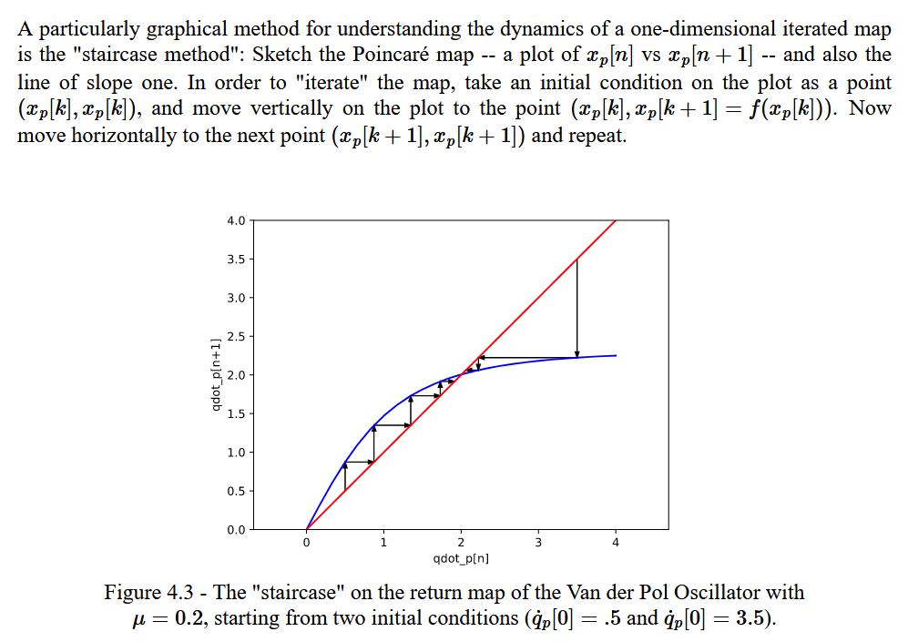
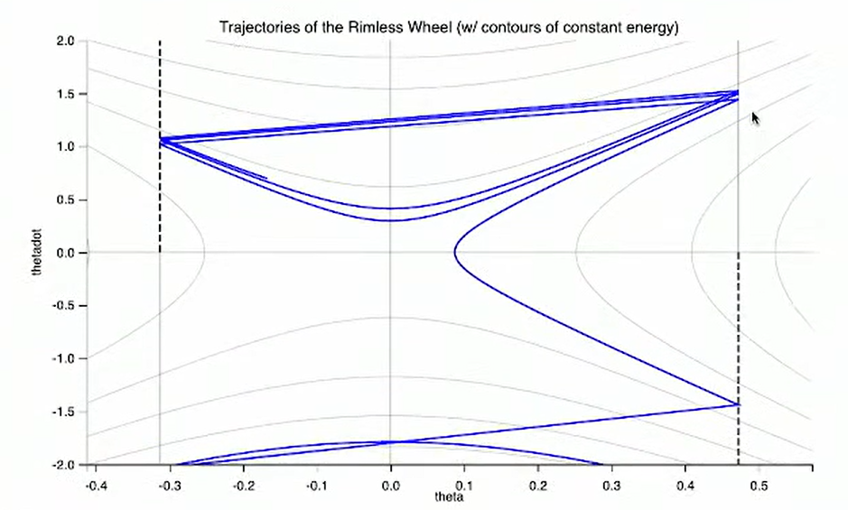
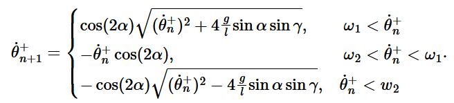
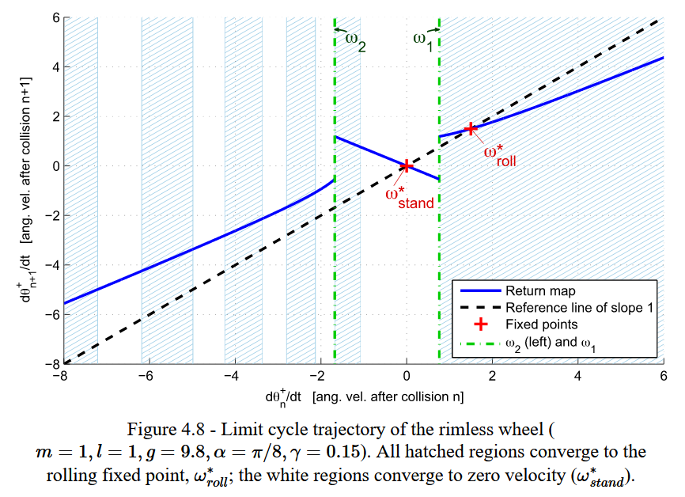
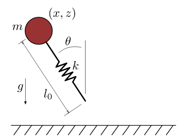
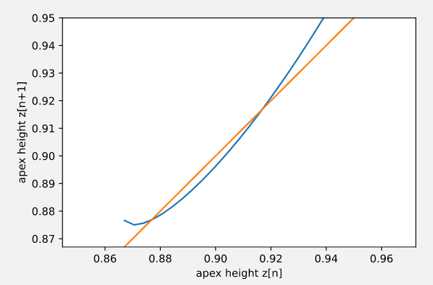

# Walking Robots and Planning through Contact

*Limit Cycle*: an orbitally stable or unstable periodic solution where $x^*(t +t_{period}) = x^*(t)$.

## Orbital Stability

The definitions of stability to a fixed point no longer work for periodic systems; for example, you are unable to check stability to a single state $x$; the system can be stable but be in a range of states at $t=\infty$.

Orbital Stability: the difference between the robot's state and any point on the cycle approaches $0$:

**Local**: for every small $\epsilon > 0, \exists \delta>0$:

$$ \min_\tau || x(t) - x^*(\tau) || < \delta \implies \min_\tau || x(t) - x^*(\tau) || < \epsilon$$

**Asymptotic**:
$$ \lim_{t \rightarrow \infty} \quad \min_\tau || x(t) - x^*(\tau) || = 0$$

**Exponential**: for some $C, \alpha$:
$$ \lim_{t \rightarrow \infty} \quad \min_\tau || x(t) - x^*(\tau) || Ce^{-\alpha t}$$

## Poincare Maps

The problem with the definition of orbital stability is that it's mathematically unhelpful; there is no closed form for a Lyapunov function, no methods of analysis; it's an optimization problem. 

Poincare maps map the dynamics of a cycle onto a lower dimensional surface to solve this problem. The resulting dynamics only look at the evolution of states that intersect the surface.

### Formal Definition

Define dynamics $\dot{x} = f(x)$. Define an $n-1$ dimensional surface of section, $S$, where trajectories of the system dynamics flow through (not parallel) to $S$. 

Then, the Poincare map is defined:

$$ x_p[n+1] = P(x_p[n]) $$

where $x_p[n]$ is the state at the $n^{th}$ crossing of the surface section. You can think of $P$ as an analog to $f$ for the dynamics of a normal system, and $n$ as sort of like a time step. 

On the example of the van der pol oscillator, we can define $S$ as the 1D surface where $q=0, \dot{q} \geq 0$. All trajectories go through $S$. Then, $P$ would map any state intersecting with $S$ to the next state (after going around the cycle 1 more time) that intersects with $S$.

 

Note: on the right plot: y-axis is $\dot{q}_p[n+1]$, x-axis is $\dot{q}_p[n]$. The red line is just a slope-1 line for visual reference.

A key point about the Poincare map is that the map starts with slope > 1 (cycle is expanding in radius), and ends with slope < 1 (cycle is reducing in radius). The points of intersection (where $x_p[n] = x_p[n+1]$) are the fixed points $x_p^*$ (the stable limit cycles). 

To find the fixed point analytically, we solve for $x_p[n+1] = x_p[n]$ (logically, this means the system ends up at the same state each cycle).

  

Similar to typical system dynamics, we define fixed points $x_p^*$ where $x_p^* = P(x_p^*)$. At each fixed point, there exists a unique limit cycle $x^*(t)$ which passes through $x^*_p$.

We can also analysis convergence rates graphically if we can plot the Poincare map:

 

If we can prove $P(x_p)$ exists for all $x_p \in S$ (all trajectories that leave $S$ return to $S$), we can reduce the stability analysis of the original limit cycle to the stability analysis of a fixed point on the discrete map: ***if $x_p^*$ is stable (locally, asymptotically, exponentially) in the system $ x_p[n+1] = P(x_p[n]) $, then the entire limit cycle that contins $x_p^*$ is stable (also locally, asymptotically, exponentially).***

In fact, $P$ is a matrix; the eigenvalues of $\frac{\partial P}{\partial x_p}$ tell us about the rate of convergence. For a stable system, all $|eig(\frac{\partial P}{\partial x_p})| < 1$.

### Solving for Limit-cycle Stable Control

Once we have a Poincare Map $x_p[n+1] = P(x_p[n], u[n])$, solving for control to stabilize the system toward the stable limit cycle is easy; we can treat the system like any other discrete-time dynamic system. For example, we can linearize the Poincare map around the fixed point and use discrete-time LQR control. All other techniques learned (Value Iteration, Lypunov Control & Stability Analysis) can also be applied.

The major limitation of this control method is that it assumes you can only update your control onput once every cycle (since the Poincare map effectively dicretizes time into cycles).

## Moving Poincare Maps

As explained in *Solving for Limit-cycle Stable Control*, the major limitation to driving control from a Poincare map is that you only get one control input per cycle. To get complete control over the entire cycle then, we need multiple Poincare maps whose surface of section cover the entire cycle.

  

## Examples: Walkers

### Rimless Wheel

 

Modeling assumptions:
 - Collisions with ground are inelastic and impulsive (only angular momentum is conserved around the point of collision).
 - The stance foot acts as a pin joint and does not slip.
 - The transfer of support at the time of contact is instantaneous (no double support phase).

We define the coordinate system such that $\theta$ resets to $\gamma-\alpha$ each time the next leg hits the ground.

Notice that this system is basically an upright pendulum where $\gamma-\alpha \leq \theta \leq \gamma + \alpha$, and where $\theta$ is shifted by $\pi$. We can analyze the system using the phase portrait of a pendulum but restricted between $\gamma-\alpha \leq \theta \leq \gamma + \alpha$; the pendulum will follow the phase portrait, gaining energy from gravity until $\theta = \gamma + \alpha$ at which point the next leg collides (inellastically), the system loses energy, and $\theta$ is reset to $\gamma - \alpha$; and this cycle repeats.

 

In this (above) particular example, initial conditions are set such that the initial velocity is just above the velocity at the limit cycle; the walker slows down a bit and will soon reach equilibrium (a stable limit cycle).

 

In this (above) case, the pendulum starts with initial velocity going up the hill, but eventually starts rolling back down, finally arriving at the same limit cycle.

<!-- We can also solve for the Poincare map for the rimless wheel using energy: 

 

Where $\omega_2$ is the threshold below which the system will roll up the slope then take a step back down; $\omega_1$ is the threshold above whch the system will walk stably forever. -->

We can also solve for the Poincare map for the rimless wheel by relating the angular velocity immediately after step $n+1$ to the angular velocity immediately after step $n$. We can then solve for the fixed points where $\dot{\theta}^+_{n+1} = \dot{\theta}^+_{n}$, which yields two values; one for standing ($\dot{\theta}^+_{n} = 0$) and one for walking: $\omega_{stand}^* = 0, \quad\omega_{roll}^* = cot(2 \alpha) \sqrt{4 \frac{g}{l} \sin \alpha \sin \gamma}$.

If we graphically/numerically analyze the Poincare map for the rimless wheel, we find 3 discontinuous curves; the left-most discontinuity is the "decision point" between continuing to roll up the hill vs beginning to rol down. The right-most discontinuity is the "decision point" between rolling down and stopping rolling entirely. We also see two fixed points; one for stationary "standing", the other for stable walking. The shaded blue areas represent RoA to the walking fixed point, solved numerically. Especially with initial conditions rolling up the hill, even slightly different initial conditions can cause the system to switch modes.

 

Note the location of the origin on the x-axis. 

### Spring-Loaded Inverted Pendulum (SLIP)

 

SLIP consists of a mass above a spring-leg. The system has 1 control input $u$, where $\theta = u$ (which is plausible because the spring-leg is massless).

SLIP's gait involves a 'flight' phase where $\theta$ is constant; upon landing, the foot gets locked to the ground, and the leg rotates before springing off the ground again when the spring-leg is at full extension. Upon liftoff, we command $u$ back to the original value during the previous flight phase. The stable limit cycle is where the landing angle is equal to the takeoff angle, and the height of the apex of the flight is constant between cycles. The control-problem then is what to set $\theta = u$ to; intuitively, if the landing angle is too shallow, the takeoff angle will be steep, trading horizontal energy for vertical energy. If the landing angle is too steep, the takeoff angle will be shallow, trading vertical energy for horizontal energy.

We model the dynamics of SLIP differently in 'flight' and 'stance' phases. For flight:

$$ \mathbf{x} = \begin{bmatrix} x \\ z \\ \dot{x} \\ \dot{z} \\  \end{bmatrix}, \quad \mathbf{\dot{x}} = \begin{bmatrix} \dot{x} \\ \dot{z} \\ 0 \\ -g \\ \end{bmatrix} $$

For stance (where we model the foot as being locked to the origin), we switch to polar coordinates: 

$$ \mathbf{x} = \begin{bmatrix} r \\ \theta \\ \dot{r} \\ \dot{\theta} \\  \end{bmatrix} $$

Using Euler Lagrange, we can derive the stance dynamics:

$$ m \ddot{r} - mr \dot{\theta}^2 + mg \cos \theta -k(l_0 - r) = 0  \\ mr^2 \ddot{\theta} + 2mr \dot{r} \dot{\theta} - mgr \sin \theta = 0$$

Because, in our model, the foot is massless and the leg is a linear spring, no energy is lost upon collision; simply, we switch dynamics.

The guard that dictates transition from flght to stance is $z-l_0 \cos\theta \leq 0$. The guard from stance to flight is $r \geq l_0$ (when the leg reaches its extended length).

#### SLIP Poincare Map

Recall that the Poincare Map is always $n-1$ dimensional, where $n$ is the dimension of the state space. Since SLIP is 4-dimensional, this would prevent us from using graphical analysis to identify fixed points. Therefore, we can use a simplified state representation to find a Poincare map: just $z$. We can then define our surface of section $S$ to be the apex of flight $\dot{z} = 0$ on a phase plot. Knowing $z$ is enough to determine stability in the Poincare map; knowing $z$ at the apex tells us $\dot{x}$, due to the conservation of energy assumption.

To get an approximation of the Poincare map (there is no closed form), we numerically integrate the (piecewise) dynamics from apex-to-apex for a range of possible $z$ values (assuming a fixed control input of $u =\theta=30 ~deg$):

 

From the Poincare map, we can see two stable fixed points for the apex height. This means the SLIP system, when in the range of the blue line, will eventually fall to one of these stable apex heights.

Note that the blue line ends abruptly to the left, since the apex height cannot be smaller than $l_0 \cos \theta$. 

The core assumption allowing this 1D Poincare analysis is conservation of energy; so, these fixed points are only really stable when there are no disturbances that change the total energy of the system.

#### SLIP Control (Deadbeat Control)

Using the Poincare map, as explained above, it's totally doable to use linearization and LQR to control SLIP to a fixed point.

The SLIP system actually is compatible with another control strategy called "Deadbeat Control"--where the control strategy is to pick the control input that will take you to the fixed point in a single cycle. Effectively, you just simulate a range of possible control inputs and find the one that will bring you to the fixed point given the height of the ground (these simulations can be pre-computed).

In fact, it's possible for SLIP to even maintain stability on varying-height terrain (as long as the terrain remains flat) without any close-loop feedback or knowledge of the terrain. The deadbeat controller generates a smooth function of control inputs for a range of ground heights, so you can control the SLIP angle continuously in preparation for hitting the ground at any moment. Then, no matter where the ground is, SLIP will rebound to the same apex height.