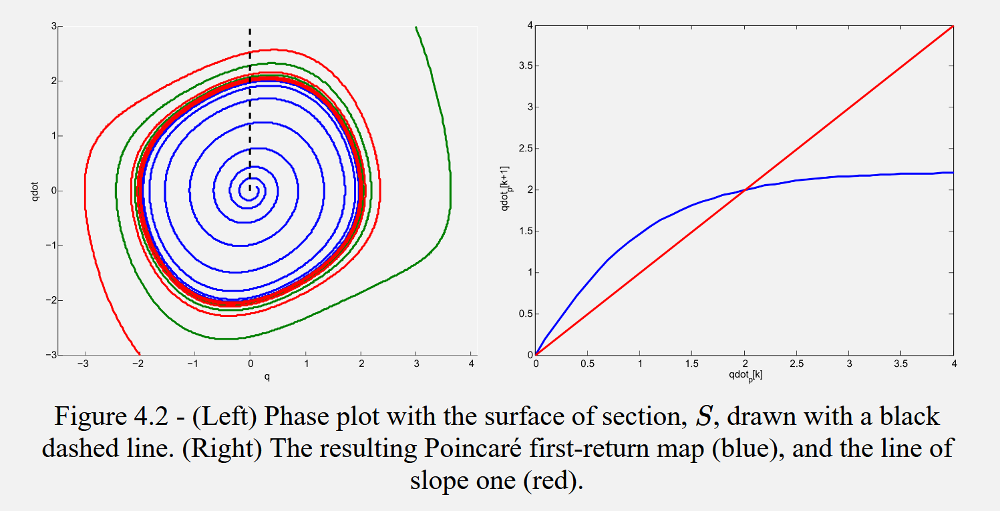
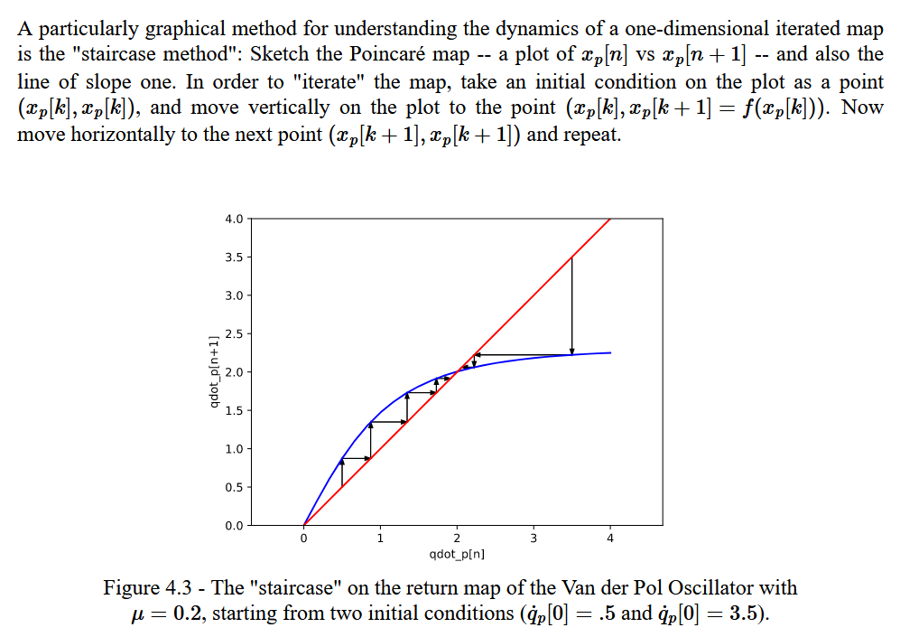
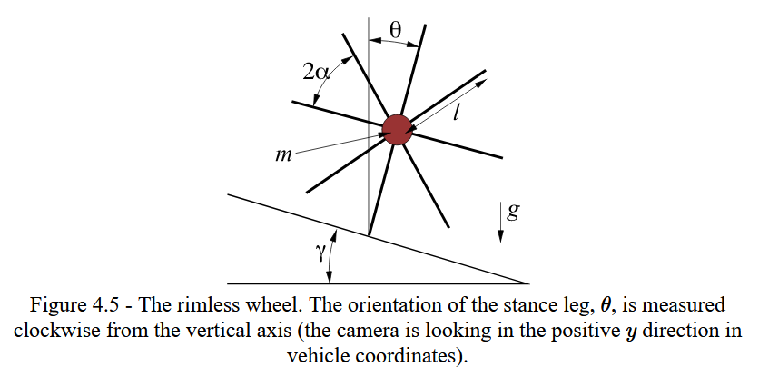

# Walking Robots and Planning through Contact

*Limit Cycle*: an orbitally stable or unstable periodic solution wher $x^*(t +t_{period}) = x^*(t)$.

## Orbital Stability

The definitions of stability to a fixed point no longer work for periodic systems; for example, you are unable to check stability to a single state $x$; the system can be stable but be in a range of states at $t=\infty$.

Orbital Stability: the difference between the robot's state and any point on the cycle approaches $0$:

**Local**: for every small $\epsilon > 0, \exists \delta>0$:

$$ \min_\tau || x(t) - x^*(\tau) || < \delta \implies \min_\tau || x(t) - x^*(\tau) || < \epsilon$$

**Asymptotic**:
$$ \lim_{t \rightarrow \infty} \quad \min_\tau || x(t) - x^*(\tau) || = 0$$

**Exponential**: for some $C, \alpha$:
$$ \lim_{t \rightarrow \infty} \quad \min_\tau || x(t) - x^*(\tau) || Ce^{-\alpha t}$$

## Poincare Maps

The problem with the definition of orbital stability is that its mathematically unhelpful; there is no closed form for a Lyapunov function, no methods of analysis; it's an optimization problem. 

Poincare maps map the dynamics of a cycle onto a lower dimensional surface to solve this problem. The resulting dynamics only look at the evolution of states that intersect the surface.

### Formal Definition

Define dynamics $\dot{x} = f(x)$. Define an $n-1$ dimensional surface of section, $S$, where trajectories of the system dynamics flow through (not parallel) to $S$. 

Then, the Poincare map is defined:

$$ x_p[n+1] = P(x_p[n]) $$

where $x_p[n]$ is the state at the $n^{th}$ crossing of the surface section. You can think of $P$ as an analog to $f$ for the dynamics of a normal system, and $n$ as sort of like a time step. 

On the example of the van der pol oscillator, we can define $S$ as the 1D surface where $q=0, \dot{q} \geq 0$. All trajectories go through $S$. Then, $P$ would map any state intersecting with $S$ to the next state (after going around the cycle 1 more time) that intersects with $S$.

 

Note: on the right plot: y-axis is $\dot{q}_p[n+1]$, x-axis is $\dot{q}_p[n]$. The red line is just a slope-1 line for visual reference.

A key point about the Poincare map is that the map starts with slope > 1 (cycle is expanding in radius), and ends with slope < 1 (cycle is reducing in radius). The points of intersection (where $x_p[n] = x_p[n+1]$) are the fixed points $x_p^*$ (the stable limit cycles). 

  

Similar to typical system dynamics, we define fixed points $x_p^*$ where $x_p^* = P(x_p^*)$. At each fixed point, there exists a unique limit cycle $x^*(t)$ which passes through $x^*_p$.

We can also analysis convergence rates graphically if we can plot the Pointcare map:

 

If we can prove $P(x_p)$ exists for all $x_p \in S$ (all trajectories that leave $S$ return to $S$), we can reduce the stability analysis of the original limit cycle to the stability analysis of a fxed point on the discrete map: ***if $x_p^*$ is stable (locally, asymptotically, exponentially) in the system $ x_p[n+1] = P(x_p[n]) $, then the entire limit cycle that contins $x_p^*$ is stable (also locally, asymptotically, exponentially).***

In fact, $P$ is a matrix; the eigenvalues of $\frac{\partial P}{\partial x_p}$ tell us about the rate of convergence. For a stable system, all $|eig(\frac{\partial P}{\partial x_p})| < 1$.

Then the hard part of analyzing stability of a limit cycle is finding a map $P$.

TODO

## Walkers

### Rimless Wheel

 

