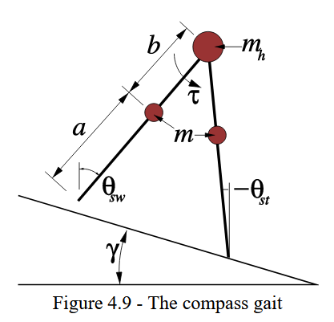
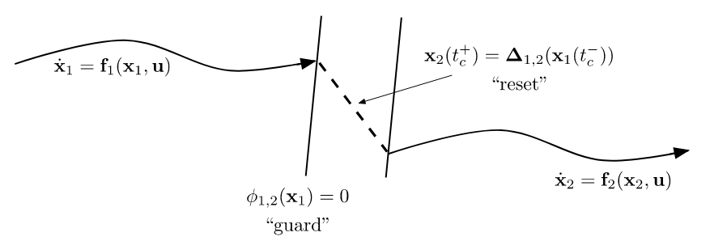

# Walking Robots and Planning through Contact

*Limit Cycle*: an orbitally stable or unstable periodic solution wher $x^*(t +t_{period}) = x^*(t)$.

## Orbital Stability

The definitions of stability to a fixed point no longer work for periodic systems; for example, you are unable to check stability to a single state $x$; the system can be stable but be in a range of states at $t=\infty$.

Orbital Stability: the difference between the robot's state and any point on the cycle approaches $0$:

**Local**: for every small $\epsilon > 0, \exists \delta>0$:

$$ \min_\tau || x(t) - x^*(\tau) || < \delta \implies \min_\tau || x(t) - x^*(\tau) || < \epsilon$$

**Asymptotic**:
$$ \lim_{t \rightarrow \infty} \quad \min_\tau || x(t) - x^*(\tau) || = 0$$

**Exponential**: for some $C, \alpha$:
$$ \lim_{t \rightarrow \infty} \quad \min_\tau || x(t) - x^*(\tau) || Ce^{-\alpha t}$$

## Poincare Maps

The problem with the definition of orbital stability is that its mathematically unhelpful; there is no closed form for a Lyapunov function, no methods of analysis; it's an optimization problem. 

Poincare maps map the dynamics of a cycle onto a lower dimensional surface to solve this problem. The resulting dynamics only look at the evolution of states that intersect the surface.

### Formal Definition

Define dynamics $\dot{x} = f(x)$. Define an $n-1$ dimensional surface of section, $S$, where trajectories of the system dynamics flow through (not parallel) to $S$. 

Then, the Poincare map is defined:

$$ x_p[n+1] = P(x_p[n]) $$

where $x_p[n]$ is the state at the $n^{th}$ crossing of the surface section. You can think of $P$ as an analog to $f$ for the dynamics of a normal system, and $n$ as sort of like a time step. 

On the example of the van der pol oscillator, we can define $S$ as the 1D surface where $q=0, \dot{q} \geq 0$. All trajectories go through $S$. Then, $P$ would map any state intersecting with $S$ to the next state (after going around the cycle 1 more time) that intersects with $S$.

 

Note: on the right plot: y-axis is $\dot{q}_p[n+1]$, x-axis is $\dot{q}_p[n]$. The red line is just a slope-1 line for visual reference.

A key point about the Poincare map is that the map starts with slope > 1 (cycle is expanding in radius), and ends with slope < 1 (cycle is reducing in radius). The points of intersection (where $x_p[n] = x_p[n+1]$) are the fixed points $x_p^*$ (the stable limit cycles). 

  

Similar to typical system dynamics, we define fixed points $x_p^*$ where $x_p^* = P(x_p^*)$. At each fixed point, there exists a unique limit cycle $x^*(t)$ which passes through $x^*_p$.

We can also analysis convergence rates graphically if we can plot the Pointcare map:

 

If we can prove $P(x_p)$ exists for all $x_p \in S$ (all trajectories that leave $S$ return to $S$), we can reduce the stability analysis of the original limit cycle to the stability analysis of a fxed point on the discrete map: ***if $x_p^*$ is stable (locally, asymptotically, exponentially) in the system $ x_p[n+1] = P(x_p[n]) $, then the entire limit cycle that contins $x_p^*$ is stable (also locally, asymptotically, exponentially).***

In fact, $P$ is a matrix; the eigenvalues of $\frac{\partial P}{\partial x_p}$ tell us about the rate of convergence. For a stable system, all $|eig(\frac{\partial P}{\partial x_p})| < 1$.

Then the hard part of analyzing stability of a limit cycle is finding a map $P$.

TODO

## Walkers

### Rimless Wheel

 

Modeling assumptions:
 - Collisions with ground are inelastic and impulsive (only angular momentum is conserved around the point of collision).
 - The stance foot acts as a pin joint and does not slip.
 - The transfer of support at the time of contact is instantaneous (no double support phase).

With 1 leg on the ground, the system dynamics are (with 1 DoF):

$$ \ddot{\theta} = \frac{g}{l} \sin(\theta) $$

Notice that this is basically an upright pendulum where $\gamma-\alpha \leq \theta \leq \gamma + \alpha$, and where $\theta$ is shifted by $\pi$. We can analyze the system using the phase portrait of a pendulum but restricted between $\gamma-\alpha \leq \theta \leq \gamma + \alpha$, where the pendulum will follow the phase portrait, gaining energy from gravity until $\theta = \gamma + \alpha$ at which point the next leg collides (inellastically), the system loses energy, and $\theta$ is reset to $\gamma - \alpha$; and this cycle repeats.

 

In this particular example, initial conditions are set such that the initial velocity is just above the velocity at the limit cycle; the walker slows down a bit and will soon reach equilibrium.

 

In this case, the pendulum starts with initial velocity going up the hill, but eventually starts rolling back down in the limit cycle.

The passive dynamic walker always ends up in one of two modes: either stationary if the energy is too low (this would look like a horizontal line on the phase portrait teleporting between $\theta= \gamma-\alpha$ and $\theta =  \gamma + \alpha$ infinitely quickly) or in the stable limit cycle rolling down the slope. Especially with initial conditions rolling up the hill, slightly different initial conditions can cause the system to switch modes.

Sidenote: You can solve the precise energy gains (from gravity) and losses (from inelastic collision). For each collision, use conservation of angular momentum about the new collision point to calculate the energy loss. During each leg swing, simple calculate gravitational potential energy over the displacement. 

If we analyze the Poincare maps for the rimless wheel, we find 3 discontinuous curves and two fixed points (one for stationary "standing", the other for stable rolling). The shaded blue areas represent RoA to the rolling fixed point.

 

### Compass Gait

 

## Finding Limit Cycles

Construct the limit cycle search problem as a trajectory optimization problem (note that time is an additional decision variable):

$$ \text{find}_{x(\cdot), T} \quad s.t. \quad \dot{x} = f(x), \quad x(0) = x(T) $$

And solve using any of the classic trajectory optimization formulations (direction collocation, direct transcription, etc.).

It may also be wise to constrain $x(0)$ not to be the origin, which may be a trivial limit cycle.

### Finding Limit Cycles with Contact (Hybrid Trajectory Optimization)

#### Rimless Wheel

Rather than enforcing a start and end to the cycle, we need to enforce from the start of one step up to the contact point, and the jump from the contact point back to the start of the next step.

$$ \begin{align*} \text{find}_{x(\cdot), T} \quad s.t. \quad \dot{x} &= f(x) \\ \quad \theta(0) &= \gamma - \alpha \\ \theta(T) &= \gamma + \alpha \\ \dot{\theta}(0) &= \cos(2 \alpha) \dot{\theta}(T) \end{align*} $$

The last constraint covers the energy loss from contact.

TODO: how to solve direct collocation without $u$ as a decision variable?

## Hybrid Dynamics

"Hybrid" = both discrete- and continuous-time systems.

A hybrid system has various "modes" where each mode is described by continuous dynamics, "guards" which are continuous functions whose zero-level set describes conditions which trigger a reset, and "resets" which describe discrete updates to the state.

 

As an example, for a robotic foot (the orange denotes guards):

 

You can solve trajectory optimizations with separate trajectories in each mode, with the corresponding resets applied.

The major limitation with this approach is it cannot handle situtions where there is no proper reset; for example, the scenario where the robot foot hits the ground toe first.