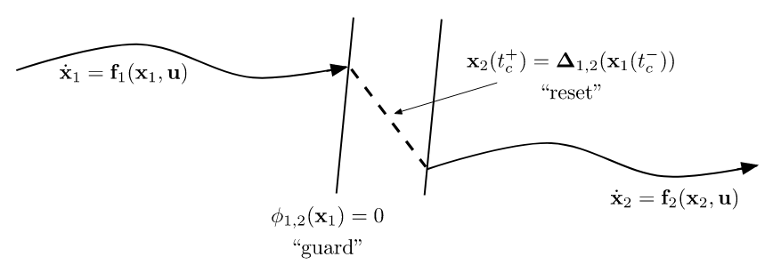
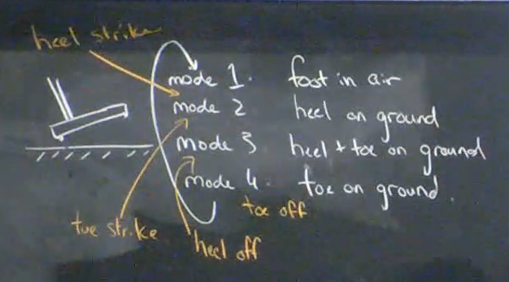
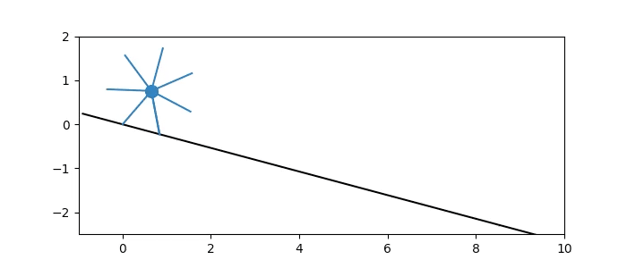
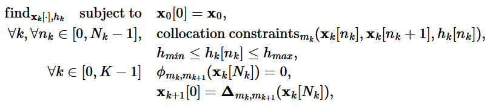
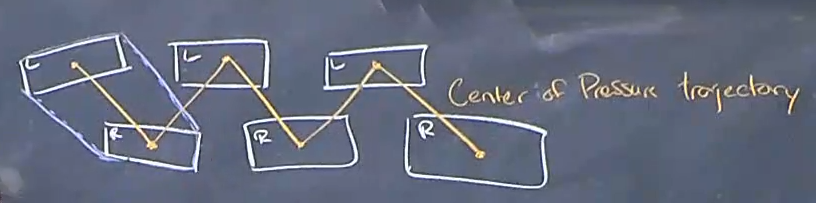
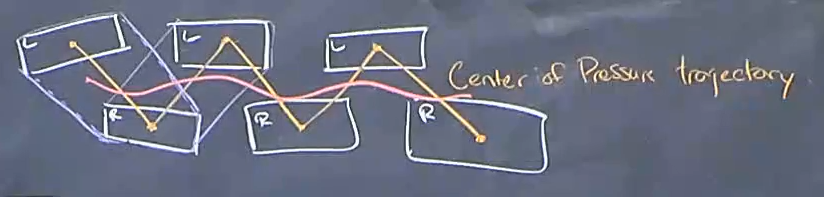

## Hybrid Dynamics

"Hybrid" = both discrete- and continuous-time systems.

A hybrid system has various "modes" where each mode is described by continuous dynamics, "guards" which are continuous functions whose zero-level set describes conditions which trigger a reset (at non-mode changes, the guard function should be positive), and "resets" which describe discrete updates to the state.

 

As an example, for a robotic foot (the orange denotes guards):

 

$\phi_{i,j}(x_i) = 0$ denotes the guard function, which initiates a reset to mode $j$ from mode $i$ when the state in mode $i$ satisfies the guard function equation.

$x_j(t_c^+) = \Delta_{i,j}(x_i(t_c^-))$ denotes the reset function mapping a state from mode $i$ at time $t_c$ to a state in mode $j$ at time $t_c$.

  

## Finding Limit Cycles

How do we find the optimal control parameters to get a system into its stable limit cycle? We can formulate this as a trajectory optimization problem (note that time is an additional decision variable):

$$ \text{find}_{x(\cdot), T} \quad s.t. \quad \dot{x} = f(x), \quad x(0) = x(T) $$

And solve using any of the classic trajectory optimization formulations (direction collocation, direct transcription, etc.).

It may also be wise to constrain $x(0)$ not to be the origin, which may be a trivial limit cycle.

#### Example: Rimless Wheel

The goal with the rimless wheel (since it has no actuation) is effectively to find an initial state that will cause it to enter a stable limit cycle (however, we pose the entire trajectory as decision variables to be able to enforce dynamics constraints).

$$ \text{find}_{x[\cdot],h} \quad \text{subject to} \quad \text {collocation constraints}(x[n],x[n+1],h) \quad \forall n \in [0, N-1]$$
$$ \begin{align*}
    \theta[0] &= \gamma- \alpha \\
    \theta[N] &= \gamma + \alpha \\
    \dot{\theta}[0] &= \dot{\theta}[N]\cos(2 \alpha) \\
    \gamma - \alpha &\leq \theta[n] < \gamma \alpha \\
    h_{min} &\leq h \leq h_{max} \\
\end{align*} $$

Here, the decision variables are the trajectory and $h$, the limit cycle time. We constrain the limit cycle time to be within reasonable bounds, we constrain the wheel angle to be within $\gamma - \alpha$ and $\gamma + \alpha$--the angles at the start and end of a cycle, and we constrain the start and end of the cycle to have the same angle (note that $\gamma - \alpha$ and $\gamma + \alpha$ are "the same position" for the rimless wheel, just with different legs). The $\cos(2 \alpha)$ constraint ensures this limit cycle is *the* stable limit cycle by ensuring the correct energy loss from the collision. Within the trajectory, we enforce the continuous system dynamics with the collocation constraint. 

Note that collocation can be applied even for a system with no actuation; you simply enforce the system's natural system dynamics at each collocation point.

 

To form such an optimization without the $\cos(2 \alpha)$ constraint that requires prior derivation of the energy loss at collision, we can pose a multi-modal optimization that constrains the time spent in each mode to be identical. We look more at multi-modal optimization below.

### Hybrid Trajectory Optimization: Finding Limit Cycles with Contact

### Given a Fixed Mode Sequence

i.e. for walking, the robot repeates the same sequence modes and reset. In this case, trajectory optimization can be solved as a series of mathematical programs with dynamics enforced within each, with contraints to enforce guards/resets. 

 

Here, we split the trajectory into $k$ segments, or $k$ modes in the sequence. We assume the guard function $\phi_{m_k,m_{k+1}}$ and reset $\Delta_{m_k,m_{k+1}}$ for each mode $k$ is given. $m_k$ is the mode in segment $k$, $x_k$ is the state in segment $k$, and $N_k$ is the time step segment $k$ ends. Collocation constraints are being enforced within each segment. The guard functions at each $N_k$ are enforced, along with the corresponding reset. 

Of course, if mode transitions occur out of sequence, the appropriate guard function may not trigger and the robot will fall.

#### Rimless Wheel

Rather than enforcing a start and end to the cycle, we need to enforce from the start of one step up to the contact point, and the jump from the contact point back to the start of the next step.

$$ \begin{align*} \text{find}_{x(\cdot), T} \quad s.t. \quad \dot{x} &= f(x) \\ \quad \theta(0) &= \gamma - \alpha \\ \theta(T) &= \gamma + \alpha \\ \dot{\theta}(0) &= \cos(2 \alpha) \dot{\theta}(T) \end{align*} $$

The last constraint covers the energy loss from contact.

  

## Dynamics of Humanoid Robots

### Background Math & Notation

CM (Center of Mass) of the robot is the average of the CM's of each body on the robot:

$$^Wp_W^{R_{CM}} = \frac{\sum_i ~^Wp_W^{B_{i, CM}} * mi_i}{\sum_i m_i}$$ 

Then the dynamics of the robot CM are (in the planer case):

$$m_{total} * \ddot{x}_{CM} = \sum_i f^{b_i}_{i, W_x}$$

$$m_{total} * \ddot{z}_{CM} = \sum_i f^{b_i}_{i, W_z} - m_{total}*g$$

We also have notions of Spatial Force, Velocity, Momentum, etc.

Spatial Momentum of body $B$ around point $B_{CM}$ relative to world frame:

$$^W L^{B/B_{CM}}(\dot{q}) = \begin{bmatrix} I\dot{\theta} \\ m\dot{x} \\ m\dot{z} \end{bmatrix} $$

Time derivative of Spatial Momentum on body $B$ is the sum of Spatial Forces on $B$:

$$^W\dot{L}^{B/B_{CM}}(\dot{q}) = \sum_i F^{B_i}_{i,W}$$

Extending this to the full robot CM:

$$^W\dot{L}^{R/R_{CM}}(q, \dot{q}, \ddot{q}) = \sum_i F^{R_i}_{i,W}$$

Center of Pressure (CP) is calculated as weighted average of forces *exerted by the ground*:

$$ ^W p^{CP}_W = \frac{\sum_i ~^W p_W^{B_i} ~f_{i,W_z}^{B_i}}{\sum_i f_{i, Wz}^{B_i}} $$

Relationship between CM and CP:

$$(m \ddot{z}_{CM} + mg)(x_{CP} - x_{CM}) = (z_{CP} - z_{CM})m \ddot{x}_{CM} - I \ddot{\theta}$$

A core intuitive behind CM and CP is that the robot will fall in whatever direction the CM is relative to the CP.

## ZMP Planning

i.e. the planning method for the [ASIMO walking robot](https://www.youtube.com/watch?v=vA0xLVCb-OA), probably Tesla Optimus, probably Figure AI.

General Outline:

1) Plan footstep location (Simple heuristic or optimization problem)
2) Plan Angular Momentum trajectory for robot CoM
3) Plan joint angles (Kinematics)
4) Execute using full-body controller

This is a fairly intuitive planning strategy; if you think intuitively about doing parkour, you're thinking about where to land/place your feet, then you think about how to move your body, and then fill in the details of exact muscle movements.

### 1) Planning Footsteps

Essentially, this is planning a CP trajectory. So long as the CP always remains within the convex hull of the support polygon drawn from the pads of any "feet" touching the ground (i.e. purple polygon), then the robot should not fall over.

 

For example, for the duration the robot only has one leg on the ground, the support polygon would only consist of the shape of that one foot.

### 2) Planning CM Trajectory

Once you have a CP trajectory, extending this to a CM trajectory is simple, using the equation relating CM and CP above.

With a slow gait, the CM of the robot follows the CP trajectory in order not to fall. But, as you walk faster this becomes less strict as long as you place down the next foot before the robot falls. Your CM trajectory can become more like the red line:

 

A core reason some humanoids like ASIMO walk with bent legs is to keep a very small agular momentum and constant $z_{CM}$. These factors together can basically linearize the equation relating $CM$ and $CP$, allowing use of linear control techniques. TODO: clarify how this linearizes dynamics?

The Unitree humanoid likely performs well with RL because of its smaller feet and lighter legs that make it easier to simulate

Some interesting mechanical techniques to improve humanoids:
1) Toes; specifically, before keeping the toe on the ground as long as possible before lifting the leg. This reduces the time the robot is on one foot, increasing the size of the support polygon
2) Adding a hip sway joint, which can reduce kinematic singularities when the leg is fully straight