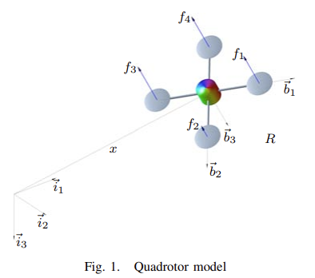
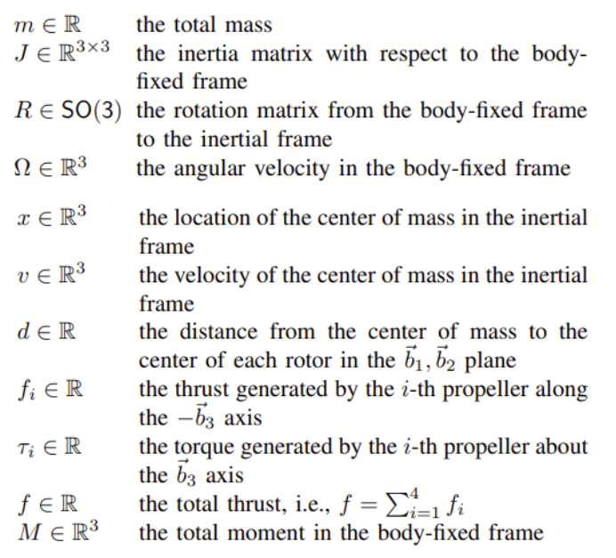
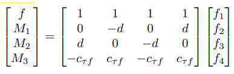
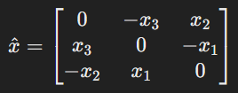
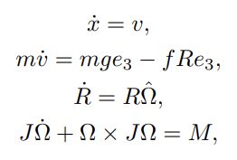
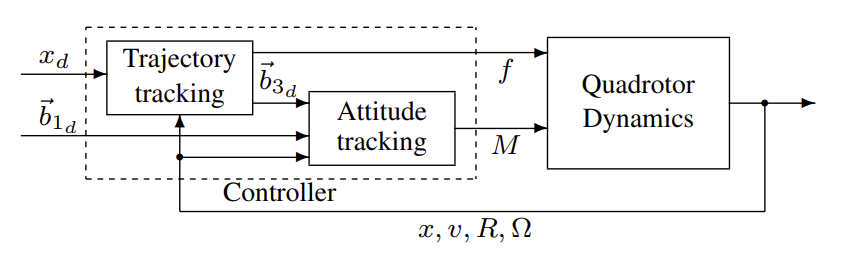
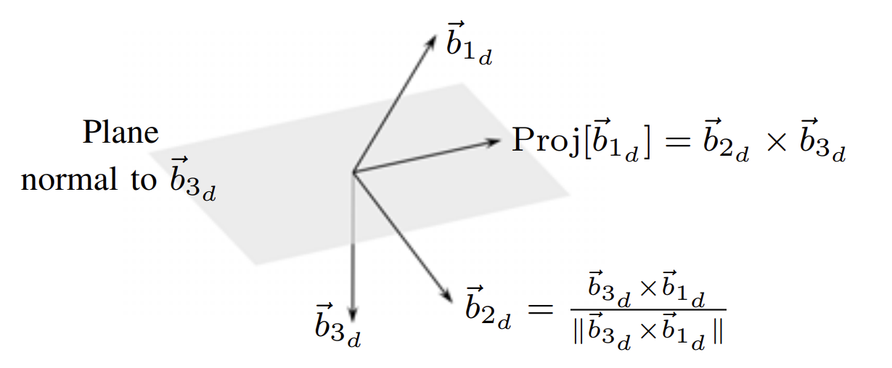

[[Source]](https://mathweb.ucsd.edu/~mleok/pdf/LeLeMc2010_quadrotor.pdf)

# Notation

SE(3): “Special Euclidean Group 3”; space of all 4x4 vectors of the form: 

$$ \begin{bmatrix} R & t \\ 0 & 1 \end{bmatrix}$$

 - R is a 3x3 rotation matrix
 - t is a 3x1 (x,y,z) translation

 

 

"Total Moment" $M$ = 3D vector of torque along the drone roll, pitch, yaw axes.

$e_i$ = unit vector in inertial frame (i.e. $e_1 = \begin{bmatrix} 1 \\ 0 \\ 0 \end{bmatrix}$, $e_2 = \begin{bmatrix} 0 \\ 1 \\ 0 \end{bmatrix}$, $e_3 = \begin{bmatrix} 0 \\ 0 \\ 1 \end{bmatrix}$)

Rotation from body frame $\vec{b}_i$ to inertial frame $e_i$ = $Re_i$

Total thrust in inertial form is given by $-fRe_3$; rotation of net force in body frame to inertial frame. Note the negative; this is because the thrust is in the $-\vec{b}_3$ direction.

Assume first/third prop spin cw, second/fourth prop spin ccw. Torque geerated by $i$-th prop is $\tau_i = (-1)^i c_{\tau f} f_i$ for a fixed constant $c_{\tau f}$.

Total thrust and total moment $M$:

 

Notice that this matrix is invertible for non-zero $d$ and $c_{\tau f}$. Therefore, given $f$ and $M$, each $f_i$ can be solved.

**Trajectory Definitions:**

$x_d(t)$ = desired position of CoM in trajectory

$\vec{b}_{1_d}(t)$ = desired direction of body axis

## System Dynamics

First, we must define the "hat map". The hat map of $x$, $\hat{x}$, is simply a convenience linear operator that expresses the 3D vector $x$ as a "skew-symmetric" 3x3 matrix. This 3x3 matrix can be used to apply angular velocities to a rotation matrix, or to perform cross products using just matrix multiplicaton (i.e. $\hat{x}y = x \times y$)

 

With this in mind, the system dynamics of a 3D quadrotor are:

 

The 2nd equation is Newton's 2nd law.

The 3rd equation describes the time derivative of the rotation matrix of the quadrotor body relative to inertial frame by applying $\hat{\Omega}$, the matrix representation of angular velocity, to the current rotation matrix.

The last equation is the rotational equivalent of Newton's 2nd law; $J$ is the inertia matrix, $\dot{\Omega}$ is the angular accelertion, and $M$ is the total moment/torque acting on the quadrotor. $\Omega \times J \Omega$ accounts for gyroscopic effects.

## Error Coordinates

We also define the "vee map" $^\vee$ as the inverse of the hat map.

Translation: $e_x = x - x_d$

Velocity: $e_v = v - v_d$

Rotation: $e_R = \frac{1}{2} (R_d^T R - R^T R_d) ^{\vee}$

Angular Velocity: $e_\Omega = \Omega - R^T R_d \Omega_d$

$\Psi(R,R_d) = \frac{1}{2} tr[I - R_d^T R]$

We chose this definition of rotational error bc it is locally (where the rotation angle between $R$ and $R_d  < 180$ degrees) positive-definite about $R = R_d$.

# The Controller

The core goal of the controller is to determine $f_i$ such that $x(t) \rightarrow x_d(t)$ and $Proj[\vec{b}_{1}] \rightarrow Proj[\vec{b}_{1_d}]$, where the $Proj$ is a normalized projection onto the plane normal to $\vec{b}_{3_d}$.

 

The first step is to calculate a desired control thrust $f$ and desired directon $\vec{b}_{3_d}$ to achieve the given desired translation $x_d$. Given control gains $k_x$ and $k_v$, $\vec{b}_{3_d}$ is calculated like so:

$$\vec{b}_{3_d} = -\frac{-k_x e_x - k_v e_v - mge_3 + m\ddot{x}_d}{||-k_x e_x - k_v e_v - mge_3 + m\ddot{x}_d||}$$

And $f$ is calculated like so:

$$ f = -(-k_x e_x -k_v e_v - mge_3 + m \ddot{x}_d) * Re_3 $$

This is intuitive; $\vec{b}_{3_d}$ is chosen to be in the direction to proportionally reduce the $x$ and $v$ error, taking into account gravitational force and desired acceleration. Assuming $\vec{b}_3 = \vec{b}_{3_d}$, then $f$ proportionally reduces the $x$ and $v$ error, taking into account gravitational force and desired acceleration. The $Re_3$ term (which equals $\vec{b}_3$) simply expresses the scalar quantity $f$ in the direction $\vec{b}_3$. 

Therefore, in the absence of attitude error, the drone will zero its translational error. 

The second step is to use $\vec{b}_{3_d}$ computed in the first step and the given desired direction $\vec{b}_{1_d}$ to compute a desired total moment $M$. To do this, we use a series of vector cross products and projections. We first compute $\vec{b}_{2_d}$ by taking the normalized cross product of $\vec{b}_{3_d}$ and $\vec{b}_{1_d}$. Then, we can find the projection of $\vec{b}_{1_d}(t)$ onto the normal plane of $\vec{b}_{3_d}$ by taking the cross product of $\vec{b}_{2_d}$ and $\vec{b}_{3_d}$. $R_d$ then follows easily (the horizontal-stacking of the 3 basis vectors): $\begin{bmatrix} \vec{b}_{2_d} \times \vec{b}_{3_d} & \vec{b}_{2_d} & \vec{b}_{3_d} \end{bmatrix}$.

 

Then, with control gains $k_R$ and $k_\Omega$, $M$ is calculated:

$$ M = -k_R e_R - k_\Omega e_\Omega + \Omega \times J \Omega - J(\hat{\Omega} R^T R_d \Omega_d - R^T R_d \dot{\Omega}_d) $$

According to the paper: "almost" global exponential attractiveness to zero-error, with no singularities.

Capable of following a trajectory specifying $x_d(t)$ and $\vec{b}_{1_d}(t)$.

# Final Project Ideation
 - Although the controller can only track 4 outputs at once, it can still track trajectories that define the whole 12D state. The trajectory obviously must just follow the system dynamics. If the trajectory follows system dynamics, then tracking those 4 outputs will force the drone to track the other two outputs as well. THIS IS THE PRINCIPLE OF DIFFERENTIAL FLATNESS.

 - How to switch between the different controller modes (position, attitude, velocity)?

 - Why NOT use the UPenn traj opt method (using differential flatness): only optimizes a trajectory about the 4 differentially flat outputs. Not all 6 DoF. However, does allow you to add "corridor constraints", although this is not as strong as a 6-DoF pose constraint.

 <!-- - Use position-controlled mode most of the time
 - Use attitude-controlled mode right before achieving final 6D pose; compute the tranlational dynamics during attitude-controlled mode and account for this offset in the target position at the end of the position-controlled trajectory. -->