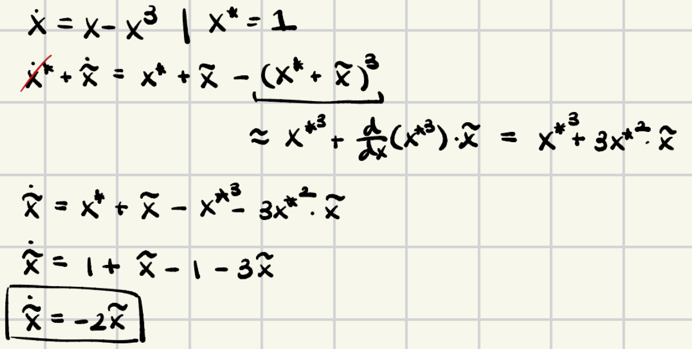
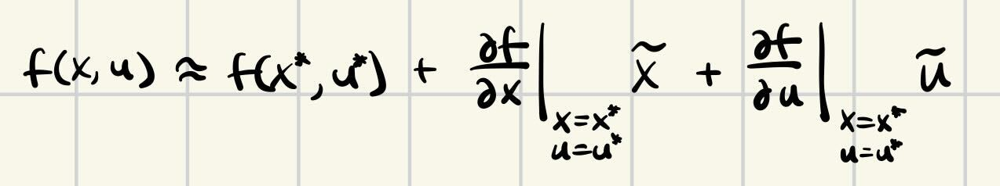

# Linearization (of ODEs)

## Method 1: Taylor Expansion

Taylor Expansion:

 

Procedure: 
1. Substitute $x = x^* + \tilde{x}$
2. For each nonlinear term, apply Taylor Series

Example:

 

Taylor Expansions also apply for multi-variate and multi-dimensional systems:

 

Example:

 

Note: Notice that the affine component, $f(x^*)$, canceled out to 0 in both examples. This will be true when linearizing any differential equation around any $x^*$ that is a fixed point; this is because, by definition of a fixed point, $f(x^*) = \dot{x} = 0$. 

However, if we want to linearize around a non-fixed point $\bar{x}$, this affine component will persist (which makes it hard to apply linear control techniques like LQR), unless we employ a trick. By substituting $x = x^* + \tilde{x}$ we express the approximation in error coordinates $\tilde{x}$. This will also get rid of the affine component, because $f(x^*) = 0$ in the reference frame of $x^*$. For more detail, see section "Linearizing around Trajectory" in *5) Trajectory Optimization*.

## Method 2: Jacobian Matrices

Compute the Jacobian matrix:

 

Then the resulting linear (affine) system is $\dot{x} = Ax + f(x^*)$

Example:

 

Intuition: Just by observation, the Jacobian matrix is clearly doing the same thing as a multi-variate Taylor Expansion. All a Jacobian is is the matrix full of partial derivatives of a function; Taylor Expansion simply evaluates partial derivatives with some added/multiplied constants/variables.

Same as in Method 1 (read above for more details), we can observe that the affine component $f(x^*) = 0$ when $x^*$ is a fixed point, and when $x^*$ is not a fixed point, we can remove the affine component by shifting into error coordinates.

  

# Jacobians & Hessians

The Jacobian is a matrix containing all 1st order partial derivatives of a function. If a function takes $n$ inputs and produces $m$ outputs, the Jacobian will be $m \times n$. For a function $f$ with $m$ outputs, you can imagine the function as a column vector of functions $f_1, ..., f_m$ for each output variable:

$$
f = \begin{bmatrix}
f_1 \\
f_2 \\
\vdots \\
f_m
\end{bmatrix}
$$

 Then, each row $i$ of the Jacobian takes partials of $f_i$ w.r.t. each input variable $x_1, ..., x_n$. Each column $j$ takes partials of each of $f_1, ..., f_m$ w.r.t. input variable $j$.

 

Intuitively, the Jacobian matrix maps small changes in the input space to changes in the output space. Each element in the Jacobian $\frac{\delta f_i}{\delta x_j}$ maps from a small change in the input variable $x_j$ to a change in the output $i$ of the function $f$.

For example, in the context of linearizing system dynamics around a trajectory, the Jacobian of the system dynamics $\dot{x} = f(x,u)$ would be $n \times (n+k)$, where $n$ is the state dimension and $k$ is the control-input dimension; this Jacobian would map from changes in state $x$ and contols $u$ to changes in the time-derivative of the state $\delta \dot{x}$. The Jacobian matrix of the dynamics function is often computed symbolically on initialization of the program; then, during realtime program execution, the symbolic Jacobian matrix is evaluated at the current desired state and control input along the trajectory $(\bar{x}, \bar{u})$, then multiplied against the deviation of the current state and control input to the target state and control input $\begin{bmatrix} \delta x_1 & \delta x_2 & ... & \delta x_n & \delta u_1 ... & \delta u_k \end{bmatrix}^T$. The Jacobian effectively maps this deviation in state to a deviation in the derivative of the state, which is added to the derivative of the desired state along the trajectory, resulting in a linear approximation of the derivative of the current state (about the desired state along the trajectory). 

$$ \dot{x} \approx f(\bar{x}, \bar{u}) + \begin{bmatrix}
\frac{\delta f_1}{\delta x_1} (\bar{x}, \bar{u}) & \frac{\delta f_1}{\delta x_2} (\bar{x}, \bar{u}) & ... & \frac{\delta f_1}{\delta u_1} (\bar{x}, \bar{u}) & ... & \frac{\delta f_1}{\delta u_k} (\bar{x}, \bar{u}) \\
\frac{\delta f_2}{\delta x_1} (\bar{x}, \bar{u}) & \frac{\delta f_2}{\delta x_2} (\bar{x}, \bar{u}) & ... & \frac{\delta f_2}{\delta u_1} (\bar{x}, \bar{u}) & ... & \frac{\delta f_2}{\delta u_k} (\bar{x}, \bar{u}) \\
\vdots \\
\frac{\delta f_m}{\delta x_1} (\bar{x}, \bar{u}) & \frac{\delta f_m}{\delta x_2} (\bar{x}, \bar{u}) & ... & \frac{\delta f_m}{\delta u_1} (\bar{x}, \bar{u}) & ... & \frac{\delta f_m}{\delta u_k} (\bar{x}, \bar{u}) \\
\end{bmatrix}
\begin{bmatrix}
\delta x_1 \\
\delta x_2 \\
\vdots \\
\delta x_n \\
\delta u_1 \\
\vdots \\
\delta u_k
\end{bmatrix} $$

Notation note: $\delta y = y - \bar{y}$, the deviation from between current state and desired state.

 

The concept of a Hessian is similar; the Hessian contains all second-order partial derivatives of a function. It can be a 2D matrix or 3D tensor depending on the dimensionality of the function it is taken of.

If the function takes $n$-dim inputs and outputs a scalar, the Hessian becomes a matrix:

 

However, if the function takes $n$-dim inputs and outputs $m$-dim vectors, then the Hessian becomes a 3D tensor. We can subdivide the function $f$ into $m$ functions $f_i$ with scalar output, corresponding to each output variable. One slice of the Hessian tensor might look like the Hessian matrix above (for one $f_i$), but there would be $m$ slices, one for each $f_i$. The Hessian would be dimension $m \times n \times n$.

The meaning of the Hessian is as a map from small changes in all combinations of two of the inputs to a change in the output. In the context of taking a 2nd-order (quadratic) approximation of a system's dynamics, the Hessian would be a $n \times (n+k) \times (n+k)$ tensor, where $n$ is the state dimension and $k$ is the control-input dimension. The Hessian would map from deviations in combinations of two state or control inputs to a deviation in the derivative of the state $\delta \dot{x}$. The quadratic approximation of the dynamics then looks like: 

$$ \dot{x} \approx f(\bar{x}, \bar{u}) + \begin{bmatrix}
\frac{\delta f_1}{\delta x_1} (\bar{x}, \bar{u}) & \frac{\delta f_1}{\delta x_2} (\bar{x}, \bar{u}) & ... & \frac{\delta f_1}{\delta u_1} (\bar{x}, \bar{u}) & ... & \frac{\delta f_1}{\delta u_k} (\bar{x}, \bar{u}) \\
\frac{\delta f_2}{\delta x_1} (\bar{x}, \bar{u}) & \frac{\delta f_2}{\delta x_2} (\bar{x}, \bar{u}) & ... & \frac{\delta f_2}{\delta u_1} (\bar{x}, \bar{u}) & ... & \frac{\delta f_2}{\delta u_k} (\bar{x}, \bar{u}) \\
\vdots \\
\frac{\delta f_m}{\delta x_1} (\bar{x}, \bar{u}) & \frac{\delta f_m}{\delta x_2} (\bar{x}, \bar{u}) & ... & \frac{\delta f_m}{\delta u_1} (\bar{x}, \bar{u}) & ... & \frac{\delta f_m}{\delta u_k} (\bar{x}, \bar{u}) \\
\end{bmatrix}
\begin{bmatrix}
\delta x_1 \\
\delta x_2 \\
\vdots \\
\delta x_n \\
\delta u_1 \\
\vdots \\
\delta u_k
\end{bmatrix} \\
+ \frac{1}{2} \begin{bmatrix} \delta x_1 & \delta x_2 & ... & \delta x_n & \delta u_1 ... & \delta u_k \end{bmatrix} \Large{\mathbf{H}} \normalsize \begin{bmatrix}
\delta x_1 \\
\delta x_2 \\
\vdots \\
\delta x_n \\
\delta u_1 \\
\vdots \\
\delta u_k
\end{bmatrix}
$$

The last thing to note is that a 3D tensor cannot be multiplied like a 2D matrix--it's a bit more complicated. For ease of notation, let's call $\delta z = \begin{bmatrix} \delta x_1 & \delta x_2 & ... & \delta x_n & \delta u_1 ... & \delta u_k \end{bmatrix}$. We know that $\frac{1}{2} \delta z^T \mathbf{H} \delta z$ should be a $n$-dim column vector; we will compute each element of the vector separately, using a different slice of $\mathbf{H}$, like so:

$$
\begin{bmatrix}
\frac{1}{2} \delta z^T \mathbf{H}_1\delta z \\
\frac{1}{2} \delta z^T \mathbf{H}_2\delta z \\
\vdots \\
\frac{1}{2} \delta z^T \mathbf{H}_n\delta z \\
\end{bmatrix}
$$

Where each $\mathbf{H}_i$ is $(n+k) \times (n+k)$ and corresponds to a different output dimension.

  

# Dimensionality of HJB

$$ 0 = \min_u \bigg [\ell(x, u) + \frac{\delta J^*}{\delta  x} \bigg|_x f_c(x, u) \bigg ] $$

 - $\frac{\delta J^*}{\delta  x} $ is $1 \times n$; each element is a partial derivative with respect to a different element of $x$
 - $f(x,u)$ is $n \times 1$

When manually solving for $u^*(x)$ (given a cost-to-go function), you can remove all terms from the right-hand-side that do not have $u$ terms.

  

# Matrix Calculus

The derivative of a funtion w.r.t a columnn vector is a row vector.