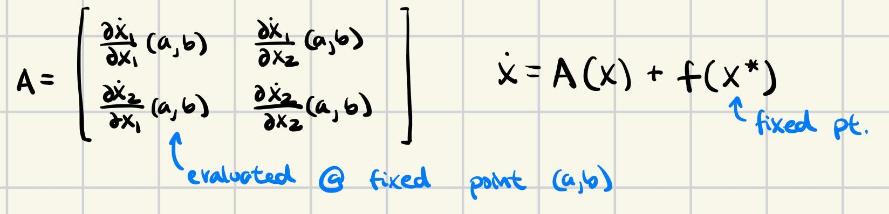

# Linearization (of ODEs)

## Method 1: Taylor Expansion

Taylor Expansion:

 

Procedure: 
1. Substitute $x = x^* + \tilde{x}$
2. For each nonlinear term, apply Taylor Series

Example:

 

Taylor Expansions also apply for multi-variate and multi-dimensional systems:

 

Example:

 

Note: Notice that the affine component, $f(x^*)$, canceled out to 0 in both examples. This will be true when linearizing any differential equation around any $x^*$ that is a fixed point; this is because, by definition of a fixed point, $f(x^*) = \dot{x} = 0$. 

However, if we want to linearize around a non-fixed point $\bar{x}$, this affine component will persist (which makes it hard to apply linear control techniques like LQR), unless we employ a trick. By substituting $x = x^* + \tilde{x}$ we express the approximation in error coordinates $\tilde{x}$. This will also get rid of the affine component, because $f(x^*) = 0$ in the reference frame of $x^*$. For more detail, see section "Linearizing around Trajectory" in *5) Trajectory Optimization*.

## Method 2: Jacobian Matrices

Compute the Jacobian matrix:

 

Then the resulting linear (affine) system is $\dot{x} = Ax + f(x^*)$

Example:

 

Intuition: Just by observation, the Jacobian matrix is clearly doing the same thing as a multi-variate Taylor Expansion. All a Jacobian is is the matrix full of partial derivatives of a function; Taylor Expansion simply evaluates partial derivatives with some added/multiplied constants/variables.

Same as in Method 1 (read above for more details), we can observe that the affine component $f(x^*) = 0$ when $x^*$ is a fixed point, and when $x^*$ is not a fixed point, we can remove the affine component by shifting into error coordinates.