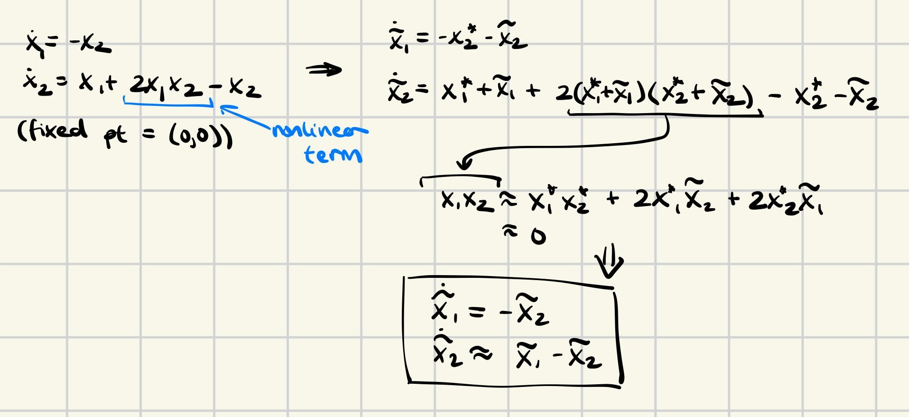

# Linearization

## Method 1: Taylor Expansion

Taylor Expansion:

 

Procedure: 
1. Set $x = x^* + \tilde{x}$
2. For each nonlinaer term, apply Taylor Series

Example:

 

Taylor Expansions also apply for multi-variate and multi-dimensional systems:

 

Example:

 

## Method 2: Jacobian Matrices

Compute the Jacobian matrix:

 

Then the resulting linear (affine) system is $\dot{x} = A(x-\begin{bmatrix}
a \\
b
\end{bmatrix})$

Example:

 

