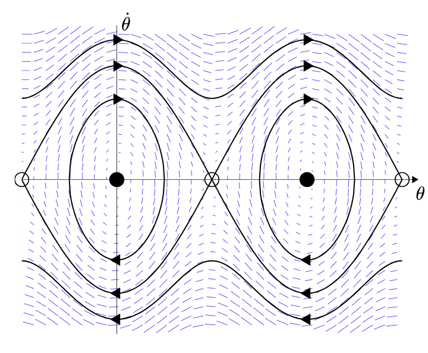
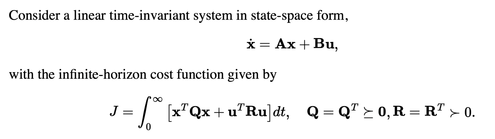

# Underactuated Systems

Dynamics of robot expressed using diff eq, relating state & control input to derivatives of state. In particular, we use 2nd-order diff eq, because we typically care about the resulting acceleration from a state & control input (why acceleration? well, $q$ and $\dot{q}$ are easy to measure with sensors; if you wanted a diff eq with jerk, you'd need a measure of $\ddot{q}$, which are usually noisy, and this is usually not necessary anyway).

General 2nd-order Dynamical System Control Equation:

$$ \ddot{q} = f(q, \dot{q}, u, t) $$

$q$ = state vector, $u$ = control command. For a fully actuated dsystem, $f$ is surjective; for each $\ddot{q}$ there exists a $u$. This is not true for underactuated systems.

Actually, dynamics of many robots is linear in torque with an added constant not dependent on $u$, so we re-express the dynamics:

$$ \ddot{q} = f_1(q, \dot{q}, t) + f_2(q, \dot{q}, t)u $$

For a robot manipulator (with rigid linkages and joints), recall the manipulator equation:

$$ M(q) \ddot{q} + C(q, \dot{q})\dot{q} = \tau_g(q) + Bu $$

where $M$ is the inertia matrix (symmetric, positive definite, invertible), and $B$ maps $u$ into generalized forces. We can re-express this in the form of the linear dynamics equation ($M^{-1}B$ represents $f_2$ and $M^{-1}[\tau_g(q) - C(q,\dot{q})\dot{q}]$ represents $f_1$):

$$ \ddot{q} = M^{-1}(q)[\tau_g(q) + Bu - C(q,\dot{q})\dot{q}] $$

As long as $B$ is full-row-rank (i.e. has rank equal to the number of dimensions of $q$, and therefore has a right inverse), $\exist u$ such that $\ddot{q}$ can achieve any value in full-dimensional space.

Sidenote 1: The manipulator equation ignores friction, but you could add a $\tau_f(q)$ to the manipulator equation to model this  (or, if you have torque-dependent friction, then $\tau_g(q)u$)

Sidenote 2: $B$ must be dimension $dim(q) \times dim(u)$, and the only way for it to be full-row-rank is if $dim(u) \geq dim(q)$. $dim(u)$ could even be much larger than $dim(q)$ if you have multiple actuators per joint; in this case the inverse of $B$ may not be unique.

If, for example, the manipulator has a free-spinning joint, then $B$ would lose a dimension, and then $\ddot{q}$ would be limited within the subspace that $B$ projects to.

### Feedback Equivalence

For full-actuated systems, control is easy. For any desired $\ddot{q}^d$:

$$ u = B^{-1} [ M(q) \ddot{q}^d - \tau_g(q) + C(q,\dot{q})\dot{q}] $$

$u$ is calculated analytically.

This is also called a "double integrator" controller. Disadvantage: requires may actuators + energy.

Also, feedback equivalence may only be possible sometimes. $B^{-1}$ could get large $\rightarrow$ demand unreasonably high torques.

### Input and State Constraints

Limits to $u$ can cause underactuation. $q$ limits (i.e. obstacles or joint limits) don't necessarily cause underactuation; they actually reduce the state space, which could make an underactuated system temporarily fully-actuated.

### Nonholonomic Constraints

Also cause underactuation. i.e. cars can't move sideways $\rightarrow$ doesn't restrict its set of possible configurations, but does restrict possible $\ddot{q}$.

 
 

# Dynamics of a Simple Pendulum

### Background: Phase Portraits

Phase portraits plot $\dot{q}$ vs $q$, along with a vector field of vectors $[\dot{q}, \ddot{q}]^T$ and repesent the dynamics of the system. We may call the "state vector" $x = [q, \dot{q}]^T$. Then, the vectors in the vector field are all $\dot{x} = [\dot{q}, \ddot{q}]^T$.

This is a simple sliding cart-mass system where, with no external force $u$, there is no $\ddot{q}$:

 

Note that, if there were, say, $u=1$, then there would be a non-zero $\ddot{q}$, then all the vectors would have a slight tilt upward. By providing torques or forces, one can shape the vector field. But only the y-components of each $\dot{x}$ vector--the x-component is fixed at $\dot{q}$.

The vector field symbollically represents the states that the system can get to from the current state. Therefore, valid trajectories must follow the vector field.

In the case of this sliding cart-mass system, the dynamics are simple: $m\ddot{q} = u$. Then, to achieve the desired $\ddot{q}$ at any time, we can just input the correct $u$. Say we want to form a particular vector $\dot{x}^d$ in the vector field; thens pick a $u$ such that $\dot{x}^d = [\dot{q}, \frac{u}{m}]^T$

In the phase portrait above, the red trajectory represents a possible trajectory with the correct control inputs $u$, while the blue trajectory is impossible to achieve. Specifically, at all $x$ on the red trajectory, there is $u$ that points $\dot{x}$ in the direction of the red arrow ($u = -0.25m \dot{q}$), but for the blue trajectory, $u$ cannot influence the x-component of $\dot{x}$, so the x-component of $\dot{x}$ can never point left like the blue arrow does.

### Back to the Pendulum.

Equation of motion for a pendulum (solved using Euler Lagrange):

$$ ml^2\ddot{\theta} + b\dot{\theta} + mgl\sin\theta = u $$

The goal would be to solve for $\theta$ as a function of time given $u, \theta, \dot{\theta}$, but, this diff. eq. of this form are not solvable (it's a non-linear 2nd order system). Therefore, we have to do some casework to roughly analyze special cases (i.e. limits as $t \rightarrow \infty$).

### Overdamped Case

Pendulum is overdamped if $b\dot{\theta} >> ml^2\ddot{\theta}$; which is equivalent to $b \sqrt\frac{l}{g} >> ml^2$ ($\sqrt\frac{l}{g}$ is the natural freq. and is there to ensure both sides have the same units, and is assumed to have a reasonable value and therefore not affect the inequality relationship).

Then, the equation of motion becomes roughly this (1st order):

$$ b\dot{\theta} + mgl\sin\theta = u_0 $$

Now, plotting $\dot{\theta}$ vs $\theta$:

 

We see equilibria at $\theta=-\pi, 0, \pi$. The only stable equilibira is at $\theta=0$ (when $\theta$ becomes slightly larger, $\dot{\theta}$ is negative, and vice versa when $\theta$ becomes slightly smaller.)

Sidenote: why do we plot $\dot{\theta}$ vs $\theta$? Because $\dot{\theta}$ and $\theta$ (velocity and position) represent "state", so each point on the plot is a different state.

Types of Lyapunov (local) Stability; if $x^*$ is the stable point:
- **Locally Stable** (i.s.L. - in the sense of Lyapunov): for some small scalar $\epsilon$, if $||x(0) - x^*|| < \delta$ where $\delta \leq \epsilon$, then $\forall t ~||x(t) - x^*|| < \epsilon$. Basically, for any $\epsilon$ ball where $x$ will stay in the $\epsilon$ ball for all time, $\exists$ a $\delta$ ball that $x(0)$ is in.
    - Example: $\dot{x} = 0$
- **Locally Attractive**: if $||x(0) - x^*|| < \epsilon$, then $lim_{t \rightarrow \infty} ~x(t) = x^*$. Basically, $x$ will reach the stable point eventually.
- **Locally Asymptotically Stable**: If both **Locally Stable** & **Locally Attractive**
- **Locally Exponentially Stable**: if $||x(0) - x^*|| < \epsilon$, then if $||x(t) - x^*|| < Ce^{-\alpha t}$, for some $C, \alpha$.

Note: Lyapunov analysis only applies to passively dynamic systems (no external forcing).

Now, stable point drawn as block dots, unstable points drawn as circles:

 

Notice, that anytime $\dot{x} > 0$, any initial condition will tend to move right, and vice versa for $\dot{x} < 0$. Therefore, we have **regions of attraction** around the black dots and **separatrix** (separating regions of attraction) at each white dot.

In certain cases, your system might have a parameter $w$, and varying $w$ varies the number of equilibirium points in the system. This is called a **bifurcation**. You can plot a **bifurcation diagram** of $x*$ versus $w$; it may have "pitches" if, at a certain $w$, the number of $x*$ changes.

Also, note that, if $u$ was a non-zero constant (imagine a constant torque shifting the equilibrium of the pendulum), you effectively shift the entire phase plot up or down (also shifting the fixed points left or right--the fixed points always are on the x-axis).

### Underdamped Case

Now, $b=0$. $ ml^2\ddot{\theta} + mgl\sin\theta = u_0 $; there is no first order term.

We can rewrite the second order equation as a first order equation with a change of variables (which doubles the number of variables). In general:

$$ \ddot{q} = f(q, \dot{q}, u) $$

becomes;
$$\begin{align*}
x_1 &= q \\
x_2 &= \dot{q} \\
\dot{x}_1 &= x_2 \\
\dot{x}_2 &= f(x_1, x_2, u)
\end{align*}$$

In the case of the pendulum, $ ml^2\ddot{\theta} + mgl\sin\theta = u_0 $ becomes:

becomes;
$$\begin{align*}
& \dot{\theta} = x \\
& \dot{x} = \frac{1}{ml^2}(u-0 - mgl \sin \theta - bx)
\end{align*}$$

From these first order equations, we can draw a phase portait, plotting $\dot{\theta}$ vs $\theta$, with a vector field depicting $(\dot{\theta}, \ddot{\theta})$.

 

Assume again that $u_0$ = 0.

The black counters represent energy level sets (conservation of energy). The pendulum will always remain on a level set. We can solve the conservation of energy equation (expressing $\dot{\theta}$ in terms of $\theta$, to be able to plot on the phase portait) to get the following:

$$ \dot{\theta}(t) = \pm \sqrt{\frac{2}{I}[E_0 + mgl \cos \theta(t)]} $$

### The Damped Case

 

The stable fixed points are now asymptotically stable.

### Control of a Torque-Limited Simple Pendulum

Now, let's consider control for this fully-actuated pendulum. **In short, the control problem is to redirect the vector field so that you get from $\theta(t_{now})$ to $\theta_{desired}$.**

**If you did not have torque limits and did not care about efficiency, you could reshape the entire vector field using feedback equivalence. But what we really want is the most minimal change to the vector field that can achieve getting from $\theta(t_{now})$ to $\theta_{desired}$.**

IMPORTANT SIDENOTE: Let's be clear about how the phase portrait works. Control inputs can only shape $\ddot{q}$, which is the y-component of each vector in the vector field. The x-component of each vector is $\dot{q}$, which is fixed (it is equal to the y-value where the vector is in the phase portrait). You cannot simply move wherever you want in the phase portrait, even with no limits on control inputs; you can only control the y-component of the vectors in the phase portrait.

First, consider the case of no damping.

One way to think about this is changing the energy of the system. Total energy is:

$$ E = \frac{1}{2} ml^2 \dot{\theta}^2 - mgl \cos \theta $$

Taking the derivative:

$$\begin{align*}
\dot{E} &= ml^2 \dot{\theta} \ddot{\theta} + \dot{\theta} mgl \sin \theta \\
&= \dot{\theta}[u-mgl \sin \theta] + \dot{\theta} mgl \sin \theta \\
&= u \dot{\theta}
\end{align*}$$

What this shows is applying torque directly changes the rate of change of energy.

As an example, let's say we want to get to $E^{desired} = mgl$; aka, when the pendulum is vertical. Then the current difference in energy is: $\tilde{E} = E - E^d$. Since $E^d$ is fixed, $\dot{\tilde{E}} = \dot{E} = u \dot{\theta}$.

Imagine a feedback controller ($k$ can be any positive constant to scale the "severity" of the controller): 

$$u = -k \dot{\theta} \tilde{E}$$

Then:

$$\dot{\tilde{E}} = -k \dot{\theta}^2 \tilde{E}$$

Imagine the phase plot for this--it would be a straight $y=-x$ -looking line. This means there's a stable fixed point at the origin where $\tilde{E} = 0$. The intuitive understanding of this controller is that, when $\tilde{E}$ is positive, energy is taken out of the system, and vice versa when $\tilde{E}$ is negative. 

This is a non-linear controller and the fixed point (the unfilled circle below) is locally attractive, but not stable (the fixed point on the phase portrait of $\dot{\tilde{E}}$ vs $\tilde{E}$ may be stable, but not on the phase portrait of $\dot{\theta}$ vs $\theta$). The controller will attempt to keep the system on the energy level set drawn in red.

 

It is locally attractive bc, as you can see, the trajectories on the energy level set loop around but always go back to the fixed point.

If we want to account for damping, this can be easily added to the control law: 

$$u = -k \dot{\theta}^2 \tilde{E} + b \dot{\theta}$$

  

# Control of the Pendulum

## As an Optimization

Consider double integrator system (aka 1D sliding cart):

$$ \ddot{q} = u $$

Our goal will be to bring $\dot{q} = 0$ and $q = 0$ starting from some $\dot{q}(0)$ and $q(0)$.

You can, imagine, with $u=0$, the phase portrait $\dot{q}$ vs $q$ of this system would have a vector field of just horizontal vectors. 

Now, consider a "time-optimal" bang-bang controller (so $u$ can only be -1 or 1). We can express this problem like so:

$$\begin{align*}
& \text{minimize} 
& & ~t_f \\
& \text{subject to}: 
& & x(t_0) = x_0 \\
&&& x(t_f) =0 \\
&&& \ddot{q}(t) = u(t) \\
&&& |u(t)| = 1
\end{align*}$$

We will consider this in two separate cases, when $u=1$ and $u=-1$. For $u=-1$:

$$ \ddot{q}(t) = u = -1 $$
$$ \dot{q}(t) = \dot{q}(0) - t $$
$$ q(t) = q(0) + \dot{q}(0)t - \frac{1}{2}t^2 $$

For this specific system, the control law is integratable, so we end up with a 1st order ODE (you can substitute to rid of $t$ in the third equation above). This means we can plot its behavior analytically on the phase portrait; we get a bunch of parabolas (the x-offset depends on initial conditions):

 

When $u=1$, you will find the solution to be the same but mirrored across the y-axis.

As stated above, the goal is to reach $\dot{q} = 0$ and $q = 0$--the origin of this plot, in minimum time. If we consider both $u=1$ and $u=-1$ at the same time, the phase portrait looks like this:

 

Note that this drawing intentionally cuts off parts of each parabola to illustrate how the optimal control policy would work. For example, if your initial conditions were at the red star, you would follow $u=-1$ until intersecting with the $u=1$ parabola, at which point switch $u$ to $1$. Notice how there is overshoot in this example; the inital speed was so high that overshoot was unavoidable.

## Dynamic Programming (DP) (aka Value Iteration)

### Discreet Time DP

Additive costs (i.e. that add or are integrated in time), whether for finite or infinite horizons, is easiest to optimize with dynamic programming. For example, a discreet-time minimum time cost is simply (accruing cost so long as we've not acheived our goal) (however, any additive loss function will work):

$$
    \ell(s_i, a)= 
\begin{cases}
    1,& \text{if } s\neq s_{goal}\\
    0,              & \text{otherwise}
\end{cases}
$$

Consider an approximation of optimal control as a graph problem: Discretize state space into a grid of nodes in the phase portrait representing every possible state the system can reach.

Call each node a "state" $s_n$, and each edge to another state "action" $a_n$. Define the transition function: $s[n+1] = f(s[n], a[n])$, if you move from $s_n$ using action $a_n$ to $s_n+1$.

You initialize objective $J^*(s)=0$ (or something random) for all states. Then, you work recursively from $s_0$ to $s_{goal}$, setting $J^*(s_i)$ (a constant) at each value iteration step: 

$$ \forall i ~J^*(s_i) = \min_{a \in A} \left[ \ell(s_i, a) + J^*(f(s_i, a)) \right]$$

where $\ell(s_i, a)$ is the cost for state action pair $s_i, a$.

We call this the "cost-to-go" function--it describes the cost of each action at the current state, and therefore allows you to find the best action. $J^*(s_i)$ is the optimal cost-to-go, which is the minimum possible cost incurred from taking an action at state $s_i$.

Basically, the cost at the current state is equal to the minimum cost at the next state plus the cost to transition from current to next.

### The "Value Iteration" Version.

From here, we'll switch away from DP to "value iteration". The concept is very similar, except, for value iteration, we don't typically solve for a specific $s_0$; we allow the recursion to continue until $J^*(s)$ converges (stops updating) for all $s$; the the real cost of each possible state has been globally computed.

This is different than the DP formulation, where there is a clear order of recursion from $s_0$ to $s_{goal}$; but value iteration simply updates all states (from $s_{goal}$) until "convergence" -- when further value iteration updates no longer change $J^*$.

In practice, you might store $J^*$ not as a function but as a vector, with an element for all possible (finite number of discretized) states. Each value-iteration update will update on element of the vector $J^*$, and this will continue recursively until covergence.

**Limitations of Discreet Time/Discreet State/Discreet Action Value Iteration**:
 - Accuracy loss due to discretization errors in state space (which propogate out further from the goal state)
 - Lack of scalability due to massive state spaces (only practical for $\leq 6$ dimensions)
 - Known state transitions & costs
 - Requires "full state" feedback

### Continuous State, Action, Time DP

Rather than a discreet state transition function like $f()$ above, we have:

$$ \dot{x}(t) = f_c(x(t), u(t)) $$

(The $f_c$ subscript denotes "continuous" for clarity). Recall that $x$ is the state vector, containing both position and velocity; so this function is calculating the resulting velocity and acceleration from applying a torque input at a given position and velocity. This function should be a known of the system (it's the system dynamics).

The long-term cost is, instead of a sum over discreet time steps, is an integral of the cost function over dt:

$$ \int l_c(x, u) dt $$

To solve for the optimal control action $u$ given, we need to do two things; first, we must solve for the optimal cost-to-go function $J^*(x)$ using value iteration,then we use the Hamilton-Jacobi-Bellman (HJB) equation to solve for $u$ using the optimal cost-to-go function:

$$ \forall x ~ 0=\min_u \bigg [\ell(x,y) + \frac{\delta J^*}{\delta x} \bigg|_x f_c(x, u) \bigg ]$$

First, we will show how to solve for $u$, assuming we know $J^*(x)$. This is simply a matter of solving the optimization problem that is the HJB equation (finding $u$ to mininimize the right-hand-side).

In the discreet time/state/action DP algorithm, we could evaluate over all possible $u$ and pick the best. In continuous action space, this is not possible. Either we need to solve for $u$ analytically or use numerical methods (like gradient descent). We will take a look at a special case where we can solve for $u$ analytically: the system must be "control affine", meaing that the acceleration of the system is linear with torque, plus some constant not dependent on $u$:

$$ f(x, y) =  f_1(x) + f_2(x)u $$

and, the cost function must be of the form (quadratic with respect to the command (i.e. a quadratic energy cost) plus something having to do with state; the cost function with the HJB cart mass system example above is an example of this):

$$ \ell(x, u) = \ell_1(x) + u^T R u $$

We can now write HJB as:

$$ 0 = \min_u \bigg[\ell_1(x) + u^T Ru + \frac{\delta J}{\delta x}[f_1(x) + f_x(x)u] \bigg] $$

We can use this HJB to solve for the optimal $u^*$; notice how the function on the right side is a quadratic; we can solve for the analytical minimum by taking the gradient and setting to 0:

$$ \frac{\delta}{\delta u} \bigg[\ell_1(x) + u^T Ru + \frac{\delta J}{\delta x}[f_1(x) + f_x(x)u] \bigg] = 2u^T R + \frac{\delta J}{\delta x}f_2(x) = 0 $$

Solving for $u$, we get:

$$ u^* = -\frac{1}{2} R^{-1} f_2^T(x) \frac{\delta J^T}{\delta x} $$

However, if we have limits on $u$ (i.e. torque limits), which would be linear constraints on $u$, then $u^*$ can be easily solved as a Quadratic Program.

Now, we are able to find the optimal $u^*$ for any given cost function and state. In a real robotic system with some loop speed, you essentially solve for $u^*$ every loop, apply it to the robot, measure changes in state, and repeat.

#### General Case
What happens if the cost function is not quadratic or the dynamics are not control affine? Then you can't solve for $u$ by just setting the gradient of HJB to 0. One workout is, every iteration of the algorithm, you could take a positive-definite quadratic approximation in $u$ of the HJB and then solve for $u^*$. Alternatively, use numerical optimization methods like gradient descent to solve for $u$.

### Example: HJB on Cart Mass System (Double Integrator)

Now, we will see an example of how to use HJB to solve for $u^*$ for controlling a cart mass system.

Once again, the goal of the Cart Mass System problem is to keep the mass at the origin.

Let's say this is our cost (quadratic in state variables and effort):

$$ \ell(x, u) = q^2 + \dot{q}^2 + u^2 $$

And let's say we've already solved for the optimal cost-to-go function:

$$ J(x) = \sqrt{3} q^2 + 2q\dot{q} + \sqrt{3}\dot{q}^2 $$

We will now prove our $u^*$ by plugging this cost-to-go function into HJB and seeing that we get $u^*$ back.

 

This math involves partial derivatives of a scalar function with respect to vectors. Just trust that this is how it works. The derivative of a scalar function wrt vectors creates a row vector. The double integrator has dynamics $f(x, u) = \begin{bmatrix}
\dot{q} \\
u 
\end{bmatrix}$ (recall that $f(x, u) = \dot{x}$ by definition), so $\frac{\delta J}{\delta x} f(x, u)$ is equal to the blob on the right side of the equation.

Now, we need to find $u$ to minimize the equation above (as required by HJB). To do so, we take the gradent of the equation with respect to $u$, set it equal to 0, and we will find $u* = -q - \sqrt{3} \dot{q} $, the optimal controller.

## Solving for $J^*(x)$ using Value Iteration

Now, it's clear how HJB can solve for $u^*$ given $J^*(x)$; but how do we calculate the function $J^*(x)$ in the first place?

### Value Iteration with a Neural Network (Discreet time, continuous state)

We define the estimated optimal cost-to-go as $\hat{J_\alpha}(x) $.

Then the value iteration update is (with 2 steps):

$$ J_k^d = \min_u \bigg[ \ell(x_k, u) + \hat{J_\alpha^*}(f(x_k, u)) \bigg] $$

$$ \alpha = \argmin_\alpha \sum_k \bigg( \hat{J_\alpha^*}(x_k) - J_k^d \bigg) $$

The purpose of having two steps instead of combining into one is that the computation of $J_k^d$ will use the prior value of $\alpha$, so the minimization over $\alpha$ step will have $J_k^d$ as a constant. The intuition behind this value iteration update is that we first calculate a desired cost-to-go given the current estimate of $\alpha$, then try to tune $\alpha$ to cahieve this desired value.

(As usual, $x_{k+1} = f(x_k, u)$ is the transition function and $\ell(x_k, u)$ is the loss function).

We can apply this value iteration update repeatedly until convergence.

To compute $\argmin_\alpha$, we typically perform a stochastic gradient descent.

This approach works well when $\hat{J}_\alpha^*(x)$ is approximated as a linear function:

$$ \hat{J}_\alpha^*(x) = \sum_i \alpha_i \phi(x) ~~~~~~~~~\text{vector form: } \hat{J}_\alpha^*(x)=\phi^T(x)\alpha$$

where $\phi^T(x)$ is a column vector of nonlinear features.

### An Aside: Informal derivation of HJB

HJB is quite unintuitive; so, an informal derivation:

$$ x[n+1] \approx x[n] + dt*f_c(x[n], u[n]) $$

(this is simply a discreet-time approximation of continuous space using a small $dt$).

$$ J^*(x) = \min_u \bigg [dt*\ell(x, u) + J^*(x + dt*f_c(x, u)) \bigg ] $$

Using a first-order Taylor Expansion, we can approximate $ J^*(x + dt*f_c(x, u))$ as $J^*(x) + \frac{\delta J^*}{\delta  x}dt*f_c(x, u)$. Plugging this in above:

$$ J^*(x) = \min_u \bigg [dt*\ell(x, u) + J^*(x) + \frac{\delta J^*}{\delta  x}dt*f_c(x, u) \bigg ] $$

With this step done, we've now separated $J^*$ into $J^*(x)$, which is not dependent on $u$, from the part of $J^*$ that is dependent on $u$. On the right side of the eqution, we can pull $J^*(x)$ out of the $\min_u$ operator, and cancel it from the left side of the equation. We can also pull the $dt$ multiplier out, since this is also independent of $u$, and this divide this term out. We are left with the HJB equation above:

$$ 0 = \min_u \bigg [\ell(x, u) + \frac{\delta J^*}{\delta  x} \bigg|_x f_c(x, u) \bigg ] $$

  

## Linear Quadratic Regulator (LQR)

Linear dynamics, quadratic cost; goal is to stabilize to $x^* = 0$ with minimum cost (at the bottom of the quadratic cost function). LQR works on system dynamics of the form:

$$ \dot{x} = Ax + Bu $$

with quadratic cost ($Q$ and $R$ are symmetric positive definite matrices):

$$ \ell(x, u) = x^TQx + u^TRu $$

In short, this is the formulation of LQR:

 

And LQR, given $A, B, Q, R$, spits out the $S$ and $K$ that stabilizes $x$ to 0, where the optimal controller is $u(x) = -Kx$.

### LQR Derivation

It's know that the quadratic cost-to-go is of the form:

$$ J^*(x) = x^T Sx $$
 
We now plug the above into HJB to find the optimal $u^*$ and optimal $S$:

$$ \forall x, ~ 0 = \min_u \bigg [ x^TQx + u^TRu + \frac{\delta J^*}{\delta x} (Ax + Bu) \bigg ]$$

$$ \frac{\delta J^*}{\delta x} = 2x^T S $$

Take the gradient of the HJB function wrt $u$, as we did above (which will find the analytical minimum of the quadratic function), and you will get:

$$ u^*(x) = -R^{-1} B^T Sx = -Kx$$

which is linear in $x$ (we defined a new variable here $K$ for convenience).

However, we still need to find the optimal $S$. We can plug $u^*$ back into HJB:

$$ 0 = x^T[Q-SBR^{-1}B^TS + 2SA]x $$

This must hold for all $x$, so we can sort of "divide" $x$ out. Then $Q-SBR^{-1}B^TS + 2SA = 0$, and we must solve for $S$. This is complicated; in practice, your numerical tookbox (i.e. drake, matlab) will have a function that will return $S$ and $K$ given $Q,R,A,B$.

LQR works for a variety of systems; even systems without linear dynamics or quadratic cost, you can take linear/quadratic approximations and still get good control.

If, for example,you want to stabilize to a fixed point other than $x=0$, you can also perform a change of variables such that you are stabilizing the new varible to $0$.

### Tuning LQR

$Q$ and $R$ are hyperparameters. Scaling both $Q$ or $R$ together just scales the cost; doesn't affect the optimal controller. The relative scale of $Q$ nd $R$ is what matters, so typically you just set $R$ = 1 and tune $Q$. You are essentially weighing how much you care about "error" vs "effort". It's a good idea to think bout the units of $Q$ and $R$, and then scale them so they are similarly sized when in the same units.

  

## Acrobots, Cart-Poles and Quadrotors (Applying Linearization and LQR)

Canonical underactuated systems, and how to control them.

### Acrobot
2-link planar robot with only an actuator at the elbow:

 

The goal of the Acrobot is to achieve the state $x =\begin{bmatrix}
           \pi \\
           0 \\
           0 \\
           0
         \end{bmatrix}$

Consider $I_1$ and $I_2$ the Moments of Inertia about the pivots for each link.

Let's first use Euler Lagrange to solve for the 2 equations of motion ($s1$ is shorthand for $\sin(\theta_1)$, and $c_{1+2}$ is shorthand for $\cos(\theta_1 + \theta_2)$, etc.):

 

where $\tau$ is a Generalized Force applied on the system (the torque from the elbow actuator).

Let's express this in the form of the manipulator equations by combining $q = \begin{bmatrix}
           q_1 \\
            q_2
         \end{bmatrix}$; essentially, each equation in the Euler Lagrange EoMs becomes a row of the manipulator equations (note that $u$ = $\tau$):

$$ M(q) \ddot{q} + C(q, \dot{q})\dot{q} = \tau_g(q) + Bu $$

 

Linearization and LQR will be easier having the EoMs in this single matrix equation.

Our approach for controlling the acrobot will be to first develop a linear controller (i.e. LQR) for the system linearized around the target fixed point/state (which is $x =\begin{bmatrix}
           \pi \\
           0 \\
           0 \\
           0
         \end{bmatrix}$). First, then, let's linearize the manipulator equation.

Because our system also has a non-constant $u$, we need to linearize around a fixed point in both $x$ and $u$, so let's denote the fixed point $x^*$ and $u^*$. As we typically do with linearization, let's also define "errors": $\bar{x} = x-x^*$ and $\bar{u} = u-u^*$ (so the linearization is around $\bar{x}$ and $\bar{u}=0$). Using a 1st order Taylor Approximation around the fixed point, we get: 

 

where $f(x,u)$ is the dynamics equation for the given system (i.e. the manipulator equation). If the fixed point we choose is an equilibrium point, then $f(x^*, u^*) = 0$ (velocity and acceleration at equilibrium = 0). Then, our equation is linear in terms of $\bar{x}, \bar{u}$:

$$\dot{\bar{x}} = A_{lin} \bar{x} + B_{lin} \bar{u}$$

where $A_{lin}$ and $B_{lin}$ are constant matrices resulting from evaluating $[\frac{\delta f}{\delta x}]_{x=x^*, u=u^*}$ and $[\frac{\delta f}{\delta u}]_{x=x^*, u=u^*}$ respectively.

If we evaluate $A_{lin}$ and $B_{lin}$ using the manipulator equation for $f(x,u)$, we get the block matrices:

 

Note that the linearization gives us quite a good approximation; if the linearized system is stable, then the nonlinear system is locally exponeitially stable. If the linearized system is unstable, the nonlinear system is locally unstable.

Now, to optimally control the system, we use LQR. We just define a quadratic cost with which to optimize (where $Q$ and $R$ are positive definite symmetric matrices):

$$ J(x^*) = \int^\infty_0 [x^TQx + u^TRu] dt $$

Then:

$$u(t) = -Kx(t)$$

We call `K = LinearQuadraticRegulator(A, B, Q, R)` passing in $A, B, Q, R$, and get the resulting control $K$ out.

  

### Cartpole

 

We define $q = \begin{bmatrix}
           x \\
           \theta \\
         \end{bmatrix}$ and try to stabilize around $x = \begin{bmatrix}
           0 \\
           \pi \\
           0 \\
           0
         \end{bmatrix}$.

Once again using Euler Lagrange to solve for the 2 equations of motion:

 

where $f_x$ is the generalized force applied on the system (the horizontal force the cart generates).

Re-expressing this in the form of the manipulator equations:

 

To solve for the optimal controller, we once again linearize the system's dynamics and apply LQR. To linearize, we perform the same first-order Taylor series expansion as above on the manipulator equation given that we have already solved for all the elements of the manipulator equation. Next, we simply define a quadratic cost and plug in matrices $A, B, Q, R$ into the LQR to get the optimal controller back. This procedure is all the same as for the acrobot.

<!-- For the cartpole, it's simple to isolate the accelerations:

 

For simplicity, let's just say all constants are 1:

  -->

  

### Quadrotors

(Technically a bi-rotor in the planar case):

 

The equations of motion are extremely simple:

 

Same as for the acrobot and cartpole, we can re-express these EoMs as the manipulator equation, linearize it, then apply LQR to control it to a desired state $x^*$ and $u^*$.

### Controllability

Controllability: If a system with dynamics $\dot{x} = f(x,u)$ has an input signal $u(t)$ that can move the system from any initial state to any final state in finite time.

For a linear system (or a linear approximation of a nonlinear system), this can be analytically calculated. Assuming the dynamics are of the form:

$$\dot{x} = Ax + Bu$$

The system is controllable if the matrix is full rank:

 

**Derivation:**

The analytical solution ($x(t)$) to the linear ODE is as follows: 

 

As can be seen, we make an assumption here for a stabilizing controller, that $x(t_f) = 0$. You can simplify this solution even further to an equation of this form:

$$x(0) = M*\begin{bmatrix}
           f_0(u) \\
           f_1(u) \\
           \dots \\
           f_n-1(u)
         \end{bmatrix}$$ 
         
where $M$ is the controllability matrix. Therefore, for every initial condition $x(0)$, there must be a correspoding set of $u$ (and therefore, $f_i(u)$). This is true when $M$ has linearly independent rows (each row of $M$ maps to an element in $x(0)$, and each element of $x(0)$ needs to be independently "actuatable").

The full derivation is here ("A general solution"): https://underactuated.mit.edu/acrobot.html#controllability_matrix

### Stabilizability

Stabilizability: If the system has an unconstrained input $u(t)$ that reaches $\lim_{t \rightarrow \infty} x(t) = 0$.

Controllability requires that we arrive at the origin in a finite time, stabilizability allows for asympotitic convergence.

LQR will solve optimal control for any linear system that is stabilizable. Note that both the acrobot and cart-pole are controllable (and therefore also stabilizable).

Also note that an underactuated system can be controllable (i.e. acrobot and cart-pole).